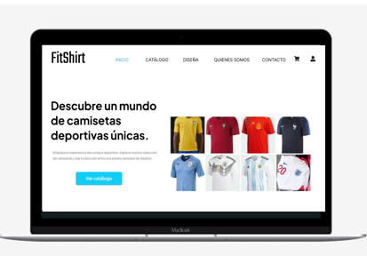
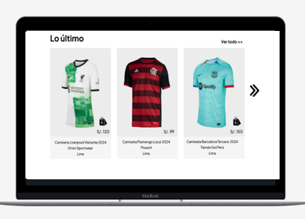
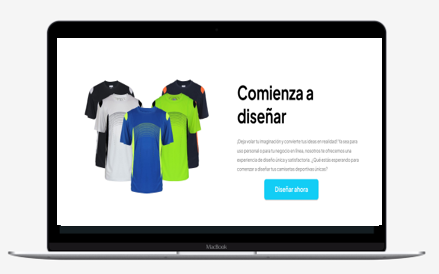
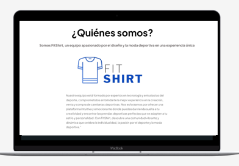
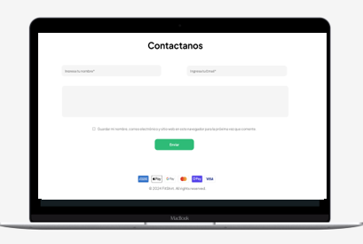

<h3 align="center"> Universidad Peruana de Ciencias Aplicadas </h3>

<h3 align="center"> Ingeniería de Software </h3>
<h3 align="center"> Ciclo 2024 - 1 </h3>

 

  

 

<h1 align="center"> TB1 Report </h1>

<h3 align="center"> Aplicaciones Web - SW53 </h3>

<h3 align="center"> Docente: Naldo Reupo-Musayón Gastulo </h3>

<h3> Startup: Dreamers in a Hurry </h3>

<h3> Product: </h3>

<h3> Team Members: </h3>

| Member                           |    Code    |
| :------------------------------- | :--------: |
| Aliaga Pimentel, George Arturo   | U20211c273 |
| Chirinos Arevalo, Daniel Rodrigo | U202019577 |
| Cruz Ticona, Aaron Alejandro     | U202213502 |
| Defilippi Santillán, Diego       | U202120448 |
| Sanchez Maita, Agustin Alejandro | U20181a313 |

<h3 align="center">Marzo, 2024</h3>

  

# Registro de Versiones del Informe

| Versión | Fecha | Autor | Descripción de modificación |
| :-----: | :---: | :---: | :-------------------------- |

  

# Project Report Collaboration Insights

  

# Contenido

## Tabla de Contenidos

### [Registro de versiones del informe](#registro-de-versiones-del-informe)

### [Project Report Collaboration Insights](#project-report-collaboration-insights)

### [Contenido](#contenido)

### [Student Outcome](#student-outcome-1)

### [Capítulo I: Introducción](#capc3adtulo-i-introduccic3b3n-1)

- [1.1. Startup Profile](#11-startup-profile)
  - [1.1.1. Descripción de la Startup](#111-description-de-la-startup)
  - [1.1.2. Perfiles de integrantes del equipo](#112-perfiles-de-integrantes-del-equipo)
- [1.2. Solution Profile](#12-solution-profile)
  - [1.2.1 Antecedentes y problemática](#121-antecedentes-y-problemática)
  - [1.2.2 Lean UX Process](#122-lean-ux-process)
    - [1.2.2.1. Lean UX Problem Statements](#1221-lean-ux-problem-statements)
    - [1.2.2.2. Lean UX Assumptions](#1222-lean-ux-assumptions)
    - [1.2.2.3. Lean UX Hypothesis Statements](#1223-lean-ux-hypothesis-statements)
    - [1.2.2.4. Lean UX Canvas](#1224-lean-ux-canvas)
- [1.3. Segmentos objetivo](#13-segmentos-objetivo)

### [Capítulo II: Requirements Elicitation & Analysis](#capc3adtulo-ii-requirements-elicitation--analysis-1)

- [2.1. Competidores](#21-competidores)
  - [2.1.1. Análisis competitivo](#211-análisis-competitivo)
  - [2.1.2. Estrategias y tácticas frente a competidores](#212-estrategias-y-tácticas-frente-a-competidores)
- [2.2. Entrevistas](#22-entrevistas)
  - [2.2.1. Diseño de entrevistas](#221-diseño-de-entrevistas)
  - [2.2.2. Registro de entrevistas](#222-registro-de-entrevistas)
  - [2.2.3. Análisis de entrevistas](#223-análisis-de-entrevistas)
- [2.3. Needfinding](#23-needfinding)
  - [2.3.1. User Personas](#231-user-personas)
  - [2.3.2. User Task Matrix](#232-user-task-matrix)
  - [2.3.3. User Journey Mapping](#233-user-journey-mapping)
  - [2.3.4. Empathy Mapping](#234-empathy-mapping)
  - [2.3.5. As-is Scenario Mapping](#235-as-is-scenario-mapping)

### [Capítulo III: Requirements Specification](#capc3adtulo-iii-requirements-specification-1)

- [3.1. To-Be Scenario Mapping](#31-to-be-scenario-mapping)
- [3.2. User Stories](#32-user-stories)
- [3.3. Impact Mapping](#33-impact-mapping)
- [3.4. Product Backlog](#34-product-backlog)

### [Capítulo IV: Product Design](#capc3adtulo-iv-product-design-1)

- [4.1. Style Guidelines](#41-style-guidelines)
  - [4.1.1. General Style Guidelines](#411-general-style-guidelines)
  - [4.1.2. Web Style Guidelines](#412-web-style-guidelines)
- [4.2. Information Architecture](#42-information-architecture)
  - [4.2.1. Organization Systems](#421-organization-systems)
  - [4.2.2. Labeling Systems](#422-labeling-systems)
  - [4.2.3. SEO Tags and Meta Tags](#423-seo-tags-and-meta-tags)
  - [4.2.4. Searching Systems](#424-searching-systems)
  - [4.2.5. Navigation Systems](#425-navigation-systems)
- [4.3. Landing Page UI Design](#43-landing-page-ui-design)
  - [4.3.1. Landing Page Wireframe](#431-landing-page-wireframe)
  - [4.3.2. Landing Page Mock-up](#432-landing-page-mock-up)
- [4.4. Web Applications UX/UI Design](#44-web-applications-uxui-design)
  - [4.4.1. Web Applications Wireframes](#441-web-applications-wireframes)
  - [4.4.2. Web Applications Wireflow Diagrams](#442-web-applications-wireflow-diagrams)
  - [4.4.3. Web Applications Mock-ups](#443-web-applications-mock-ups)
  - [4.4.4. Web Applications User Flow Diagrams](#444-web-applications-user-flow-diagrams)
- [4.5. Web Applications Prototyping](#45-web-applications-prototyping)
- [4.6. Domain-Driven Software Architecture](#46-domain-driven-software-architecture)
  - [4.6.1. Software Architecture Context Diagram](#461-software-architecture-context-diagram)
  - [4.6.2. Software Architecture Container Diagrams](#462-software-architecture-container-diagrams)
  - [4.6.3. Software Architecture Components Diagrams](#463-software-architecture-components-diagrams)
- [4.7. Software Object-Oriented Design](#47-software-object-oriented-design)
  - [4.7.1. Class Diagrams](#471-class-diagrams)
  - [4.7.2. Class Dictionary](#472-class-dictionary)
- [4.8. Database Design](#48-database-design)
  - [4.8.1. Database Diagram](#481-database-diagram)

### [Capítulo V: Product Implementation, Validation & Deployment](#capc3adtulo-v-product-implementation-validation--deployment-1)

- [5.1. Software Configuration Management](#51-software-configuration-management)
  - [5.1.1. Software Development Environment Configuration](#511-software-development-environment-configuration)
  - [5.1.2. Source Code Management](#512-source-code-management)
  - [5.1.3. Source Code Style Guide & Conventions](#513-source-code-style-guide--conventions)
  - [5.1.4. Software Deployment Configuration](#514-software-deployment-configuration)
- [5.2. Landing Page, Services & Applications Implementation](#52-landing-page-services--applications-implementation)
  - [5.2.1. Sprint 1](#521-sprint-1)
    - [5.2.1.1. Sprint Planning 1](#5211-sprint-planning-1)
    - [5.2.1.2. Sprint Backlog 1](#5212-sprint-backlog-1)
    - [5.2.1.3. Development Evidence for Sprint Review](#5213-development-evidence-for-sprint-review)
    - [5.2.1.4. Testing Suite Evidence for Sprint Review](#5214-testing-suite-evidence-for-sprint-review)
    - [5.2.1.5. Execution Evidence for Sprint Review](#5215-execution-evidence-for-sprint-review)
    - [5.2.1.6. Services Documentation Evidence for Sprint Review](#5216-services-documentation-evidence-for-sprint-review)
    - [5.2.1.7. Software Deployment Evidence for Sprint Review](#5217-software-deployment-evidence-for-sprint-review)
    - [5.2.1.8. Team Collaboration Insights during Sprint](#5218-team-collaboration-insights-during-sprint)

### [Conclusiones](#conclusiones-1)

- [Conclusiones y recomendaciones](#conclusiones-y-recomendaciones)

### [Bibliografía](#bibliografc3ada-1)

### [Anexos](#anexos-1)

  

# Student Outcome

| Criterio específico                                                                                                                                 | Acciones realizadas | Conclusiones |
| :-------------------------------------------------------------------------------------------------------------------------------------------------- | :------------------ | :----------- |
| Participa en equipos multidisciplinarios con eficacia, eficiencia y objetividad, en el marco de un proyecto en soluciones de ingeniería de software |                     |              |
| Conoce al menos un sector empresarial o dominio de aplicación de soluciones de software.                                                            |                     |              |

  

## Capítulo I: Introducción

## 1.1. StartUp Profile

### 1.1.1. Description de la StartUp

### 1.1.2. Perfiles de integrantes del equipo

## 1.2. Solution Profile

### 1.2.1. Antecedentes y problemática

### 1.2.2. Lean UX Process

#### 1.2.2.1. Lean UX Problem Statements

#### 1.2.2.2. Lean UX Assumptions

#### 1.2.2.3. Lean UX Hypothesis Statements

#### 1.2.2.4. Lean UX Canvas

# 1.3. Segmentos Objetivo

  

# Capítulo II: Requirements Elicitation & Analysis

## 2.1. Competidores

### 2.1.1. Análisis competitivo

### 2.1.2. Estrategias y tácticas frente a competidores

## 2.2. Entrevistas

### 2.2.1. Diseño de entrevistas

### 2.2.2. Registro de entrevistas

### 2.2.3. Análisis de entrevistas

## 2.3. Needfinding

### 2.3.1. User Personas

### 2.3.2. User Task Matrix

### 2.3.3. User Journey Mapping

### 2.3.4. Empathy Mapping

### 2.3.5. As-is Scenario Mapping

  

# Capítulo III: Requirements Specification

## 3.1. To-Be Scenario Mapping

## 3.2. User Stories

## 3.3. Impact Mapping

## 3.4. Product Backlog

  

# Capítulo IV: Product Design

## 4.1. Style Guidelines.

### 4.1.1. General Style Guidelines

<b>Branding:</b> El logo de nuestro proyecto está representado por su nombre y un icono de una camiseta para representar
lo que ofrece nuestra aplicación.

Se decidio que las letras del nombre sean de dos colores.

<td></td>

<b>Typography:</b> Nuestro logotipo presenta la fuente Xpress Rounded, que refleja un estilo moderno y amigable, encapsulando así
la naturaleza innovadora y entretenida de nuestra aplicación. Para mantener coherencia con las imágenes de señas que utilizaremos, optamos por letras blancas, asegurando que nuestra marca sea inclusiva y que ningún usuario se sienta discriminado.

En particular, las letras 'Fit' se destacan en negro, mientras que 'Shirt' se presenta en un vibrante tono azul. Esta combinación de colores refuerza la identidad visual de FitShirt, añadiendo un toque de dinamismo y frescura a nuestro logotipo.

<b>Colores:</b> Los colores de nuestra página fueron seleccionados con el objetivo de ofrecer una experiencia visualmente agradable para el usuario, al mismo tiempo que transmiten sensaciones de calma y equilibrio. La combinación de blanco y gris aporta un aspecto positivo y único a nuestra marca, creando una atmósfera de serenidad y sofisticación.

<td></td>

### 4.1.2. Web Style Guidelines

En la landing page de FitShirt, decidimos implementar el Patrón F para optimizar la experiencia del usuario y guiar su atención hacia los elementos clave de nuestro sitio web. Al seguir este patrón, nos aseguramos de que los visitantes se enfoquen en los elementos más importantes de la página, como el título, y todo lo que ofrecemos.

En la parte superior de la página, colocamos el nombre de FitShirt y un encabezado con diversas opciones. Luego, organizamos el contenido de manera horizontal, resaltando las características principales de nuestra aplicación, que es lo que ofrecemos, quienes somos, y un formulario para contactarnos.

<td></td>

<td></td>

<td></td>

<td></td>

<td></td>

## 4.2. Information Architecture

### 4.2.1. Organization Systems

### 4.2.2. Labeling Systems

### 4.2.3. SEO Tags and Meta Tags

### 4.2.4. Searching Systems

### 4.2.5. Navigation Systems

## 4.3. Landing Page UI Design

### 4.3.1. Landing Page Wireframe

<b>Página Principal </b>
<td></td>
 
<b>Catálogo</b>
<td></td>
 
<b>Diseña</b>
<td></td>
 
<b>¿Quienes Somos?</b>
<td></td>
 
<b>Contactanos</b>
<td></td>
 
    
### 4.3.2. Landing Page Mock-up

<b>Página Principal </b>
<td></td>
 
<b>Catálogo</b>
<td></td>
 
<b>Diseña</b>
<td></td>
 
<b>¿Quienes Somos? <b>
<td></td>
 
<b>Contactanos <b>
<td></td>

[Ver diseño en Figma](https://www.figma.com/file/34WQCRohgfDxl5QPuWQxKc/FitShirt?type=design&node-id=0-1&mode=design&t=trCfJ8GunZpOGtwE-0)

## 4.4. Web Applications UX/UI Design

### 4.4.1. Web Applications Wireframes
<b>Página de Producto:</b>

La siguiente Imagen permite al usuario encontrar las diferentes camisetas deportivas que son publicadas por los diversos comerciantes, aquí se les ofrece la opción de seleccionar el producto que quieran y filtrarlos en base a sus preferencias.

<b>Cambio de Contraseña:</b>

La siguiente interfaz permite al usuario cambiar su contraseña actual con el fin de que pueda proporcionar la seguridad adecuada a su cuenta privada.

<b>Confirmación de Compra:</b>
 

La siguiente interfaz permite al usuario reafirmar o cancelar la acción de compra realizada, esto permite evitar errores posteriores y mejora la experiencia de usuario.

<b>Crear Diseño:</b>
 

La siguiente interfaz permite al usuario crear un diseño personalizado, en el que tiene la opción de escoger los colores primario, secundarios y terciarios, el diseño y el Escudo.

<b>Personalizar Camisa Deportiva:</b>
 

Esta interfaz permite al usuario personalizar su camisa deportiva añadiendole un nombre y un dorsal de su preferencia.

<b>Editar Diseño:</b>
 

Esta interfaz Permite al Usuario ver y editar la descripción de un diseño, además de ir a la siguiente interfaz donde puede editar las imágenes.

<b>Sección de Productos Filtrada:</b>

Esta interfaz muestra los productos filtrados después que el usuario escogió los filtros de su preferencia y seleccionó el botón filtrar.

<b>Imágenes de diseño:</b>
 

Esta interfaz permite al usuario visualizar las imágenes de un diseño, editarlas y confirmarlas.

<b>Carga exitosa:</b>
 

Esta interfaz permite al usuario reconocer que la carga de imágenes fue exitosa.

<b>Edición exitosa:</b>
 

Esta interfaz permite al usuario reconocer que la edición de imágenes fue exitosa.

<b>Insertar Imagen de Diseño:</b>
 

Esta interfaz permite al usuario ingresar las imágenes de un diseño.

<b>Detalles de producto</b>
 

Esta interfaz permite al usuario ver los detalles de un producto, definir la talla y cantidad que desea para añadir al carrito de compras.

<b>Edición de Perfil:</b>
 

Esta interfaz permite que el usuario cambie la información de su perfil.

<b>Interfaz de Login:</b>
 

Esta interfaz permite al usuario ingresar sus credenciales de acceso a la aplicación y en caso de no tener una cuenta, le permite ir a la interfaz de registro.

<b>Ingreso de Método de Pago:</b>
 

Esta interfaz permite al usuario ingresar el método de pago para realizar compras en la aplicación.

<b>Interfaz de Diseños:</b>
 

Esta interfaz permite al comerciante o usuario visualizar sus diseños y mediante los iconos puedes decidir si quieren que se muestren al público para realizar su venta o si quiere que determinado producto tenga más visibilidad. También puede dirigirse a las interfaces para crear o subir diseños.

<b>Comfirmación de Premium:</b>
 

Esta interfaz permite rectificar que el usuario quiere hacer compra de la membresía premium.

<b>Mejora a Premium:</b>
 

Esta interfaz muestra los beneficios de adquirir la membresía premium y permite hacer compra de esta mediante un botón.

<b>Interfaz de Perfil:</b>
 

Meduante esta Interfaz el usuario podrá acceder a su perfil y será capaz de escoger si desea cambiar su contraseña, añadir un método de pago o editar su perfil.

<b>Interfaz de Registro:</b>
 

Mediante esta interfaz el usuario podrá crear su cuenta en nuestra aplicación, para que pueda gozar de nuestros servicios y funcionalidades.

<b>Carrito de Compras Vacío:</b>
 

Esta interfaz muestra el carrito de compras sin ningún artículo para comprar.

<b>Carrito de Compra:</b>
 

Esta interfaz es el de carrito de compra, acá puede ver todos los artículos que añadió para su copra posterior, con sus subtotales, cantidad, precio unitario y total. También puede eliminar items del carrito.

<b>Subir Diseño:</b>
 

Esta interfaz permite al usuario subir un diseño que ya tenga hecho, aqui puede agregar su descripción del producto e ir a la siguiente interfaz para insertar imágenes.

### 4.4.2. Web Applications Wireflow Diagrams

Flujo para el inicio de Sesión:
 

Cuando el Usuario ingresa a la aplicación y quiere acceder para realizar sus compras o gestionar sus diseños, tiene que ingresar sus credenciales de acceso para poder empezar a navegar

Flujo para el registro en la aplicación: 

 

Cuando el usuario no tiene una cuenta en la aplicación y quiere ingresar para ver y probar los servicio que ofrecemos, este debe pulsar el botón regristrarse, completar el formulario de registro y luego darle a registrarse.

Flujo para edición de perfil:
 

Cuando el usuario quiere editar los datos de su perfil, tiene que seleccionar el icono de una persona en la barra lateral izquierda, aqui podra editar su información, añadir un método de pago y cambiar su contraseña.

Flujo para mejorar cuenta premium:
 

Cuando el usuario quiere tener más capacidad para diseños o que estos sean vistos por más personas. Debe seleccionar el icono de dimante en la barra lateral izquierda, aqui podrá ber los beneficios del premium y podrá adquirirlo.

Flujo para publicar diseños:
 

Como comerciante o confeccionista quiero publicar los diseños de las camisetas que voy a vender, por esto selecciono el icono del polo con un lápiz, luego soy redirigido a la interfaz de "Mis diseños" aquí puedo seleccionar el botón de "Subir Diseño", agrego los daptos del diseño y sus respectivas imágenes, luego acepto y el diseño se agrega a la lista.

 Flujo para visualizar mis diseños:
 

 El comerciante selecciona el icono de un polo con lapiz del lateral derecho el cual lo llevara donde se encuentra la lista de sus diseños, allí podrá gestionarlos a su disposición.
 
 Flujo para editar diseños:
 

 Al encontrarse en "Mis diseños" y seleccionar el botón editar diseño, el usuario logra editar los detalles e imagenes del diseño, para luego confirmar los cambio y que el sistema los refleje.
 
 Flujo para visualizar Camiseta:
 

 EL usuario al encontrarse en el catalogo de camisetas, puede seleccionar una de estas para luego definir la cantidad que desea, la talla y si es posible la personalizacion.

Flujo para mejorar crear diseño:
 

El usuario podrá escoger las caracteristicas de la camiseta, sea color, tipo, diseño, entre otros y su camiseta se generará.

Flujo para mejorar personalizar camiseta:

 

 El usuario al seleccionar una camiseta y encontrar el botón personalizar, al seleccionarlo podrá editar el nombre y el dorso, luego de acepta esta personalizacion se añadira al carrito de compras.

Flujo para realizar compra:
 

El usuario escoge una camiseta y selecciona el botón de comprar, luego se dirige a su carrito de compras, edita la cantidad si lo requiere o elimina alguna camiseta, luego selecciona comprar, pasa la doble verificación de la compra y la compra se realiza con éxito, después es redirigo a la lista de camisetas para que continue con su compra.

 Flujo para filtrar camisetas:
 

 El usuario selecciona los diferentes filtros en el catalogo de camisetas y luego le da al botón filtrar, el sistema le mostrará las camisetas con las carácteristicas escogidas

### 4.4.3. Web Applications Mock-ups

<b>Página de Producto:</b>
 

 
La siguiente Imagen permite al usuario encontrar las diferentes camisetas deportivas que son publicadas por los diversos comerciantes, aquí se les ofrece la opción de seleccionar el producto que quieran y filtrarlos en base a sus preferencias.

<b>Cambio de Contraseña:</b>
 

La siguiente interfaz permite al usuario cambiar su contraseña actual con el fin de que pueda proporcionar la seguridad adecuada a su cuenta privada.

<b>Confirmación de Compra:</b>
 

La siguiente interfaz permite al usuario reafirmar o cancelar la acción de compra realizada, esto permite evitar errores posteriores y mejora la experiencia de usuario.

<b>Crear Diseño:</b>
 

La siguiente interfaz permite al usuario crear un diseño personalizado, en el que tiene la opción de escoger los colores primario, secundarios y terciarios, el diseño y el Escudo.

<b>Personalizar Camisa Deportiva:</b>
 

Esta interfaz permite al usuario personalizar su camisa deportiva añadiendole un nombre y un dorsal de su preferencia.

<b>Editar Diseño:</b>
 

Esta interfaz Permite al Usuario ver y editar la descripción de un diseño, además de ir a la siguiente interfaz donde puede editar las imágenes.

<b>Sección de Productos Filtrada:</b>

Esta interfaz muestra los productos filtrados después que el usuario escogió los filtros de su preferencia y seleccionó el botón filtrar.

<b>Imágenes de diseño:</b>
 

Esta interfaz permite al usuario visualizar las imágenes de un diseño, editarlas y confirmarlas.

<b>Carga exitosa:</b>
 

Esta interfaz permite al usuario reconocer que la carga de imágenes fue exitosa.

<b>Edición exitosa:</b>
 

Esta interfaz permite al usuario reconocer que la edición de imágenes fue exitosa.

<b>Insertar Imagen de Diseño:</b>
 

Esta interfaz permite al usuario ingresar las imágenes de un diseño.

<b>Detalles de producto</b>
 

Esta interfaz permite al usuario ver los detalles de un producto, definir la talla y cantidad que desea para añadir al carrito de compras.

<b>Edición de Perfil:</b>
 

Esta interfaz permite que el usuario cambie la información de su perfil.

<b>Interfaz de Login:</b>
 

Esta interfaz permite al usuario ingresar sus credenciales de acceso a la aplicación y en caso de no tener una cuenta, le permite ir a la interfaz de registro.

<b>Ingreso de Método de Pago:</b>
 

Esta interfaz permite al usuario ingresar el método de pago para realizar compras en la aplicación.

<b>Interfaz de Diseños:</b>
 

Esta interfaz permite al comerciante o usuario visualizar sus diseños y mediante los iconos puedes decidir si quieren que se muestren al público para realizar su venta o si quiere que determinado producto tenga más visibilidad. También puede dirigirse a las interfaces para crear o subir diseños.

<b>Comfirmación de Premium:</b>
 

Esta interfaz permite rectificar que el usuario quiere hacer compra de la membresía premium.

<b>Mejora a Premium:</b>
 

Esta interfaz muestra los beneficios de adquirir la membresía premium y permite hacer compra de esta mediante un botón.

<b>Interfaz de Perfil:</b>
 

Meduante esta Interfaz el usuario podrá acceder a su perfil y será capaz de escoger si desea cambiar su contraseña, añadir un método de pago o editar su perfil.

<b>Interfaz de Registro:</b>
 

Mediante esta interfaz el usuario podrá crear su cuenta en nuestra aplicación, para que pueda gozar de nuestros servicios y funcionalidades.

<b>Carrito de Compras Vacío:</b>
 

Esta interfaz muestra el carrito de compras sin ningún artículo para comprar.

<b>Carrito de Compra:</b>
 

Esta interfaz es el de carrito de compra, acá puede ver todos los artículos que añadió para su copra posterior, con sus subtotales, cantidad, precio unitario y total. También puede eliminar items del carrito.

<b>Subir Diseño:</b>
 

Esta interfaz permite al usuario subir un diseño que ya tenga hecho, aqui puede agregar su descripción del producto e ir a la siguiente interfaz para insertar imágenes.

[Ver diseño en Figma](https://www.figma.com/file/rAcxltmkjSIrKyjWHsL1dL/WEB%2FMOBILE-FITSHIRT?type=design&node-id=0%3A1&mode=design&t=5XHQaKGutqJZ8IPJ-1)

### 4.4.4. Web Applications User Flow Diagrams

 Flujo para el inicio de Sesión:
 

 Cuando el Usuario ingresa a la aplicación y quiere acceder para realizar sus compras o gestionar sus diseños, tiene que ingresar sus credenciales de acceso para poder empezar a navegar

 Flujo para el registro en la aplicación: 
 

 Cuando el usuario no tiene una cuenta en la aplicación y quiere ingresar para ver y probar los servicio que ofrecemos, este debe pulsar el botón regristrarse, completar el formulario de registro y luego darle a registrarse.
 
 Flujo para edición de perfil:
 

 Cuando el usuario quiere editar los datos de su perfil, tiene que seleccionar el icono de una persona en la barra lateral izquierda, aqui podra editar su información, añadir un método de pago y cambiar su contraseña.

 Flujo para mejorar cuenta premium:
 

 Cuando el usuario quiere tener más capacidad para diseños o que estos sean vistos por más personas. Debe seleccionar el icono de dimante en la barra lateral izquierda, aqui podrá ber los beneficios del premium y podrá adquirirlo.

 Flujo para publicar diseños:
 

 Como comerciante o confeccionista quiero publicar los diseños de las camisetas que voy a vender, por esto selecciono el icono del polo con un lápiz, luego soy redirigido a la interfaz de "Mis diseños" aquí puedo seleccionar el botón de "Subir Diseño", agrego los daptos del diseño y sus respectivas imágenes, luego acepto y el diseño se agrega a la lista.

 Flujo para visualizar mis diseños:
 

 El comerciante selecciona el icono de un polo con lapiz del lateral derecho el cual lo llevara donde se encuentra la lista de sus diseños, allí podrá gestionarlos a su disposición.

 Flujo para editar diseños:
 

 Al encontrarse en "Mis diseños" y seleccionar el botón editar diseño, el usuario logra editar los detalles e imagenes del diseño, para luego confirmar los cambio y que el sistema los refleje.

 Flujo para visualizar Camiseta:
 

 EL usuario al encontrarse en el catalogo de camisetas, puede seleccionar una de estas para luego definir la cantidad que desea, la talla y si es posible la personalizacion.

 Flujo para mejorar crear diseño:
 

 El usuario podrá escoger las caracteristicas de la camiseta, sea color, tipo, diseño, entre otros y su camiseta se generará.

 Flujo para mejorar personalizar camiseta:
 

 El usuario al seleccionar una camiseta y encontrar el botón personalizar, al seleccionarlo podrá editar el nombre y el dorso, luego de acepta esta personalizacion se añadira al carrito de compras.

 Flujo para realizar compra:
 

 El usuario escoge una camiseta y selecciona el botón de comprar, luego se dirige a su carrito de compras, edita la cantidad si lo requiere o elimina alguna camiseta, luego selecciona comprar, pasa la doble verificación de la compra y la compra se realiza con éxito, después es redirigo a la lista de camisetas para que continue con su compra.

 Flujo para filtrar camisetas:
 

 El usuario selecciona los diferentes filtros en el catalogo de camisetas y luego le da al botón filtrar, el sistema le mostrará las camisetas con las carácteristicas escogidas

## 4.5. Web Applications Prototyping
<b>Demostración Prototypo Web:</b>
 

Enlance del Video de la Explicación del Prototipo: https://upcedupe-my.sharepoint.com/:v:/g/personal/u20181a313_upc_edu_pe/EUdsYyXsjZpGouMlFt7A9HEBWGfVWbpR0PloDuq0mJgaKA?e=SoOR8e&nav=eyJyZWZlcnJhbEluZm8iOnsicmVmZXJyYWxBcHAiOiJTdHJlYW1XZWJBcHAiLCJyZWZlcnJhbFZpZXciOiJTaGFyZURpYWxvZy1MaW5rIiwicmVmZXJyYWxBcHBQbGF0Zm9ybSI6IldlYiIsInJlZmVycmFsTW9kZSI6InZpZXcifX0%3D

Enlance del Prototipo: https://www.figma.com/proto/rAcxltmkjSIrKyjWHsL1dL/WEB%2FMOBILE-FITSHIRT?type=design&node-id=3-18363&t=6X1dlatUsJWHBgui-1&scaling=contain&page-id=0%3A1&starting-point-node-id=3%3A18363&mode=design

<b>Demostración Prototypo Mobile:</b>
 

Enlance del Video de la Explicación del Prototipo: https://upcedupe-my.sharepoint.com/:v:/g/personal/u20181a313_upc_edu_pe/EZCfuUL-CyZBjMyHp8LdkagBG6jscX8zl7PfeklTZYVtCQ?e=YYTjdu&nav=eyJyZWZlcnJhbEluZm8iOnsicmVmZXJyYWxBcHAiOiJTdHJlYW1XZWJBcHAiLCJyZWZlcnJhbFZpZXciOiJTaGFyZURpYWxvZy1MaW5rIiwicmVmZXJyYWxBcHBQbGF0Zm9ybSI6IldlYiIsInJlZmVycmFsTW9kZSI6InZpZXcifX0%3D

Enlance del Prototipo: https://www.figma.com/proto/NgftH2JsrQBU8XiT7UGm3w/MOBILE-FITSHIRT?type=design&node-id=139-2995&t=LSHlHkTGqHIIYWEU-1&scaling=contain&page-id=0%3A1&mode=design

## 4.6. Domain-Driven Software Architecture

### 4.6.1. Software Architecture Context Diagram

### 4.6.2. Software Architecture Container Diagrams

### 4.6.3. Software Architecture Components Diagrams

## 4.7. Software Object-Oriented Design

### 4.7.1. Class Diagrams

<td></td>

### 4.7.2. Class Dictionary

<table>
    <td colspan= "3" align="center">Usuario</td>
<tr>
    <td>int</td>
    <td>idUser</td>
    <td>Identificador</td>
  </tr>
  <tr>
    <td>string</td>
    <td>firstName</td>
    <td>Nombre del usuario</td>
  </tr>
  <tr>
    <td>string</td>
    <td>lastName</td>
    <td>Apellido del usuario</td>
  </tr>
  <tr>
    <td>double</td>
    <td>password</td>
    <td>Contraseña del usuario</td>
  </tr>
   <tr>
    <td>string</td>
    <td>location</td>
    <td>Ubicación del usuario</td>
  </tr>
   <tr>
    <td>date</td>
    <td>birthdate</td>
    <td>Cumpleaños del usuario</td>
  </tr>
   <tr>
    <td>string</td>
    <td>email</td>
    <td>Correo del usuario</td>
  </tr>
   <tr>
    <td>double</td>
    <td>phone</td>
    <td>Telefono del usuario</td>
  </tr>
   <tr>
    <td>void</td>
    <td>escribirReseña()</td>
    <td>Reseña que hará el usuario</td>
  </tr>
   <tr>
    <td>void</td>
    <td>realizarCuestionario()</td>
    <td>Cuestionario que realizará el usuario para las camisetas</td>
  </tr>
</table>

<table>
    <td colspan= "3" align="center">Proveedor</td>
<tr>
    <td>string</td>
    <td>nombreEmpresa</td>
    <td>Nombre de la empresa donde proviene el proveedor</td>
  </tr>
  <tr>
    <td>string</td>
    <td>tipoProveedor</td>
    <td>Tipo de proveedor</td>
  </tr>
</table>

<table>
    <td colspan= "3" align="center">Premium</td>
<tr>
    <td>double</td>
    <td>descuento</td>
    <td>Descuento que recibirá el usuario premium</td>
  </tr>
  <tr>
    <td>bool</td>
    <td>limiteDiseño</td>
    <td>El usuario premium obtendrá una cantidad ilimitada de diseño de camisetas</td>
  </tr>
  <tr>
    <td>bool</td>
    <td>limiteContacto</td>
    <td>El usuario premium obtendrá una cantidad ilimitada de contactos con los proveedores</td>
  </tr>
</table>

<table>
    <td colspan= "3" align="center">Gratis</td>
  <tr>
    <td>bool</td>
    <td>limiteDiseño</td>
    <td>El usuario gratuito obtendrá un limite de diseño</td>
  </tr>
  <tr>
    <td>bool</td>
    <td>limiteContacto</td>
    <td>El usuario gratuito obtendrá un limite de contactos con los proveedores</td>
  </tr>
</table>

<table>
    <td colspan= "3" align="center">CuestionarioDiseño</td>
<tr>
    <td>int</td>
    <td>idCuestionario</td>
    <td>Identificador</td>
  </tr>
  <tr>
    <td>string</td>
    <td>descripcion</td>
    <td>Descripción de la camiseta personalizada</td>
  </tr>
  <tr>
    <td>int</td>
    <td>opcionesdiseño</td>
    <td>Funciones para el diseño de la camiseta</td>
  </tr>
</table>

<table>
    <td colspan= "3" align="center">Reseña</td>
<tr>
    <td>int</td>
    <td>valoración</td>
    <td>Calificación de la camiseta</td>
  </tr>
  <tr>
    <td>string</td>
    <td>comentario</td>
    <td>Comentario de la camiseta</td>
  </tr>
</table>

<table>
    <td colspan= "3" align="center">TarjetaDebito</td>
<tr>
    <td>int</td>
    <td>numTarjeta</td>
    <td>Número de la tarjeta de debito</td>
  </tr>
  <tr>
    <td>double</td>
    <td>cvv</td>
    <td>Código de seguridad de la tarjeta de debito</td>
  </tr>
  <tr>
    <td>date</td>
    <td>fecha</td>
    <td>Fecha de expiración de la tarjeta de debito</td>
  </tr>
  <tr>
    <td>string</td>
    <td>name</td>
    <td>Nombre del dueño de la tarjeta de debito</td>
  </tr>
  <tr>
    <td>void</td>
    <td>pago()</td>
    <td>Realizar el pago con la tarjeta de debito</td>
  </tr>
</table>

<table>
    <td colspan= "3" align="center">Plataforma</td>
<tr>
    <td>void</td>
    <td>vistaInicioSesion()</td>
    <td>Pantalla de inicio de sesión</td>
  </tr>
  <tr>
    <td>void</td>
    <td>vistaDiseñoCamiseta()</td>
    <td>Pantalla de la personalización de camisetas deportivas</td>
  </tr>
  <tr>
    <td>void</td>
    <td>vistaPlanSuscripcion</td>
    <td>Pantalla de el metodo de pago para el plan de suscripción</td>
  </tr>
  <tr>
    <td>void</td>
    <td>vistaCatalogo()</td>
    <td>Pantalla de el catalogo de nuestra plataforma</td>
  </tr>
  <tr>
    <td>void</td>
    <td>vistaContacto()</td>
    <td>Pantalla de los contactos hacia los proveedores</td>
  </tr>
  <tr>
    <td>void</td>
    <td>vistaPerfilUsuario()</td>
    <td>Pantalla del perfil del usuario</td>
  </tr>
  <tr>
    <td>void</td>
    <td>vistaTienda()</td>
    <td>Pantalla de la tienda</td>
  </tr>
</table>

<table>
    <td colspan= "3" align="center">PlanSuscripción</td>
  <tr>
    <td>void</td>
    <td>metodopago()</td>
    <td>Metodo de pago que realizará el usuario</td>
  </tr>
</table>

## 4.8. Database Design

### 4.8.1. Database Diagram

<td></td>

  

# Capítulo V: Product Implementation, Validation & Deployment

## 5.1. Software Configuration Management

### 5.1.1. Software Development Environment Configuration

<table border="1">

  <tr>
    <td>Project Management</td>
    <td>Microsoft 365 Alojamiento de los videos de entrevistas, explicación de prototipos y otros relacionados al proyecto</td>
  </tr>
  <tr>
    <td></td>
    <td>Discord Plataforma de mensajería instantánea donde se llevaron a cabo las reuniones, repartición de tarea y desarrollo del proyecto colaborativo.</td>
  </tr>
  <tr>
    <td></td>
    <td>Whatsapp Aplicación de mensajería instantánea donde se realizaron recordatorios de las reuniones.</td>
  </tr>
  <tr>
    <td></td>
    <td>Trello Software de administración Y gestión de proyectos que se utilizó para establecer y designar las tareas</td>
  </tr>
  <tr>
    <td>Requirements Management</td>
    <td>Structurizr Structurizr es una herramienta de modelado y documentación que permitió el desarrollo de los diagramas C4</td>
  </tr>
  <tr>
    <td></td>
    <td>Vertabelo Herramienta de diseño para el modelado de diagrama de bases de datos.</td>
  </tr>
  <tr>
    <td></td>
    <td>LucidChart Herramienta de diseño para el modelado de diagramas UML.</td>
  </tr>
  <tr>
    <td></td>
    <td>Miro Herramienta de diseño para la creación de los As-Is y To-Be Scenario Mapping</td>
  </tr>
  <tr>
    <td>Product UX/UI Design</td>
    <td>Figma Herramienta que se utilizó para la creación de wireframes, mockups y prototipos.</td>
  </tr>
  <tr>
    <td>Software Development</td>
    <td>Git Es un software de control de versiones para los trabajos en equipos y confiabilidad del desarrollo.</td>
  </tr>
  <tr>
    <td></td>
    <td>Node.js Node.js es un entorno de ejecución de JavaScript del lado del servidor, que permite desarrollar aplicaciones web escalables y de alto rendimiento fuera del navegador.</td>
  </tr>
  <tr>
    <td></td>
    <td>GitHub Sistema de control de versiones Git.</td>
  </tr>
  <tr>
    <td></td>
    <td>HTML5 Lenguaje de etiquetas, utilizado para la estructuración y la presentación de contenido.</td>
  </tr>
  <tr>
    <td></td>
    <td>CSS CSS es un lenguaje utilizado para estilizar y dar formato a documentos HTML.</td>
  </tr>
  <tr>
    <td></td>
    <td>JavaScript JavaScript es un lenguaje de programación de alto nivel, interpretado y multi-paradigma, utilizado para crear interactividad en páginas web.</td>
  </tr>
  <tr>
    <td></td>
    <td>VScode Es un editor de código fuente con extensiones que ayudan al desarrollo.</td>
  </tr>
  <tr>
    <td></td>
    <td>Vue.js Framework Framework basado en Single Page Applications para el desarrollo de frontend</td>
  </tr>
  <tr>
    <td>Software Deployment</td>
    <td>Github Pages Plataforma que nos facilitó realizar el despliegue de nuestro landing page de manera rápida y práctica.</td>
  </tr>
</table>

### 5.1.2. Source Code Management

Utilizamos la metodología de git flow con finalidad es tener un control mayor sobre la gestión del proyecto, avanzar el proyecto de forma simultanea tanto como en la implementación del la aplicación y creación del reporte.

Esto nos permitio separar el proyecto en la rama principal (main) en la que se encuentra la versión presentable del proyecto, que a la vez no cuenta con errores. También tenemos la rama secundario (develop) que sirve para unificar los cambios de las demás ramas. También contamos con más branches una para determinadas fuincionalidades amplias de la aplicación y una para cada chapter del reporte.

 

 

 

 

URL del repositorio del Report en GitHub: https://github.com/Dreamers-in-a-Hurry/Report

URL del repositorio del Landing Page en GitHub: https://github.com/Dreamers-in-a-Hurry/Landing-page

### 5.1.3. Source Code Style Guide & Conventions

**HTML**: Lenguaje utilizado para diseñar páginas web. Este lenguaje utiliza etiquetas para marcar y definir el contenido de la página web; Como un texto, imagenes, videos, etc.

Convenciones:

- Se tiene que declarar el tipo de documento en la primera línea de la siguiente manera: <!DOCTYPE html>
- Las etiquetas siempre tienen que esta en minúscula, ya que es más claro a la vista y es de facil escritura para los desarrolladores.
- Usar las comillas para darle un valor a los atributos para una mejor legibilidad.
  
**CSS**: Lenguaje que permite dar formatos o estilos a los elementos html. Con este lenguaje se pueden crear diseños web agradables e intuitivos para el usuario.

Convenciones: 

- Unir los nombres de las clases compuestas con guiones: **box-container{}**
- Usar la unidad de medida rem para mantener un diseño responsive: **1rem**

### 5.1.4. Software Deployment Configuration

Para despliegar el landing page, usamos las siguientes herraminetas.

- Git: Para realizar el manejo de las versiones del proyecto.
- GitHub: Dentro de la plataforma tenemos un repositorio, lo usamos para almacenar todo el proyecto con sus respectivas versiones.
- GitFlow: Esto permite visualizar y controlar el flujo de trabajo hecho por el equipo de desarrollo.

## 5.2. Landing Page, Services & Applications Implementation

### 5.2.1. Sprint 1

#### 5.2.1.1. Sprint Planning 1

#### 5.2.1.2. Sprint Backlog 1

#### 5.2.1.3. Development Evidence for Sprint Review

#### 5.2.1.4. Testing Suite Evidence for Sprint Review

#### 5.2.1.5. Execution Evidence for Sprint Review

#### 5.2.1.6. Services Documentation Evidence for Sprint Review

#### 5.2.1.7. Software Deployment Evidence for Sprint Review

#### 5.2.1.8. Team Collaboration Insights during Sprint

  

# Conclusiones

## Conclusiones y recomendaciones

  

# Bibliografía

  

# Anexos
