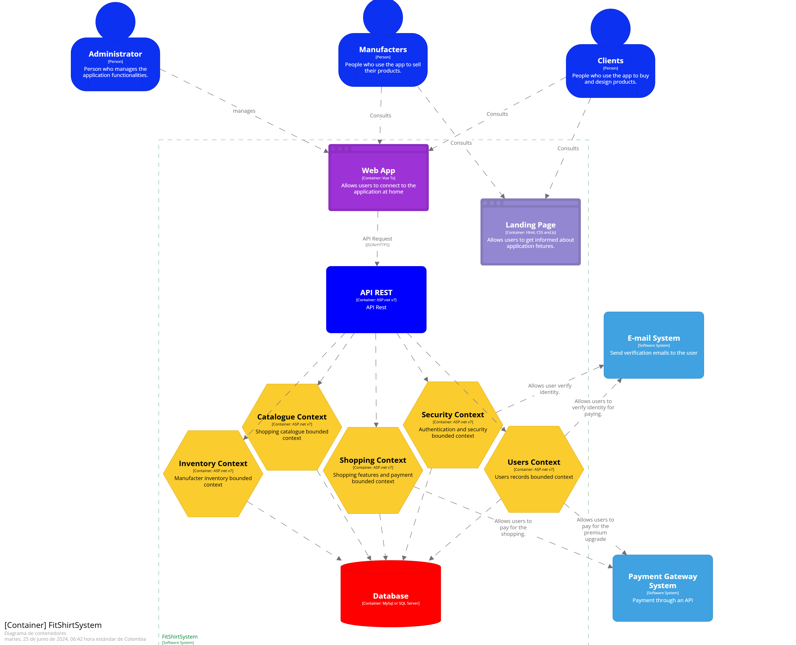
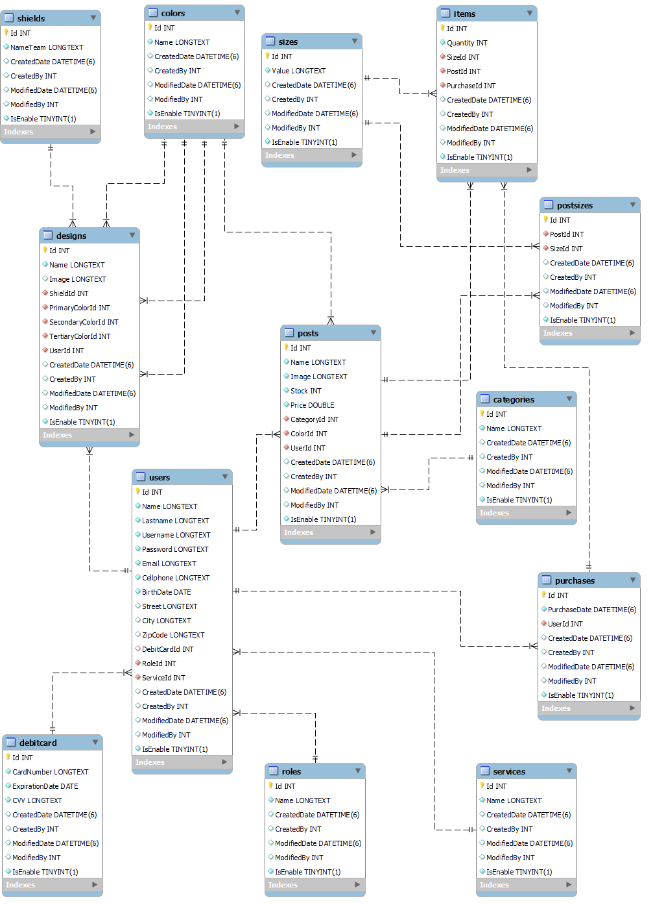
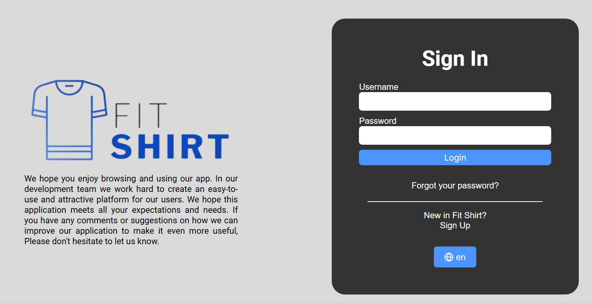
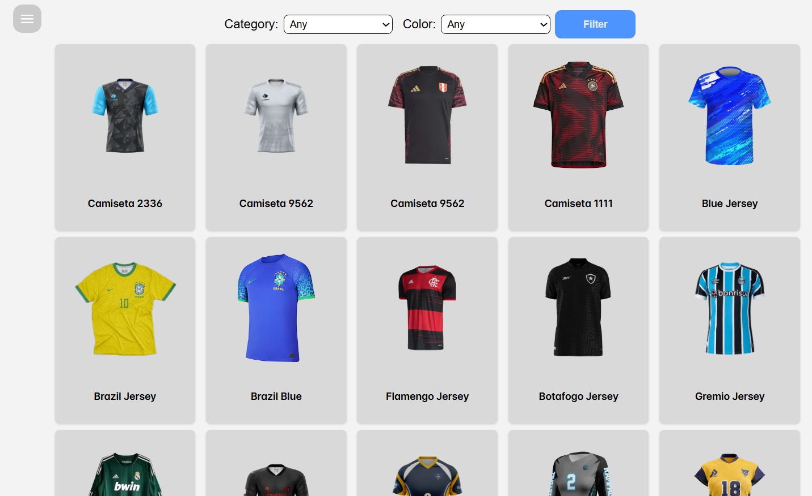
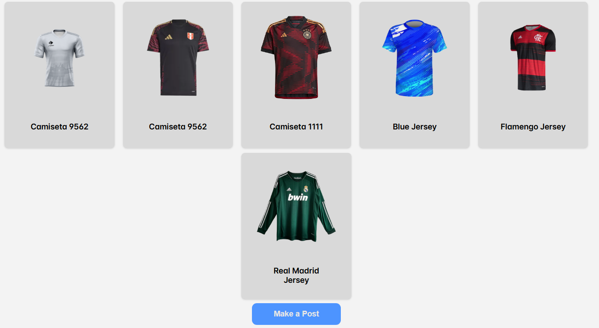
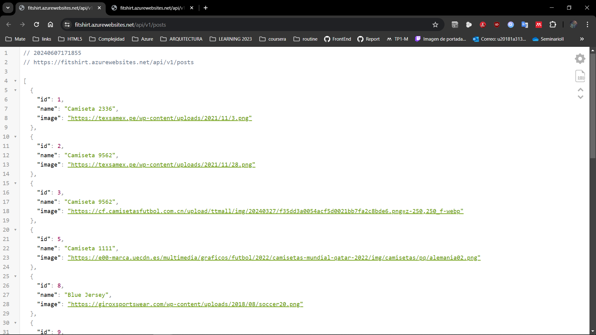
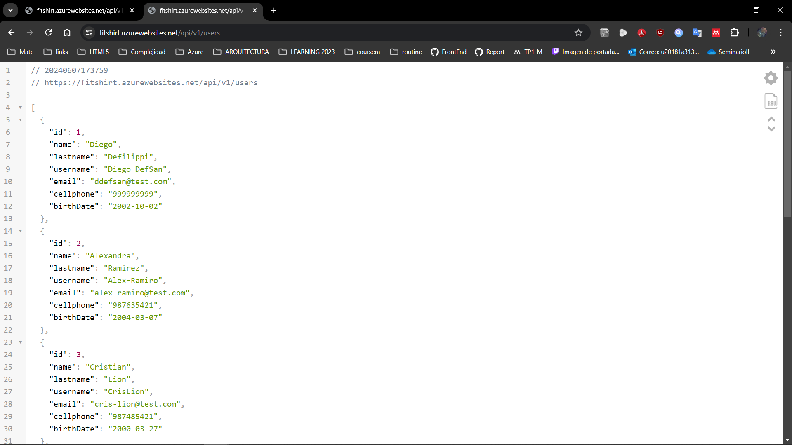
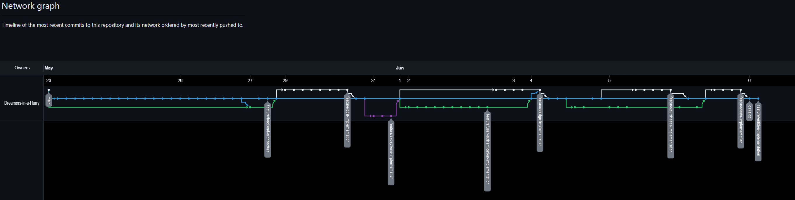
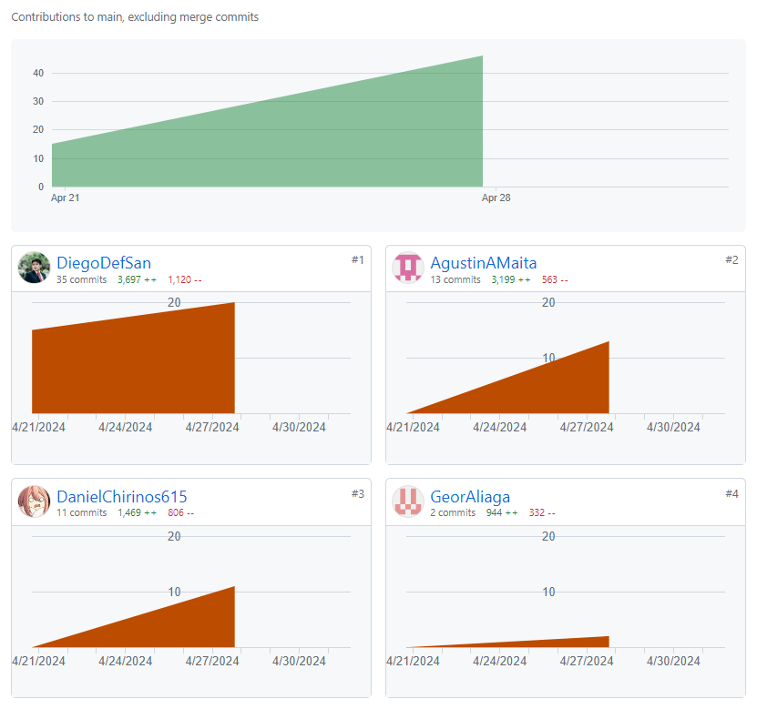

<h3 align="center"> Universidad Peruana de Ciencias Aplicadas </h3>

<h3 align="center"> Ingeniería de Software </h3>
<h3 align="center"> Ciclo 2024 - 1 </h3>

 

  

 

<h1 align="center"> TB2 Report </h1>

<h3 align="center"> Aplicaciones Web - SW53 </h3>

<h3 align="center"> Docente: Naldo Reupo-Musayón Gastulo </h3>

<h3> Startup: Dreamers in a Hurry </h3>

<h3> Product: </h3>

<h3> Team Members: </h3>

| Member                           |    Code    |
| :------------------------------- | :--------: |
| Aliaga Pimentel, George Arturo   | U20211c273 |
| Chirinos Arevalo, Daniel Rodrigo | U202019577 |
| Cruz Ticona, Aaron Alejandro     | U202213502 |
| Defilippi Santillán, Diego       | U202120448 |
| Sanchez Maita, Agustin Alejandro | U20181a313 |

<h3 align="center">Junio, 2024</h3>

  

# Registro de Versiones del Informe

| Versión |   Fecha    |              Autor               | Descripción de modificación                                                                                                                                                                                                                                                                                                                                                             |
| :-----: | :--------: | :------------------------------: | :-------------------------------------------------------------------------------------------------------------------------------------------------------------------------------------------------------------------------------------------------------------------------------------------------------------------------------------------------------------------------------------- |
|   TB1   | 12/03/2024 | Todos los integrantes del equipo | Se estableció la solución propuesta, se realizó un análisis Lean UX, se definió el segmento objetivo y se recopilaron los requisitos necesarios para desarrollar las herramientas necesarias (Personas de Usuario, Historias de Usuario, Product Backlog, Impact Mapping, entre otros). Posteriormente, se implementó y desplegó la Landing Page, que era el objetivo del primer Sprint. |
|   TP    | 02/05/2024 |    Los integrantes del equipo    | Se desarrolló el Sprint 2 del trabajo, en cual consistió en la implementación de la aplicación web empleando Vue.js como Framework principal. Asimismo, se desplegó la aplicación mediante Azure services. De igual modo, se levantaron las observaciones de la anterior entrega. |
|   TB2    | 06/06/2024 |    Los integrantes del equipo    | Se desarrolló el Sprint 3 del trabajo, en cual consistió en la implementación del backend de la aplicación web empleando ASP.NET Core Framework y utilizando C# como lenguaje de programación. Se realizaron las validation interviews y los video about the team y about the product. De igual modo, se levantaron las observaciones de la entrega anterior. |

  

# Project Report Collaboration Insights

 

# Contenido

## Tabla de Contenidos

### [Registro de versiones del informe](#registro-de-versiones-del-informe)

### [Project Report Collaboration Insights](#project-report-collaboration-insights)

### [Contenido](#contenido)

### [Student Outcome](#student-outcome-1)

### [Capítulo I: Introducción](#capc3adtulo-i-introduccic3b3n-1)

- [1.1. Startup Profile](#11-startup-profile)
  - [1.1.1. Descripción de la Startup](#111-description-de-la-startup)
  - [1.1.2. Perfiles de integrantes del equipo](#112-perfiles-de-integrantes-del-equipo)
- [1.2. Solution Profile](#12-solution-profile)
  - [1.2.1 Antecedentes y problemática](#121-antecedentes-y-problemática)
  - [1.2.2 Lean UX Process](#122-lean-ux-process)
    - [1.2.2.1. Lean UX Problem Statements](#1221-lean-ux-problem-statements)
    - [1.2.2.2. Lean UX Assumptions](#1222-lean-ux-assumptions)
    - [1.2.2.3. Lean UX Hypothesis Statements](#1223-lean-ux-hypothesis-statements)
    - [1.2.2.4. Lean UX Canvas](#1224-lean-ux-canvas)
- [1.3. Segmentos objetivo](#13-segmentos-objetivo)

### [Capítulo II: Requirements Elicitation & Analysis](#capc3adtulo-ii-requirements-elicitation--analysis-1)

- [2.1. Competidores](#21-competidores)
  - [2.1.1. Análisis competitivo](#211-análisis-competitivo)
  - [2.1.2. Estrategias y tácticas frente a competidores](#212-estrategias-y-tácticas-frente-a-competidores)
- [2.2. Entrevistas](#22-entrevistas)
  - [2.2.1. Diseño de entrevistas](#221-diseño-de-entrevistas)
  - [2.2.2. Registro de entrevistas](#222-registro-de-entrevistas)
  - [2.2.3. Análisis de entrevistas](#223-análisis-de-entrevistas)
- [2.3. Needfinding](#23-needfinding)
  - [2.3.1. User Personas](#231-user-personas)
  - [2.3.2. User Task Matrix](#232-user-task-matrix)
  - [2.3.3. User Journey Mapping](#233-user-journey-mapping)
  - [2.3.4. Empathy Mapping](#234-empathy-mapping)
  - [2.3.5. As-is Scenario Mapping](#235-as-is-scenario-mapping)
- [2.4. Ubiquitous Language](#24-ubiquitous-language)

### [Capítulo III: Requirements Specification](#capc3adtulo-iii-requirements-specification-1)

- [3.1. To-Be Scenario Mapping](#31-to-be-scenario-mapping)
- [3.2. User Stories](#32-user-stories)
- [3.3. Impact Mapping](#33-impact-mapping)
- [3.4. Product Backlog](#34-product-backlog)

### [Capítulo IV: Product Design](#capc3adtulo-iv-product-design-1)

- [4.1. Style Guidelines](#41-style-guidelines)
  - [4.1.1. General Style Guidelines](#411-general-style-guidelines)
  - [4.1.2. Web Style Guidelines](#412-web-style-guidelines)
- [4.2. Information Architecture](#42-information-architecture)
  - [4.2.1. Organization Systems](#421-organization-systems)
  - [4.2.2. Labeling Systems](#422-labeling-systems)
  - [4.2.3. SEO Tags and Meta Tags](#423-seo-tags-and-meta-tags)
  - [4.2.4. Searching Systems](#424-searching-systems)
  - [4.2.5. Navigation Systems](#425-navigation-systems)
- [4.3. Landing Page UI Design](#43-landing-page-ui-design)
  - [4.3.1. Landing Page Wireframe](#431-landing-page-wireframe)
  - [4.3.2. Landing Page Mock-up](#432-landing-page-mock-up)
- [4.4. Web Applications UX/UI Design](#44-web-applications-uxui-design)
  - [4.4.1. Web Applications Wireframes](#441-web-applications-wireframes)
  - [4.4.2. Web Applications Wireflow Diagrams](#442-web-applications-wireflow-diagrams)
  - [4.4.3. Web Applications Mock-ups](#443-web-applications-mock-ups)
  - [4.4.4. Web Applications User Flow Diagrams](#444-web-applications-user-flow-diagrams)
- [4.5. Web Applications Prototyping](#45-web-applications-prototyping)
- [4.6. Domain-Driven Software Architecture](#46-domain-driven-software-architecture)
  - [4.6.1. Software Architecture Context Diagram](#461-software-architecture-context-diagram)
  - [4.6.2. Software Architecture Container Diagrams](#462-software-architecture-container-diagrams)
  - [4.6.3. Software Architecture Components Diagrams](#463-software-architecture-components-diagrams)
- [4.7. Software Object-Oriented Design](#47-software-object-oriented-design)
  - [4.7.1. Class Diagrams](#471-class-diagrams)
  - [4.7.2. Class Dictionary](#472-class-dictionary)
- [4.8. Database Design](#48-database-design)
  - [4.8.1. Database Diagram](#481-database-diagram)

### [Capítulo V: Product Implementation, Validation & Deployment](#capc3adtulo-v-product-implementation-validation--deployment-1)

- [Registro de Versiones del Informe](#registro-de-versiones-del-informe)
- [Project Report Collaboration Insights](#project-report-collaboration-insights)
- [Contenido](#contenido)
  - [Tabla de Contenidos](#tabla-de-contenidos)
    - [Registro de versiones del informe](#registro-de-versiones-del-informe-1)
    - [Project Report Collaboration Insights](#project-report-collaboration-insights-1)
    - [Contenido](#contenido-1)
    - [Student Outcome](#student-outcome)
    - [Capítulo I: Introducción](#capítulo-i-introducción)
    - [Capítulo II: Requirements Elicitation \& Analysis](#capítulo-ii-requirements-elicitation--analysis)
    - [Capítulo III: Requirements Specification](#capítulo-iii-requirements-specification)
    - [Capítulo IV: Product Design](#capítulo-iv-product-design)
    - [Capítulo V: Product Implementation, Validation \& Deployment](#capítulo-v-product-implementation-validation--deployment)
    - [Conclusiones](#conclusiones)
    - [Bibliografía](#bibliografía)
    - [Anexos](#anexos)
- [Student Outcome](#student-outcome-1)
  - [Capítulo I: Introducción](#capítulo-i-introducción-1)
  - [1.1. StartUp Profile](#11-startup-profile)
    - [1.1.1. Description de la StartUp](#111-description-de-la-startup)
    - [1.1.2. Perfiles de integrantes del equipo](#112-perfiles-de-integrantes-del-equipo)
  - [1.2. Solution Profile](#12-solution-profile)
    - [1.2.1. Antecedentes y problemática](#121-antecedentes-y-problemática)
    - [1.2.2. Lean UX Process](#122-lean-ux-process)
      - [1.2.2.1. Lean UX Problem Statements](#1221-lean-ux-problem-statements)
      - [1.2.2.2. Lean UX Assumptions](#1222-lean-ux-assumptions)
      - [1.2.2.3. Lean UX Hypothesis Statements](#1223-lean-ux-hypothesis-statements)
      - [1.2.2.4. Lean UX Canvas](#1224-lean-ux-canvas)
- [1.3. Segmentos Objetivo](#13-segmentos-objetivo)
- [Capítulo II: Requirements Elicitation \& Analysis](#capítulo-ii-requirements-elicitation--analysis-1)
  - [2.1. Competidores](#21-competidores)
    - [2.1.1. Análisis competitivo](#211-análisis-competitivo)
    - [2.1.2. Estrategias y tácticas frente a competidores](#212-estrategias-y-tácticas-frente-a-competidores)
  - [2.2. Entrevistas](#22-entrevistas)
    - [2.2.1. Diseño de entrevistas](#221-diseño-de-entrevistas)
    - [2.2.2. Registro de entrevistas](#222-registro-de-entrevistas)
    - [2.2.3. Análisis de entrevistas](#223-análisis-de-entrevistas)
  - [2.3. Needfinding](#23-needfinding)
    - [2.3.1. User Personas](#231-user-personas)
    - [2.3.2. User Task Matrix](#232-user-task-matrix)
    - [2.3.3. User Journey Mapping](#233-user-journey-mapping)
    - [2.3.4. Empathy Mapping](#234-empathy-mapping)
    - [2.3.5. As-is Scenario Mapping](#235-as-is-scenario-mapping)
  - [2.4. Ubiquitous Language](#24-ubiquitous-language)
- [Capítulo III: Requirements Specification](#capítulo-iii-requirements-specification-1)
  - [3.1. To-Be Scenario Mapping](#31-to-be-scenario-mapping)
  - [3.2. User Stories](#32-user-stories)
  - [3.3. Impact Mapping](#33-impact-mapping)
  - [3.4. Product Backlog](#34-product-backlog)
- [Capítulo IV: Product Design](#capítulo-iv-product-design-1)
  - [4.1. Style Guidelines.](#41-style-guidelines)
    - [4.1.1. General Style Guidelines](#411-general-style-guidelines)
    - [4.1.2. Web Style Guidelines](#412-web-style-guidelines)
  - [4.2. Information Architecture](#42-information-architecture)
    - [4.2.1. Organization Systems](#421-organization-systems)
    - [4.2.2. Labeling Systems](#422-labeling-systems)
    - [4.2.3. SEO Tags and Meta Tags](#423-seo-tags-and-meta-tags)
    - [4.2.4. Searching Systems](#424-searching-systems)
    - [4.2.5. Navigation Systems](#425-navigation-systems)
  - [4.3. Landing Page UI Design](#43-landing-page-ui-design)
    - [4.3.1. Landing Page Wireframe](#431-landing-page-wireframe)
    - [4.3.2. Landing Page Mock-up](#432-landing-page-mock-up)
  - [4.4. Web Applications UX/UI Design](#44-web-applications-uxui-design)
    - [4.4.1. Web Applications Wireframes](#441-web-applications-wireframes)
    - [4.4.2. Web Applications Wireflow Diagrams](#442-web-applications-wireflow-diagrams)
    - [4.4.3. Web Applications Mock-ups](#443-web-applications-mock-ups)
    - [4.4.4. Web Applications User Flow Diagrams](#444-web-applications-user-flow-diagrams)
  - [4.5. Web Applications Prototyping](#45-web-applications-prototyping)
  - [4.6. Domain-Driven Software Architecture](#46-domain-driven-software-architecture)
    - [4.6.1. Software Architecture Context Diagram](#461-software-architecture-context-diagram)
    - [4.6.2. Software Architecture Container Diagrams](#462-software-architecture-container-diagrams)
    - [4.6.3. Software Architecture Components Diagrams](#463-software-architecture-components-diagrams)
  - [4.7. Software Object-Oriented Design](#47-software-object-oriented-design)
    - [4.7.1. Class Diagrams](#471-class-diagrams)
    - [4.7.2. Class Dictionary](#472-class-dictionary)
  - [4.8. Database Design](#48-database-design)
    - [4.8.1. Database Diagram](#481-database-diagram)
- [Capítulo V: Product Implementation, Validation \& Deployment](#capítulo-v-product-implementation-validation--deployment-1)
  - [5.1. Software Configuration Management](#51-software-configuration-management)
    - [5.1.1. Software Development Environment Configuration](#511-software-development-environment-configuration)
    - [5.1.2. Source Code Management](#512-source-code-management)
    - [5.1.3. Source Code Style Guide \& Conventions](#513-source-code-style-guide--conventions)
    - [5.1.4. Software Deployment Configuration](#514-software-deployment-configuration)
  - [5.2. Landing Page, Services \& Applications Implementation](#52-landing-page-services--applications-implementation)
    - [5.2.1. Sprint 1](#521-sprint-1)
      - [5.2.1.1. Sprint Planning 1](#5211-sprint-planning-1)
      - [5.2.1.2. Sprint Backlog 1](#5212-sprint-backlog-1)
      - [5.2.1.3. Development Evidence for Sprint Review](#5213-development-evidence-for-sprint-review)
      - [5.2.1.4. Testing Suite Evidence for Sprint Review](#5214-testing-suite-evidence-for-sprint-review)
      - [5.2.1.5. Execution Evidence for Sprint Review](#5215-execution-evidence-for-sprint-review)
      - [5.2.1.6. Services Documentation Evidence for Sprint Review](#5216-services-documentation-evidence-for-sprint-review)
      - [5.2.1.7. Software Deployment Evidence for Sprint Review](#5217-software-deployment-evidence-for-sprint-review)
      - [5.2.1.8. Team Collaboration Insights during Sprint](#5218-team-collaboration-insights-during-sprint)
    - [5.2.2. Sprint 2](#522-sprint-2)
      - [5.2.2.1. Sprint Planning 2](#5221-sprint-planning-2)
      - [5.2.2.2. Sprint Backlog 2](#5222-sprint-backlog-2)
      - [5.2.2.3. Development Evidence for Sprint Review](#5223-development-evidence-for-sprint-review)
      - [5.2.2.4. Testing Suite Evidente for Sprint Review](#5224-testing-suite-evidente-for-sprint-review)
      - [5.2.2.5. Execution Evidence for Sprint Review](#5225-execution-evidence-for-sprint-review)
  - [Catalogo](#catalogo)
  - [Descripción de la camiseta](#descripción-de-la-camiseta)
  - [Publicaciones](#publicaciones)
  - [Subir una publicación de camiseta](#subir-una-publicación-de-camiseta)
  - [Editar una publicación de camiseta](#editar-una-publicación-de-camiseta)
  - [Diseños](#diseños)
  - [Crear un diseño de camiseta](#crear-un-diseño-de-camiseta)
  - [Editar Diseño](#editar-diseño)
  - [Carrito](#carrito)
      - [5.2.2.6. Services Documentation Evidence for Sprint Review](#5226-services-documentation-evidence-for-sprint-review)
      - [5.2.2.7. Software Deployment Evidence for Sprint Review](#5227-software-deployment-evidence-for-sprint-review)
      - [5.2.2.8. Team Collaboration Insights during Sprint](#5228-team-collaboration-insights-during-sprint)
    - [5.2.3. Sprint 3](#523-sprint-3)
      - [5.2.3.1. Sprint Planning 3](#5231-sprint-planning-3)
      - [5.2.3.2. Sprint Backlog 3](#5232-sprint-backlog-3)
      - [5.2.3.3. Development Evidence for Sprint Review](#5233-development-evidence-for-sprint-review)
      - [5.2.3.4. Testing Suite Evidente for Sprint Review](#5234-testing-suite-evidente-for-sprint-review)
      - [5.2.3.5. Execution Evidence for Sprint Review](#5235-execution-evidence-for-sprint-review)
      - [5.2.3.6. Services Documentation Evidence for Sprint Review](#5236-services-documentation-evidence-for-sprint-review)
      - [5.2.3.7. Software Deployment Evidence for Sprint Review](#5237-software-deployment-evidence-for-sprint-review)
      - [5.2.3.8. Team Collaboration Insights during Sprint](#5238-team-collaboration-insights-during-sprint)
  - [5.3. Validation Interviews](#53-validation-interviews)
    - [5.3.1. Diseño de Entrevistas](#531-diseño-de-entrevistas)
    - [5.3.2. Registro de Entrevistas](#532-registro-de-entrevistas)
    - [5.3.3. Evaluaciones según heurísticas](#533-evaluaciones-según-heurísticas)
- [Evaluación Heurística de FitShirt](#evaluación-heurística-de-fitshirt)
  - [Información General](#información-general)
  - [Tareas a Evaluar](#tareas-a-evaluar)
  - [Tareas No Incluidas en Esta Versión de la Evaluación](#tareas-no-incluidas-en-esta-versión-de-la-evaluación)
  - [Escala de Severidad](#escala-de-severidad)
  - [Problemas Encontrados y Descripción Detallada](#problemas-encontrados-y-descripción-detallada)
    - [Descripción Detallada de Cada Problema](#descripción-detallada-de-cada-problema)
  - [5.4. Video About-the-Product](#54-video-about-the-product)
- [Conclusiones](#conclusiones-1)
  - [Conclusiones y recomendaciones](#conclusiones-y-recomendaciones)
- [Bibliografía](#bibliografía-1)
- [Anexos](#anexos-1)

### [Conclusiones](#conclusiones-1)

- [Conclusiones y recomendaciones](#conclusiones-y-recomendaciones)
- [Video About-the-Team](#video-about-the-team)

### [Bibliografía](#bibliografía-1)

### [Anexos](#anexos-1)

  

# Student Outcome

Participa en equipos multidisciplinarios con eficacia, eficiencia y objetividad, en el marco de un proyecto en soluciones de ingeniería de software.

Conoce al menos un sector empresarial o dominio de aplicación de soluciones de software.

<table>
<tr>
    <td><b>Criterio específico</b></td>
    <td><b>Acciones realizadas</b></td>
    <td><b>Conclusiones</b></td>
</tr>
<tr>
    <td><b>Participa en equipos multidisciplinarios con eficacia, eficiencia y objetividad, en el marco de un proyecto en soluciones de ingeniería de software.</b></td>
    <td> 
        TB1
          
        <b>Aliaga Pimentel, George Arturo </b>
         
        - Asistí a todas las reuniones, aporté ideas, elaboré los Lean UX problem statements y assumptions además de los Empathy Mapping y User Journey
           
        <b>Chirinos Arevalo, Daniel Rodrigo</b>
         
        - Realicé mis tareas asignadas en el horario correspondiente 
        - Realicé las partes importantes como el diagrama de clases, diagrama de base de datos, parte del Lean UX, user stories y aporté ideas para el trabajo. 
          
        <b>Cruz Ticona, Aaron Alejandro</b> 
        - Realice las actividades asignadas por parte de mi equipo, entre las que resalta los Information Architecture y los Segmetnos Objetivos.  
        - Participe en la formulacion inicial para la idea general del proyecto.  
          
        <b>Defilippi Santillán, Diego</b>
         
        - Participé y aporté ideas en las reuniones virtuales, además de planificar y organizar las tareas a realizar. 
        - Realicé mis tareas y las entregué en fecha. 
          
        <b>Sanchez Maita, Agustin Alejandro</b>
         
        - Elaboré los Wireframes, Mockups y Prototypes de la Aplicación Web utilizando la herramienta figma para realizar el entregable con mayor rapidez. 
        - Logré cumplir las actividades que se me asignaron haciendo uso de las herramientas aprendidas en el curso.
         
         
        TP
          
        <b>Aliaga Pimentel, George Arturo </b>
        -Participé en todas las reuniones virtuales, además de entregar las tareas en la fecha acordada grupalmente.
        -Elaboré la parte de la implementación de crear, editar y borrar diseños de camisetas en la aplicación.
         
           
        <b>Chirinos Arevalo, Daniel Rodrigo</b>
         
        - Actualicé el Diagrama de clase y base de datos.
        - Realicé mi feature posts del frontend.
          
        <b>Defilippi Santillán, Diego</b>
         
        - Participación activa en el desarrollo de la aplicación y reuniones  
        - Presentación de avances en el tiempo pactado
          
        <b>Sanchez Maita, Agustin Alejandro</b>
         
        - Actualicé los Mockups de la Aplicación y su Prototipo con el uso de la herramienta figma y con la colaboración de ideas de mis compañeros de trabajo.
        - Logré implementar las vistas que se me asignaron y aporte en el desarrollo de otras vostas y componentes.
         
         
        TB2
          
        <b>Aliaga Pimentel, George Arturo </b>
         
        - Realice las actividades asignadas por parte de mi equipo 
        - Realicé la programación del backend posts design de la aplicación 
           
        <b>Chirinos Arevalo, Daniel Rodrigo</b>
         
        - Realicé mis tareas asignadas en el horario correspondiente 
        - Realicé la programación del backend domain design de la aplicación 
          
        <b>Cruz Ticona, Aaron Alejandro</b> 
        - Fui capaz de organizarme junto a mi equipo para completar el sprint 3 
        - Apoyé en el desarrollo del backend de la aplicación 
          
        <b>Defilippi Santillán, Diego</b>
         
        - Participé y aporté ideas en las reuniones virtuales, además de planificar y organizar las tareas a realizar. 
        - Realicé mis entregables y las entregué en fecha. 
          
        <b>Sanchez Maita, Agustin Alejandro</b>
         
        - Realicé las validation interview y los resumenes correspondientes según el formato indicado.  
        - Realicé las mejoras al report y entrgables pasados.  
         
    </td>
    <td>
    TB1
     
    Se logró desarrollar y desplegar la Landing page en base a las reuniones colaborativas y proacticas que se tuvieron. Además, se consiguió implementarlo mediante la comprensión de metodología GitFlow.
      
    TP
     
    Se logró implementar y desplegar la primera versión de la aplicación web.
      
    TB2
     
    Se logró desarrollar y desplegar el FrontEnd y Backend de la aplicación.
      
    </td>
      

</tr>
<tr>
<td><b>
Conoce al menos un sector empresarial o dominio de aplicación de soluciones de software.</b></td>
    <td> 
        TB1
          
        <b>Aliaga Pimentel, George Arturo </b>
         
        - Desarrollé los style guidelines para la realización de los wireframes y posteriormente mockup de la landing page
           
        <b>Chirinos Arevalo, Daniel Rodrigo</b>
         
        -Desarrollé la hypothesis y canvas del Lean UX de acuerdo a nuestro problema.
        -Realicé el diagrama de clases y el de base de datos de acuerdo a la plataforma realizada.
        -Desarrollé algunos user stories y user personas de acuerdo a nuestros entrevistados.
          
        <b>Cruz Ticona, Aaron Alejandro</b> 
        - Desarrollo del Análisis Competitivo y las estrategias aplicables para nuestros competidores.  
          
        <b>Defilippi Santillán, Diego</b>
         
        - Desarrollo de user stories y acceptance criterias en base a los features determinados en reuniones 
        - Domain-Driven Sotfware Arquitecture en base a las conversaciones con el equipo. 
        - Guía de GitFlow para el proyecto
          
        <b>Sanchez Maita, Agustin Alejandro</b>
         
        - Al realizar los Mockups de la aplicación se tomó de referencias las interfaces de nuestros competidores, recopilando las funcionalidades más destacables para ofrecer un mejor servicio al usuario.
           
         
        TP  
        <b>Aliaga Pimentel, George Arturo </b>
         
        -Participé en todas las reuniones virtuales, además de entregar las tareas en la fecha acordada grupalmente.
        -Elaboré la parte de la implementación de crear, editar y borrar diseños de camisetas en la aplicación.
           
        <b>Chirinos Arevalo, Daniel Rodrigo</b>
         
        - Realicé mi parte de los posts para agregar, editar y eliminar los post en el frontend
          
        <b>Defilippi Santillán, Diego</b>
         
        - Implementación de la funcionalidad del catálogo de la aplicación web 
        - Implementación adecuada de los merge entre ramas
          
        <b>Sanchez Maita, Agustin Alejandro</b>
         
        - Realicé la programación de las vistas de cart, profile y login, guiándome de las plataformas y aplicaciones de nuestro entorno, recopilando las funcionalidades destacables.
         
         
        TB2
          
        <b>Aliaga Pimentel, George Arturo </b>
         
        - Realicé la implementación del domain designs 
        - Me encargué de actualizar en diseño de las vistas del frontend 
           
        <b>Chirinos Arevalo, Daniel Rodrigo</b>
         
        - Realicé la implementación del domain posts 
        - Complete las mejoras de accesibilidad del frontend 
          
        <b>Cruz Ticona, Aaron Alejandro</b> 
        - Realicé la implementación del domain user and cart 
        - Corregí y mejore las vistas del frontend de la aplicación 
          
        <b>Defilippi Santillán, Diego</b>
         
        - Realicé la implementación del domain catalogue y user authentication  
        - Implementación adecuada de los merge entre ramas 
          
        <b>Sanchez Maita, Agustin Alejandro</b>
         
        - Realicé las validation interview y los resumenes correspondientes según el formato indicado.  
        - Realicé las mejoras al report y entrgables pasados.  
         
</td>
    <td>TB1
     
    Se identificó una oportunidad de negocio a partir de una problemática actual. A partir de ello, se comenzó a desarrollar una solución de software aplicando los conocimientos aprendidos en los diferentes cursos.
      
    TP
     
    Se implementó la propuesta de solución como una primera versión de la aplicación Web, la cual cumple con los user stories propuestos.
      
    TB2
     
    Se añadió implemento el backend de la aplicación y se relacionó con el Front End. Además de añadier más funcionalidades al proyecto con el fin de resolver el problema detectado. Estas funcionalidades ayudarán a que nuestro cliente pueda cumplir con su objetivo de manera óptima.
      
    </td>
</tr>
</table>

  

## Capítulo I: Introducción

## 1.1. StartUp Profile

### 1.1.1. Description de la StartUp

**Dreamers in a Hurry** es una Startup conformada por un equipo de estudiantes de la carrera de Ingeniería de software. Somos un equipo altamente innovador, organizado y eficiente, con la capacidad de encontrar oportunidades donde muchos ven problemas. Nuestro objetivo es diseñar soluciones tecnológicas eficientes e innovadoras en base a una problemática social para mejorar la vida de los ciudadanos. Creemos que la tecnología tiene el potencial de transformar la vida de las personas, y estamos comprometidos con el desarrollo de soluciones que tengan un impacto positivo en la sociedad.

El primer proyecto de **Dreamers in a Hurry** es la aplicación **FitShirt**. Una web innovadora que permite a los usuarios comprar, vender y diseñar camisetas deportivas personalizadas, a través del contacto directo de diseñadores con clientes. Es una aplicación que busca fomentar la creatividad y el emprendimiento entre los jóvenes, a la vez que ofrece a los usuarios una experiencia personalizada y única.

**Misión de Dreamers in a Hurry**

Fomentar la creatividad y el emprendimiento a través de soluciones innovadoras que impacten positivamente en la sociedad.

**Visión de Dreamers in a Hurry**

Ser la plataforma líder en el desarrollo de soluciones tecnológicas que empoderen a las personas para que expresen su potencial creativo, emprendan sus sueños y construyan un futuro mejor.

### 1.1.2. Perfiles de integrantes del equipo

<table>
  <tr align="center">
    <td rowspan="4">
      
    </td>
    <td align="left">
      <b>Nombre y Apellido:</b>
                   
      Daniel Rodrigo Chirinos Arevalo
    </td>
  </tr>
  <tr>
    <td align="left">
    <b>Código:</b>
     
    U202019577
    </td>
  </tr>
  <tr>
    <td align="left">
    <b>Carrera:</b>
     
    Ingeniería de Software
    </td>
  </tr>
  <tr>
    <td align="left">
    <b>Acerca de:</b>
     
    Me llamo Daniel Chirinos Arevalo y soy de la carrera de Ingeniería de Software. Mi experiencia en la universidad es bastante normal y me encuentro cursando el sexto ciclo. A lo largo del tiempo, sí que tuve algunas dificultades con algunos cursos, pero logré enfrentarlos. Mi habilidad es ser líder en algunas ocasiones, trabajar con tiempo y lo más importante, ser siempre amistoso con el equipo.
    </td>
  </tr>

  </tr>
  <tr align="center">
    <td rowspan="4">
      
    </td>
    <td align="left">
      <b>Nombre y Apellido:</b>
                   
      Diego Defilippi Santillán
    </td>
  </tr>
  <tr>
    <td align="left">
    <b>Código:</b>
     
    U202120448
    </td>
  </tr>
  <tr>
    <td align="left">
    <b>Carrera:</b>
     
    Ingeniería de Software
    </td>
  </tr>
  <tr>
    <td align="left">
    <b>Acerca de:</b>
     
    Soy Diego Defilippi, tengo 21 años y tengo una gran pasión por la programación y el diseño de software. Desde hace tres años, estoy aprendiendo las diversas ramas de esta fascinante ingeniería, como el backend, frontend y data science. Además, siempre ando en búsqueda de soluciones creativas e innovadoras ante problemas cotidianos. Finalmente, me considero una persona autodidacta, organizada y con muchos ánimos de aprender. 
    </td>
  </tr>

  <tr>
  <tr align="center">
    <td rowspan="4">
      
    </td>
    <td align="left">
      <b>Nombre y Apellido:</b>
                   
      George Arturo Aliaga Pimentel
    </td>
  </tr>
  <tr>
    <td align="left">
    <b>Código:</b>
     
    U20211c273
    </td>
  </tr>
  <tr>
    <td align="left">
    <b>Carrera:</b>
     
    Ingeniería de Software
    </td>
  </tr>
  <tr>
    <td align="left">
    <b>Acerca de:</b>
     
    Me llamo George Arturo Aliaga Pimentel y soy de la carrera de Ingeniería de Software. Estoy cursando el sexto ciclo. Me considero una persona cooperativa y responsable, lo cual es lo requerido para un proyecto grupal. Tengo la meta de ser un gran ingeniero y espero mejorar todo lo aprendido en la carrera.
    </td>
  </tr>

  <tr>
  <tr align="center">
    <td rowspan="4">
      
    </td>
    <td align="left">
      <b>Nombre y Apellido:</b>
                   
      Aaron Alejandro Cruz Ticona
    </td>
  </tr>
  <tr>
    <td align="left">
    <b>Código:</b>
     
    U202213502
    </td>
  </tr>
  <tr>
    <td align="left">
    <b>Carrera:</b>
     
    Ingeniería de Software
    </td>
  </tr>
  <tr>
    <td align="left">
    <b>Acerca de:</b>
     
    Me llamo Aarón Alejandro, tengo 18 años y estoy inmerso en el quinto ciclo de la carrera de Ingeniería de Software. debido a la elecciòn de mi carrera poseo gusto por la programacion, y por ende, conocimientos acerca del diseño y elaboración de distintas estructuras de datos y el desarrollo frontend, así como el marco teórico de todo lo mencionado. En lo que respecta a mi personalidad, siempre me he caracterizado por ser una persona alegre, creativa y curiosa. Deseo apoyar a mi equipo y culminar exitosamente el presente curso.
    </td>
  </tr>

<tr>
  <tr align="center">
    <td rowspan="4">
      
    </td>
    <td align="left">
      <b>Nombre y Apellido:</b>
                   
      Agustin Alejandro Sanchez Maita
    </td>
  </tr>
  <tr>
    <td align="left">
    <b>Código:</b>
     
    U20181A313
    </td>
  </tr>
  <tr>
    <td align="left">
    <b>Carrera:</b>
     
    Ingeniería de Software
    </td>
  </tr>
  <tr>
    <td align="left">
    <b>Acerca de:</b>
     
    Me llamo Agustin, tengo 23 años y me encuentro en el septimo ciclo de la carrera de Ingeniería de Software. Considero que soy una persona responsable y que tiene ganas de trabajar en equipo con el fin de completar el presente proyecto. Espero aprender lo necesario junto a mi equipo para presentar una aplicación de calidad.
    </td>
  </tr>

</table>

## 1.2. Solution Profile

### 1.2.1. Antecedentes y problemática

Actualmente, el mercado de prendas deportivas está en constante crecimiento. Según Mordor Intelligence (2023), el valor de este alcanzará los 340 mil millones de dolares. Este crecimiento se debe a diversos factores, como el aumento de la participación en actividades deportivas, el mayor interés por la moda y la personalización, y el crecimiento del comercio electrónico.

Sin embargo, a pesar del crecimiento del mercado, existe un problema sin resolver: la falta de opciones variadas y accesibles para la compra y venta de camisetas deportivas personalizadas. Los consumidores se enfrentan a una oferta limitada, dificultad para encontrar diseños únicos, procesos tediosos y costosos, y falta de confianza en el trabajo de los diseñadores.

FitShirt se presenta como una solución innovadora a este problema. La aplicación ofrece un amplio catálogo de diseños, una herramienta de personalización intuitiva, conexión directa entre cliente y diseñador, y una plataforma accesible y segura. FitShirt tiene el potencial de revolucionar el mercado de las camisetas deportivas personalizadas, democratizando el acceso a este tipo de productos y satisfaciendo las necesidades de una amplia comunidad de usuarios.

**What?**

El problema principal radica en la escasez de alternativas para la compra y venta de camisetas deportivas personalizadas. Los usuarios se encuentran con una oferta limitada en cuanto a diseños, estilos y opciones de personalización, lo que dificulta encontrar la camiseta ideal que se ajuste a sus necesidades y preferencias.

**When?**

Este problema se presenta en dos momentos clave:

- Al momento de comprar una camiseta: La oferta en tiendas físicas y online suele ser limitada, con diseños repetitivos y poca variedad. Encontrar una camiseta que realmente represente el estilo e identidad del usuario se convierte en una tarea difícil.

- Al momento de solicitar un diseño personalizado: Existe la opción de acudir a un diseñador para crear una camiseta única, pero este proceso puede ser costoso, lento y complejo. Asimismo, no siempre es fácil encontrar un diseñador que comprenda a la perfección la visión del cliente.

**Where?**

Este problema se manifiesta principalmente en las tiendas de ropa deportiva, ya sean online o físicas; puesto que la variedad de diseños suele ser limitada, con pocas opciones para personalizar las camisetas.

**Who?**

El problema afecta a los siguientes grupos de personas:
Personas que practican deporte y desean o precisan una camiseta personalizada:

- Deportistas, aficionados, equipos, etc., que buscan una camiseta que represente su identidad y pasión por el deporte.
- Jóvenes aficionados a la colección de camisetas deportivas: Buscan diseños únicos y originales que les permitan expresar su estilo personal y diferenciarse del resto.
- Personas que venden y/o diseñan camisetas: Diseñadores talentosos con dificultades para encontrar clientes y vender sus diseños, y vendedores que no logran satisfacer la demanda de camisetas personalizadas.

**Why?**

Las causas principales del problema son:

- Falta de conexión entre cliente y diseñador: Dificultad para encontrar un diseñador que comprenda las necesidades del cliente y pueda plasmar su visión en una camiseta.
- Falta de confianza con el diseñador: Incertidumbre sobre la calidad del trabajo del diseñador, el tiempo de entrega y el precio final del producto.
- Poca oferta de lugares especializados: Limitado número de tiendas y plataformas online que ofrecen un servicio integral de diseño y confección de camisetas personalizadas.
- Falta de variedad en la oferta: Escasa disponibilidad de diseños originales y personalizados que se ajusten a diferentes gustos y estilos.

**How?**

**FitShirt** busca brindar una solución integral al problema de la falta de opciones en la compra y diseño de camisetas deportivas personalizadas. La aplicación ofrece:

- Amplio catálogo de diseños: Variedad de diseños creados por una comunidad global de artistas, permitiendo a los usuarios encontrar la camiseta ideal para su estilo y gusto.
- Herramienta de personalización: Permite a los usuarios crear sus propios diseños de forma intuitiva y sencilla, sin necesidad de conocimientos técnicos.
  Conexión directa entre cliente y diseñador: Facilita la comunicación entre ambas partes para asegurar una mejor comprensión de las necesidades del cliente y un resultado final satisfactorio.

**How much?**

Las estadísticas revelan un creciente interés por la personalización de productos, incluyendo las camisetas deportivas. Según un informe reciente de Mordor Intelligence (2023), se proyecta que el mercado de prendas deportivas alcance un valor de aproximadamente 272,51 mil millones de dólares en 2024, y se prevé que aumente hasta los 339,76 mil millones de dólares para el año 2029. Este crecimiento se espera que se produzca a una tasa compuesta anual del 4,51% durante el periodo mencionado. Asimismo, el mismo estudio indica que el cruce entre moda y deporte impulse aún más este mercado.

### 1.2.2. Lean UX Process

#### 1.2.2.1. Lean UX Problem Statements

Nuestra iniciativa, FitShirt, surge en respuesta a una necesidad insatisfecha en el mercado de prendas deportivas personalizadas. A pesar del crecimiento constante de este sector, los consumidores se enfrentan a una oferta limitada y poco variada, así como a procesos tediosos y costosos al buscar diseños únicos y personalizados. Esta falta de opciones accesibles afecta a deportistas, entusiastas de la moda deportiva y diseñadores por igual, generando una brecha en la satisfacción de las necesidades del mercado.

Enfocándonos en esta problemática, nos preguntamos: ¿Cómo podemos transformar la experiencia de compra y diseño de camisetas deportivas personalizadas, ofreciendo una plataforma integral que satisfaga las necesidades de variedad, accesibilidad y confiabilidad de los usuarios? Con FitShirt, buscamos democratizar el acceso a productos personalizados, ofreciendo un amplio catálogo de diseños, una herramienta de personalización intuitiva y una conexión directa entre cliente y diseñador, todo dentro de una plataforma segura y fácil de usar. ¿Cómo podemos asegurar que FitShirt no solo aborde las necesidades del mercado actual, sino que también revolucione la forma en que se accede y se diseña ropa deportiva personalizada?

#### 1.2.2.2. Lean UX Assumptions

 
<b>Segmento de Usuarios:</b>

    <ul>
        <li><b>¿Quién es el usuario?</b>: Nuestros usuarios son personas jóvenes y adultas de 18 a 40 años que tienen interés en el deporte y desean adquirir, vender o diseñar camisetas deportivas de manera conveniente y accesible.</li>
        <li><b>¿Dónde encaja nuestro producto? ¿En su trabajo o vida?</b>: Nuestro producto se integra directamente en la vida de los usuarios, brindando una solución eficaz y atractiva para satisfacer sus necesidades relacionadas con el deporte y la moda deportiva.</li>
        <li><b>¿Cuándo y cómo es usado nuestro producto?</b>: La aplicación será utilizada por los usuarios en su tiempo libre, ya sea para explorar nuevas camisetas deportivas, diseñar sus propios diseños o vender productos existentes.</li>
        <li><b>¿Qué problemas tiene nuestro servicio?</b>: Uno de los problemas potenciales es garantizar la retención a largo plazo de los usuarios, asegurando que sigan utilizando la aplicación para todas sus necesidades relacionadas con las camisetas deportivas.</li>
    </ul>
    
<b>Business Outcomes:</b>

    <ul>
        <li><b>Creemos que a nuestros clientes les interesaría una aplicación que les ayude a satisfacer sus necesidades de compra, venta y diseño de camisetas deportivas de manera conveniente y efectiva.</b></li>
        <li><b>Nuestro público objetivo incluye a personas de 18 a 40 años interesadas en el deporte y la moda deportiva como parte de su estilo de vida.</b></li>
        <li><b>El valor principal que nuestros clientes esperan de nuestra aplicación es una experiencia confiable, fácil de usar y gratificante que les permita encontrar, diseñar y adquirir camisetas deportivas de alta calidad.</b></li>
        <li><b>Planeamos generar ingresos a través de tarifas de intermediación por transacciones, así como posibles asociaciones con marcas deportivas y proveedores de camisetas.</b></li>
        <li><b>Reconocemos que hay competidores en el mercado, pero creemos que podemos diferenciarnos ofreciendo una experiencia de usuario superior, un diseño intuitivo y una amplia gama de opciones de diseño y compra.</b></li>
        <li><b>Estamos comprometidos a garantizar la calidad y confiabilidad de nuestra aplicación, realizando pruebas rigurosas antes del lanzamiento y manteniendo una comunicación activa con nuestros usuarios para abordar cualquier problema o inquietud que puedan surgir.</b></li>
    </ul>

#### 1.2.2.3. Lean UX Hypothesis Statements

<ol>
<li><b>Creemos que</b> existe un segmento de usuarios que estén interesados en comprar y vender sus propias camisetas deportivas. <b>Sabremos que</b> esto es cierto <b>cuando</b> observemos un aumento en la frecuencia de visita en nuestro sitio web por parte de nuestro público objetivo.</li>

<li><b>Creemos que</b> nuestro público objetivo utilizará como prioridad nuestro sitio web para la venta de sus propias camisetas. <b>Sabremos que</b> esta afirmación es cierta <b>cuando</b> los usuarios opten por pagar por el servicio premium de nuestro sitio web, el cual viene acompañado de ventajas diseñadas para satisfacer las necesidades de nuestros usuarios.</li>

<li><b>Creemos que</b>, si no proporcionamos contenido a nuestro sitio web y no priorizamos a los usuarios no premium ofreciéndoles una variedad de opciones, perderá interés nuestra plataforma. <b>Sabremos que</b> esta afirmación es correcta <b>cuando</b> observemos una reducción en el número de usuarios en la pagina.</li>

<li><b>Creemos que</b> las empresas minoristas y mayoristas les guste nuestra plataforma. <b>Sabremos que</b> esta afirmación sea correcta <b>cuando</b> observemos que dichas empresas están usando frecuentemente nuestra plataforma con el fin de vender sus productos.</li>

</ol>

#### 1.2.2.4. Lean UX Canvas

<td></td>

# 1.3. Segmentos Objetivo

<h3> Segmento #1: Empresas Mayoristas y Minoristas (Emprendedores), dirigidas al rubro del comercio de venta de ropa deportiva</h3>

<b>Aspectos demográficos:</b>

<ul>
  <li> Sexo: Masculino y Femenino </li>
  <li> Edades: Entre 18 y 55 años </li>
  <li> Nivel Socioeconómico: Clases A y B (alta y media alta) </li>
</ul>

<b>Aspectos geográficos:</b>

<ul>
  <li> Nacionalidad: Peruana </li>
  <li> Zona Geográfica de Residencia: Urbana </li>
  <li> Departamento: Lima Metropolitana </li>
</ul>

<b>Aspectos psicograficos:</b>

<ul>
  <li> Personas naturales o jurídicas que están preocupados por la naciente era digital en la actualidad, y que desean ser parte del avance. </li>
  <li> Emprendedores que ven potencial en las ventas en línea y la creciente pasión por deportes como el futbol. </li>
  <li> Empresas de venta al por mayor y menor de ropa deportiva que buscan incrementar sus ventas. </li>
</ul>

 
<h3> Segmento #2: Jóvenes y/o adultos aficionados de los deportes</h3>

<b>Aspectos demográficos:</b>

<ul>
  <li> Sexo: Masculo y Femenino </li>
  <li> Edades: Entre 18 y 40 años </li>
  <li> Nivel Socioeconómico: Clases A. B y C (Clase alta, clase media alta y clase media) </li>
</ul>

<b>Aspectos geográficos:</b>

<ul>
  <li> Nacionalidad: Peruana </li>
  <li> Zona Geográfica de Residencia: Urbana </li>
  <li> Departamento: Lima Metropolitana </li>
</ul>

<b>Aspectos psicograficos:</b>

<ul>
  <li> Jóvenes apasionados que les gusta el deporte y practican el deporte. Ya sea fútbol o baloncesto, y desean lucir la camiseta de su equipo preferido. </li>
  <li> Adultos que de la misma forma, son aficionados e incluso coleccionistas de camisetas deportivas, quienes aprecian con gran cariño por las circunstancias que aquellas camisetas puedan haber pasado. </li>
  <li> Empresas de venta al por mayor y menor de ropa deportiva que buscan incrementar sus ventas. </li>
</ul>

  

# Capítulo II: Requirements Elicitation & Analysis

## 2.1. Competidores

### 2.1.1. Análisis competitivo

|          Nombre          |                                                                                          FitShirt                                                                                           |                                                                        Mercado Libre                                                                         |                                                                                     Facebook Marketplace                                                                                      |                                                                                          Adidas                                                                                          |
| :----------------------: | :-----------------------------------------------------------------------------------------------------------------------------------------------------------------------------------------: | :----------------------------------------------------------------------------------------------------------------------------------------------------------: | :-------------------------------------------------------------------------------------------------------------------------------------------------------------------------------------------: | :--------------------------------------------------------------------------------------------------------------------------------------------------------------------------------------: |
|           Logo           |                                                                                                                                                                                             |                                                           |                                                                                       |                                                                                               |
|         Overview         |                                                 Plataforma con una interfaz intuitiva donde podrás encontrar cualquier camiseta deportiva.                                                  |                      Mercado Libre es una plataforma líder de comercio electrónico que ofrece una amplia gama de productos y servicios.                      |                                                        Plataforma de compraventa en línea integrada dentro de la red social Facebook.                                                         |                              Adidas es una empresa multinacional alemana de ropa, calzado y accesorios deportivos, reconocida a nivel mundial por su marca.                              |
|   Ventaja Competitiva    |                                              Buscamos especializarnos en la venta y compra exclusiva de camisetas con diseños personalizables.                                              |         Dentro del área del comercio electrónico, la popularidad de mercado libre lo convierte en una popular herramienta para intercambiar bienes.          | Su ventaja radica en su enorme base de usuarios activos en Facebook, lo que le proporciona una amplia audiencia para los vendedores y facilita la búsqueda de productos para los compradores. |                               La ventaja está en la marca, en la tecnología innovadora en sus productos, y las colaboraciones con celebridades deportivas.                               |
|     Mercado Objetivo     |                                             Jóvenes, adultos y empresas que se encuentran involucradas con el comercio de camisetas deportivas.                                             |                                    Consumidores y vendedores en Perú, abarcando la mayoría de los segmentos demográficos.                                    |                                                          Se dirige a usuarios de Facebook interesados en comprar y vender productos.                                                          |                                                       Se dirige a consumidores interesados en la moda y el rendimiento deportivo.                                                        |
| Estrategias de Marketing |                                     Deseamos enfocarnos en publicidad dentro de redes sociales y campañas en eventos deportivos de relevancia en Perú.                                      |      Utiliza publicidad en línea, alianzas estratégicas y campañas promocionales para aumentar su visibilidad y atraer a nuevos usuarios y vendedores.       |                      Utiliza la plataforma de Facebook para promocionar el Marketplace, además de colaboraciones con vendedores destacados para aumentar la visibilidad.                      |                                   Utiliza estrategias de marketing global, entre las que resaltan los patrocinios de eventos deportivos y culturales.                                    |
|  Productos y Servicios   |                                             Ofrece productos personalizados de camisetas deportivas de diferentes equipos, deportes y sectores.                                             |               Ofrece productos electrónicos hasta de consumo, así como servicios de logística, pagos en línea y herramientas para vendedores.                |                                      Ofrece artículos de segunda mano hasta productos nuevos, así como servicios locales como alquileres, clases y más.                                       |                    Ofrece una amplia gama de productos, incluyendo calzado deportivo, ropa, accesorios y equipos para una variedad de deportes y actividades físicas.                    |
|     Precios y Costos     |                      Dentro de la plataforma se basa en la venta de camisetas que diversos proveedores podrán compartir, lo que el precio dependerá de cada proveedor.                      |         Al ser una plataforma que permite ventas de diversos productos, no existe ningún precio predeterminado al momento de realizar transacciones.         |                                 Del mismo modo que Mercado Libre, en Facebook Marketplace, no existe un precio definido para todos los productos que ofrecen.                                 |                 Adidas, dentro de su línea de camisetas ofrece distintos precios que varían entre los 30 dólares a 100 dólares, dependiendo del diseño, colección, etc.                  |
| Canales de Distribución  |                     Nuestro canal de distribución será la interfaz web, así como la presencia en redes sociales, con el objetivo de llegar a nuestro segmento objetivo.                     |               A través de su plataforma digital, garantizando una experiencia de compra segura y conveniente para sus usuarios.transacciones.                |                                        Su principal canal es a través de la plataforma de Facebook, garantizando una experiencia de compra integrada.                                         |                           Distribuye sus productos a través de tiendas minoristas propias, tiendas en línea, distribuidores autorizados y socios comerciales.                            |
|        Fortalezas        |           FitShirt es la única empresa la cual podrá permitir a los clientes, solicitar un posible diseño no producido anteriormente, lo que genera exclusividad y originalidad.            |                           Cuenta con tecnología avanzada, una sólida red de usuarios y una amplia oferta de productos y servicios.                           |                               Su principal fortaleza es la base de usuarios masiva y su integración con la red social Facebook, además de su facilidad de uso.                                |                              Adidas es una marca icónica, productos de alta calidad, innovación tecnológica en sus productos y envidiable presencia global.                              |
|       Debilidades        |       Al ser una plataforma nueva dentro de un mercado renovado gracias a la digitalización, puede significar una debilidad la falta de respaldo económico frente a un posible éxito.       |                        Puede enfrentar desafíos como la competencia intensa en el mercado digital y posibles limitaciones logísticas.                        |              Puede enfrentar desafíos relacionados con la competencia de otras plataformas de compraventa en línea y la gestión de la calidad de los productos y transacciones.               | Puede enfrentar desafíos relacionados con la competencia en la industria del deporte y la moda, así como fluctuaciones en las tendencias de consumo y cambios en la demanda del mercado. |
|      Oportunidades       | El incremente del comercio electrónico en la última década en nuestro país, representa una oportunidad para comerciar prendas deportivas, las cuales incrementan su demanda constantemente. | Tiene oportunidades de crecimiento en el mercado peruano debido al aumento del comercio electrónico y los cambios en los hábitos de consumo de los usuarios. |                             Debido a su base de usuarios activos, y la posibilidad de expandir sus servicios a nivel global representan una oportunidad latente.                              |                      Principalmente existen oportunidades de expansión, debido al desarrollo de productos innovadores y enfoque en la venta directa al consumidor.                       |
|         Amenazas         | Debido al reciente nacimiento de la plataforma, la desconfianza que nacería a partir del desconocimiento del público sobre nuestra plataforma podría impedir el uso de nuestra plataforma.  |           Las amenazas incluyen la competencia fuerte de otras plataformas, cambios en la regulación gubernamental y posibles impactos económicos.           |                   Principalmente existe amenazas debido a lo sencillo que pueden expresarse las estafas, además que la competencia es intensa en el mercado de compraventa.                   |                                Cambios en las preferencias de los consumidores hacia marcas competidoras, incluyendo gigantes en la industria como Nike.                                 |

### 2.1.2. Estrategias y tácticas frente a competidores

En base a lo mencionado por Porter (1985). Se entiende por estrategia o táctica competitiva aquella acción que supone una acción ofensiva y/o defensiva con el objetivo de crear una posición favorable frente a las cinco fuerzas competitivas, de tal modo, obtener un resultado superior al promedio de las empresas competidoras en tu sector. Es decir, que buscaremos establecer una posición provechosa para potenciar y confrontar la competencia mediante el analisis FODA. Por lo que, plantearemos las siguientes estrategias competitivas:

<b>Estrategia de posicionamiento: FitShirt promoverá la originalidad y exclusividad</b>

Ademas de buscar que la plataforma sea intuituiva y la busqueda sea una tarea divertida para los usuarios. Con FitShirt buscamos posicionarnos como la plataforma que comercia camisetas exclusivas y de calidad. El hecho de que el cliente pueda solicitar una camiseta personalizable promueve la originalidad, de manera que, bajo estos dos terminos, existe la opotunidad de establecernos sobre otras marcas, enfocandonos en lo que realmente el cliente desea.

<b>Estrategia de alcance al usuario: FitShirt sera publicitado en los principales medios del público objetivo</b>

Los deportes, en especial, el fútbol y el baloncesto, tienen una de las mayores audiencias al rededor del pais y el mundo. Generar publicidad hacia este mercado y en base a los conceptos manejados en nuestra estrategia de posicionamiento, podemos publicitarnos tanto en eventos nacionales deportivos, como culturales con el eslogan de obtener originalidad y exclusividad. Asi como la presencia en redes sociales, la cual es consumida en abundacia por nuestro público objetivo.

## 2.2. Entrevistas

### 2.2.1. Diseño de entrevistas

Se han establecido algunas preguntas dirigidas a nuestro grupo objetivo con el fin de recolectar información cualitativa, como opiniones o descripciones. Esta información será muy útil en la creación de nuestra solución.

**Preguntas generales:**

- ¿Cuál es su nombre completo?

- ¿Cuántos años tienes?
- ¿Cuál es tu género?
- ¿Cuál es su estado civil?
- ¿En qué ciudad y distrito reside?
- ¿A qué te dedicas? ¿Trabajas? ¿Estudias?

**Preguntas segmento 1: Deportistas**

Hábitos del cliente

- ¿Qué te motiva a comprar una nueva camiseta deportiva?

- ¿Para qué actividades usas las camisetas deportivas que compras?

- ¿Con qué frecuencia compras ropa deportiva?

Características que busca el cliente

- ¿Qué tipo de camiseta deportiva compras con mayor frecuencia (football, volleyball, basketball…)?

- ¿Tienes en cuenta la marca de la ropa a la hora de comprar?

- ¿Sueles comprar camisetas deportivas originales o replicas?

- ¿Qué características son más importantes para ti al elegir una camiseta deportiva?

- ¿Cuánto es el promedio que inviertes en la compra de una camiseta?

- ¿Cuál es su proceso de búsqueda de una camiseta deportiva? (mediante tienda virtual, tienda física, redes sociales, etc)

Sobre camiseta personalizada

- ¿Alguna vez has solicitado una camiseta personalizada? Si es el caso:

  - ¿Qué te motivó a comprar una camiseta personalizada?
  - ¿Cómo fue el proceso para la personalización de la camiseta?
  - ¿Qué tan satisfecho quedaste con el resultado final?
  - ¿Qué aspectos mejorarías de la experiencia?

- ¿Qué características de una camiseta te gustaría poder personalizar?
- ¿Qué te gustaría que las marcas de ropa deportiva ofrecieran en cuanto a personalización de camisetas?
- ¿De cuánto es el presupuesto que estás dispuesto a invertir en una camiseta deportiva personalizada?

Sobre una posible aplicación

- ¿Qué le parece la idea de una aplicación donde pueda encontrar una gran variedad de camisetas personalizadas mediante un catálogo virtual?

- ¿Le gustaría personalizar una camiseta deportiva desde una aplicación web y que esta sea confeccionada?
  ¿Le agradaría la posibilidad de facturar por el diseño de la misma?

**Preguntas segmento 2: Comerciantes**

Sobre la experiencia del comerciante

- ¿Cuánto tiempo lleva en el mercado de camisetas deportivas?

- ¿Cuál es el precio promedio de venta de camisetas?
- ¿Qué tipo de camisetas son las más buscadas en el mercado actual (football, volleyball, basketball…)?
- En su experiencia, ¿qué características poseen las camisetas que son más vendidas?
- ¿Con qué frecuencia vende las camisetas deportivas?

Más a detalle sobre su experiencia

- ¿Cuáles han sido los mayores desafíos que has enfrentado como comerciante de camisetas deportivas?

- ¿Qué aspectos consideras que son más importantes para tener éxito en este mercado?

Sobre la venta online

- ¿Tiene experiencia en la venta de camisetas en tiendas virtuales?

- ¿Qué estrategias emplea para dar a conocer su trabajo a demás personas?

Sobre las camisetas personalizadas

- ¿Tienes experiencia en la confección de camisetas deportivas con un diseño propio?

  - ¿Cuál fue el motivo de la confección?
  - ¿Cómo fue el proceso de la confección?
  - ¿Qué aspectos mejoraría de la experiencia?

Sobre una posible aplicación

- ¿Qué le parece la idea de una aplicación donde pueda vender camisetas deportivas?

- ¿Le agradaría la idea de promocionar sus confecciones mediante una aplicación?
- ¿Estaría dispuesto a confeccionar camisetas en base al diseño de otro usuario?

**En este apartado, se le cuenta al entrevistado la idea de “FitShirt”, sus características, sus principales funciones y a quiénes va dirigido.**

**Preguntas sobre la idea del proyecto:**

- ¿Qué te parece la propuesta de FitShirt para la compra y venta de camisetas personalizadas
- ¿Cuál es el aspecto que más le llama la atención?

- ¿Qué otras características le gustaría que tuviera la aplicación?
- ¿Recomendarías nuestra aplicación a otras personas cuando sea lanzada?

### 2.2.2. Registro de entrevistas

<b>Segmento objetivo 1:</b> Comerciantes

<b>Entrevista 1</b> 

- Nombre: Deyvid Joseph
- Apellidos: Guevara Cueva
- Edad: 21 años
- Distrito: San Miguel
- Link de la entrevista: <a href="https://upcedupe-my.sharepoint.com/:v:/g/personal/u202120448_upc_edu_pe/EYhQ66d0gQNCj9N8qQ8yl4kBvCAMhFk-xMe03zl7D6iJHA?e=T9d0OL ">Entrevista</a>
- Duración: 15 minutos

Evidencia de la reunión:

    

Resumen de la entrevista:

Se entrevistó a Deyvid Guevara, un joven de 21 años quien vive en el distrito de San Miguel.

Indica que se encuentra un año en el ámbito de venta de camisetas, y en su experiencia, resalta aspectos importantes. Afirma que el precio de las camisetas suele variar por varios factores, como el material, la talla, la demanda o algún evento actual como el mundial, pero generalmente el precio oscila entre 50 y 70 nuevos soles. También indica que las camisetas más demandadas son las de fútbol, en especial las de la selección peruana. Además, la frecuencia de venta depende, mayormente, del contexto, como un evento deportivo.

Al momento de indagar más sobre su experiencia, señala que los dos desafíos a afrontar son el capital a invertir y la cuantiosa competencia en el mercado actual. Sin embargo, afirma que teniendo una buena estrategia de negocio se puede llegar a más personas y tener un público sólido. Una de las estrategias que empleó fue la venta online mediante WhatsApp e Instagram, lo cual afirma que aumentó significativamente sus ventas. Sin embargo, uno de los problemas es la poca versatilidad de estos medios, lo que conllevó que a veces no concretase alguna venta.

El entrevistador confirma que tiene experiencia en la confección de camisetas con diseño personalizado. Indica que el proceso consiste en comunicarse primero con el cliente, que le envía el diseño y se encarga de confeccionarlo a su gusto. No obstante, insiste que el problema más recurrente es el medio de comunicación, pues le toma mucho tiempo responder mensajes y a veces no se muestra el catálogo completo.

Al preguntarle sobre una posible aplicación de compra, venta y personalización de camisetas, se mostró bastante encantado, incluso dijo que tenía pensado implementar una página web para su propia empresa. Señala que esta aplicación le ayudaría bastante, pues podría responderle a los clientes con mayor rapidez, promocionaría sus productos fácilmente y también los mismos usuarios podrían usar la app como herramienta para hacer el diseño.

Luego de describir la propuesta de FitShirt, indicó que es una muy buena idea de negocio y el aspecto que más le gusta es el de poder diseñar tu camiseta a través de la aplicación y que los confeccionistas puedan vender aquel diseño para atraer a un público que desee una camiseta “fuera de lo convencional”. Finalmente, menciona que recomendaría esta aplicación a más personas, sobretodo a sus propios clientes.

 

<b>Entrevista 2</b> 

- Nombre: Luis
- Apellidos: Pelaez
- Edad: 23 años
- Distrito: San Isidro
- Link de la entrevista: <a href="https://upcedupe-my.sharepoint.com/:v:/g/personal/u20181a313_upc_edu_pe/ETBdgHxXrqNNl4wj1-FoUUwBmmt8Xdha5DYI7IYT_RD4mA?e=NNS8iH&nav=eyJyZWZlcnJhbEluZm8iOnsicmVmZXJyYWxBcHAiOiJTdHJlYW1XZWJBcHAiLCJyZWZlcnJhbFZpZXciOiJTaGFyZURpYWxvZy1MaW5rIiwicmVmZXJyYWxBcHBQbGF0Zm9ybSI6IldlYiIsInJlZmVycmFsTW9kZSI6InZpZXcifX0%3D ">Entrevista</a>
- Duración: 7 minutos

Evidencia de la reunión:

    

Resumen de la entrevista:

Luis nos comentó que empezó a trabajar en la venta de camisetas hace unos 2 o 3 años, ya que detectó que es algo popular en Perú, y comenzaron importando camisetas deportivas desde el extranjero. Nos cuenta que la cantidad de camisetas y el precio de las mismas dependen de la temporada actual, lo cual está relacionado con los eventos deportivos actuales o el cambio de indumentaria oficial de alguna selección conocida; en su mayoría trabaja con ropa deportiva de fútbol. Nos expresó que un momento difícil para su emprendimiento fue durante la pandemia, ya que las personas evitaban comprar cosas innecesarias al inicio de esta. Los pedidos de camisetas los realizan por internet y para promocionar su producto utilizan redes sociales como Instagram, en la que pagan por publicidad. En relación a la aplicación que le presentamos, considera que es una buena idea para aquellos negocios que no son grandes o que venden productos oficiales. En cuanto a la confección, considera que no es tarea fácil y no sabe cuán rentable sería realizarla si no es al por mayor, pero no le tiene miedo al desafío de la confección. Nos dijo que una buena funcionalidad de la aplicación sería que le brinde información estratégica para incrementar sus ventas, como un dashboard o tendencias de compras de las personas.

 

 

<b>Entrevista 3</b> 

- Nombre: Fabrizzio
- Apellidos: Cornejo
- Edad: 23 años
- Distrito: San Juan de Miraflores
- Link de la entrevista: <a href="https://upcedupe-my.sharepoint.com/:v:/g/personal/u202213502_upc_edu_pe/EWxr78YTglJNplgnC44eEs0BwlZFUKIavUdf0UdOMoKe7w?nav=eyJyZWZlcnJhbEluZm8iOnsicmVmZXJyYWxBcHAiOiJPbmVEcml2ZUZvckJ1c2luZXNzIiwicmVmZXJyYWxBcHBQbGF0Zm9ybSI6IldlYiIsInJlZmVycmFsTW9kZSI6InZpZXciLCJyZWZlcnJhbFZpZXciOiJNeUZpbGVzTGlua0NvcHkifX0&e=7Tkag2">Entrevista</a>
- Duración: 9 minutos

Evidencia de la reunión:

    

Resumen de la entrevista:

Fabrizzio nos cuenta que lleva trabajando como vendedor de ropa deportiva desde el 2021, a pesar de trabaje y estudie al dia de hoy, reconoce que gran parte de la sustentabilidad de su trabajo se debe a las redes sociales y su influencia para poder crecer. De la misma forma, nos comenta que las camisetas suele tener precios variados que van a partir de 40 soles para arriba, siendo el promedio de precios el más vendido, debido al favor precio-calidad. Referente a la confección, nos comenta que el trabaja en compañia de su pariente maternal, quien se encarga de la confección, lo cual simboliza un cliente potencial espectacular para nuestra empresa. En adición, Fabrizzio nos menciona que la confianza con el cliente es la base del negocio, por lo que nos recomiendo enfocar la seguridad dentro de nuestra plataforma.

 

<b>Segmento objetivo 2:</b> Clientes

<b>Entrevista 1</b> 

- Nombre: Salvador Hugo
- Apellidos: Roncero Zarancilla
- Edad: 21 años
- Distrito: Lima
- Link de la entrevista: <a href="https://upcedupe-my.sharepoint.com/:v:/g/personal/u202019577_upc_edu_pe/EQlOdKvoDfxEjpp4CNfofcMBBhyuYqFcGxFuPPgIXbFd1w?nav=eyJyZWZlcnJhbEluZm8iOnsicmVmZXJyYWxBcHAiOiJTdHJlYW1XZWJBcHAiLCJyZWZlcnJhbFZpZXciOiJTaGFyZURpYWxvZy1MaW5rIiwicmVmZXJyYWxBcHBQbGF0Zm9ybSI6IldlYiIsInJlZmVycmFsTW9kZSI6InZpZXcifX0%3D&e=bb429a" >Entrevista</a>
- Duración: 16:18 minutos

Evidencia de la reunión:

    

Resumen de la entrevista:

Salvador nos comenta que su motivación de las camisetas es la calidad de tela, los colores y la combinación de estilos que sacan las marcas deportivas. Considera que el factor más importante en las camisetas son los colores. Para el es importante de que las camisetas sean sueltas, transpirables y que tengan flexibilidad. Le gustaría que las camisetas tengan una mejor previsualización a la hora de comprar. Tambien le parece buena la idea de personalizar su propia camiseta y facturar de la misma a otros clientes.

 

<b>Entrevista 2</b> 

- Nombre: Miguel
- Apellidos: Rodríguez
- Edad: 22 años
- Distrito: Surco
- Link de la entrevista: <a href="https://upcedupe-my.sharepoint.com/:v:/g/personal/u20181a313_upc_edu_pe/EQ0Fc7mvvIJPnvX-IJE6FEQB5318KeW378412mZRRRVpGg?e=w8gigt&nav=eyJyZWZlcnJhbEluZm8iOnsicmVmZXJyYWxBcHAiOiJTdHJlYW1XZWJBcHAiLCJyZWZlcnJhbFZpZXciOiJTaGFyZURpYWxvZy1MaW5rIiwicmVmZXJyYWxBcHBQbGF0Zm9ybSI6IldlYiIsInJlZmVycmFsTW9kZSI6InZpZXcifX0%3D ">Entrevista</a>
- Duración: 4 minutos

Evidencia de la reunión:

    

Resumen de la entrevista:

Miguel nos comentó que cuando compra una camiseta deportiva, lo motiva que sea original; considera que este factor es importante además de que sea del equipo que le gusta. La mayoría de las camisetas que ha adquirido son de fútbol, pero también está interesado en comprar camisetas de béisbol. No las compra con mucha frecuencia, pero cada mes se da el gusto de comprarse una. Si le resulta difícil conseguir una camiseta original, usualmente espera a que baje su precio o adquiere una réplica a un precio más cómodo. En cuanto a la calidad del producto, considera que debe tener un color agradable, ser cómodo al tacto y fresca. Realiza sus compras por internet y realiza el pago por PayPal o con tarjetas de crédito. Nos dijo que un precio razonable para una camiseta deportiva podría rondar los 50 dólares.

 

<b>Entrevista 3</b> 

- Nombre: Henry
- Apellidos: Aguila Cortes
- Edad: 21 años
- Distrito: Carabayllo
- Link de la entrevista: <a href="https://upcedupe-my.sharepoint.com/:v:/g/personal/u20211c273_upc_edu_pe/EdaoYwxN2kpIneZ7rP1bXOwBLwDZzNwZTjvOjp8bph9CjA?e=4RDLZf&nav=eyJyZWZlcnJhbEluZm8iOnsicmVmZXJyYWxBcHAiOiJTdHJlYW1XZWJBcHAiLCJyZWZlcnJhbFZpZXciOiJTaGFyZURpYWxvZy1MaW5rIiwicmVmZXJyYWxBcHBQbGF0Zm9ybSI6IldlYiIsInJlZmVycmFsTW9kZSI6InZpZXcifX0%3D">Entrevista</a>
- Duración: 14:32 minutos

Evidencia de la reunión:

    

Resumen de la entrevista:

Henry mostró un fuerte interés en camisetas deportivas, especialmente las relacionadas con el fútbol. Su motivación para comprar camisetas radica en el diseño, la calidad y su lealtad hacia su equipo favorito. Utiliza las camisetas principalmente para jugar partidos de fútbol y compra nuevas aproximadamente cada cuatro a cinco meses, mostrando un alto grado de compromiso con su pasión deportiva. Henry prefiere camisetas originales pero también considera réplicas si el precio es más accesible. Ha solicitado camisetas personalizadas en el pasado y se muestra dispuesto a invertir entre 200 a 250 soles en una camiseta personalizada. Se mostró entusiasmado con la idea de una aplicación como FitShirt, donde podría encontrar una variedad de camisetas personalizadas a través de un catálogo virtual. En resumen, Henry representa un potencial cliente para FitShirt, ya que muestra un fuerte interés en camisetas deportivas, valora la calidad y la personalización, y está abierto a nuevas opciones de compra a través de plataformas digitales.

### 2.2.3. Análisis de entrevistas

Análisis de las entrevistas del sector Comerciantes:

- Importancia de la calidad de las camisetas. Algodón, poliéster, dri-fit, etc. Influyen en la transpirabilidad, comodidad y durabilidad.
- Demanda de camisetas de fútbol, especialmente de la selección peruana. El fútbol es un deporte que une al país y las camisetas son una forma de expresar orgullo.
- Desafíos: capital, competencia, comunicación con clientes.
- Estrategias: venta online, redes sociales, personalización.
- Buena acogida a la propuesta de FitShirt.
- Sugerencias: información estratégica, mejor previsualización, confección a pequeña escala.

Análisis de las entrevistas del sector Clientes:

- Motivación: La motivación para comprar camisetas varía según el entrevistado. Salvador busca calidad y comodidad, mientras que Miguel y Henry buscan originalidad y equipo favorito. (Obtenido de las entrevistas 1, 2 y 3).
- Factores importantes: Los factores más importantes en las camisetas también varían. Salvador prioriza la calidad de la tela, mientras que Miguel y Henry se enfocan en el diseño y la originalidad. (Obtenido de las entrevistas 1, 2 y 3).
- Frecuencia de compra: La frecuencia de compra también varía. Miguel compra una camiseta al mes, mientras que Henry compra cada 4-5 meses. (Obtenido de las entrevistas 2 y 3).
- Precio: El precio que los entrevistados consideran razonable también varía. Miguel menciona $50, mientras que Henry está dispuesto a pagar S/.200-250 por una camiseta personalizada. (Obtenido de las entrevistas 2 y 3).
- Canales de compra: Miguel compra por internet, mientras que Henry no menciona su canal de compra preferido. (Obtenido de las entrevistas 2 y 3).
- Personalización: Salvador y Henry están abiertos a la idea de personalizar camisetas. Henry incluso ha solicitado personalizaciones en el pasado. (Obtenido de las entrevistas 1 y 3).
- Opinión sobre FitShirt: Solo Henry expresa una opinión sobre FitShirt, mostrándose entusiasmado con la idea. (Obtenido de la entrevista 3).

## 2.3. Needfinding

### 2.3.1. User Personas

**User persona de Comerciante :**

    

**User persona de Cliente :**

    

### 2.3.2. User Task Matrix

**User Task Matrix de Comerciante :**

    

**User Task Matrix de Cliente :**

    

### 2.3.3. User Journey Mapping

    

### 2.3.4. Empathy Mapping

<b>Persona interesada en comprar camisetas deportivas:</b>

    

<b>Persona interesada en vender camisetas deportivas:</b>

    

### 2.3.5. As-is Scenario Mapping

Usuario:

  

Confeccionista:

  

## 2.4. Ubiquitous Language

 

Inventory: El stock de camisetas disponibles para la venta en la aplicación.

Customer: Personas que navegan y potencialmente compran camisetas a través de la aplicación.

Order: Una solicitud realizada por un cliente para comprar una o varias camisetas.

Shopping Cart: Una colección temporal de camisetas elegidas por el cliente para su posible compra.

Checkout: La transferencia de fondos del cliente a la aplicación a cambio de las camisetas compradas.

Payment: El proceso de entrega de las camisetas compradas a la dirección especificada por el cliente.

Discount: Una reducción en el precio de una camiseta, generalmente ofrecida a través de promociones o ofertas especiales.

Notification: Mensajes enviados al cliente para proporcionar actualizaciones sobre sus pedidos, como confirmación del pedido, estado de envío, etc.

Customer Support: Asistencia proporcionada a los clientes con respecto a consultas, problemas o solicitudes relacionadas con sus pedidos.

Product: Las camisetas deportivas disponibles para la venta en la aplicación.

Review: Opinión proporcionada por los clientes sobre las camisetas o su experiencia de compra. 

# Capítulo III: Requirements Specification

## 3.1. To-Be Scenario Mapping

Usuario:

  

Confeccionista:

  

## 3.2. User Stories

<table align="center"     border="1" width="90%" style="text-align:center;">
    <tr align="left">
        <td colspan=2>
            <b>Epic</b>
        </td>
        <td colspan=2>
            Gestión de cuenta del usuario
        </td>
    </tr>
    <tr align="left">
        <td>
            <b>ID-US</b>
        </td>
        <td>
            01
        </td>
        <td>
            <b>Owner</b>
        </td>
        <td>
          Daniel Chirinos
        </td>
    </tr>
        <tr align="left">
        <td colspan=2>
            <b>Título US</b>
        </td>
        <td colspan=2>
            Creación de cuenta
        </td>
    </tr>
    <tr align="left">
        <td colspan=4>
            <b>Descripción:</b> 
            Como usuario, quiero crear una cuenta en la aplicación para acceder a las funcionalidades.
        </td>
    </tr>
    <tr align="left">
        <td colspan=4>
            <b>Criterio de Aceptación:</b>
             

<b>Scenario 1:</b> Registro exitoso  
Dado que el cliente quiere registrarse en la plataforma  
Cuando el cliente ingresa un correo electrónico válido y una contraseña segura  
Entonces el sistema procesará el registro  
Y creará una cuenta en la aplicación.  

<b>Scenario 2:</b> Correo electrónico en uso  
Dado que el cliente quiere registrarse en la plataforma  
Cuando el cliente ingresa un correo electrónico que ya está en uso  
Entonces el sistema no permitirá que el usuario complete el registro  
Y mostrará un mensaje de error indicando que ese correo ya ha sido registrado.  

<b>Scenario 3:</b> Contraseña no segura  
Dado que el cliente quiere registrarse en la plataforma  
Cuando el cliente ingrese una contraseña inválida  
Entonces el sistema no permitirá que el usuario complete el registro  
Y mostrará un mensaje de error indicando que el correo es muy poco seguro.  

 </td>
</tr>
</tr>
</table>
 

<table align="center"     border="1" width="90%" style="text-align:center;">
    <tr align="left">
        <td colspan=2>
            <b>Epic</b>
        </td>
        <td colspan=2>
            Gestión de cuenta del usuario
        </td>
    </tr>
    <tr align="left">
       <td>
            <b>ID-US</b>
        </td>
        <td>
            02
        </td>
        <td>
            <b>Owner</b>
        </td>
        <td>
          Daniel Chirinos
        </td>
    </tr>
        <tr align="left">
        <td colspan=2>
            <b>Título US</b>
        </td>
        <td colspan=2>
            Inicio de sesión
        </td>
    </tr>
    <tr align="left">
        <td colspan=4>
            <b>Descripción:</b> 
Como usuario, quiero iniciar sesión con mi correo y contraseña para un acceso seguro.
        </td>
    </tr>
    <tr align="left">
        <td colspan=4>
            <b>Criterio de Aceptación:</b>
             

<b>Scenario 1:</b> Inicio de sesión exitoso  
Dado que el usuario ya se encuentra registrado en la plataforma  
Cuando ingresa su respectivo correo y contraseña  
Entonces el sistema permitirá al usuario iniciar sesión correctamente en la plataforma.  

<b>Scenario 02:</b> Inicio de sesión fallido  
Dado que el usuario ya se encuentra registrado en la plataforma 
Cuando ingresa un correo o contraseña incorrecta 
Entonces el sistema no permitirá al usuario iniciar sesión  
Y se mostrará un mensaje de error indicando que las creedenciales son incorrectas.

 </td>
</tr>
</tr>
</table>
 

<table align="center"     border="1" width="90%" style="text-align:center;">
    <tr align="left">
        <td colspan=2>
            <b>Epic</b>
        </td>
        <td colspan=2>
            Visualización y gestión de diseños
        </td>
    </tr>
    <tr align="left">
        <td>
            <b>ID-US</b>
        </td>
        <td>
            03
        </td>
        <td>
            <b>Owner</b>
        </td>
        <td>
          George Aliaga
        </td>
    </tr>
        <tr align="left">
        <td colspan=2>
            <b>Título US</b>
        </td>
        <td colspan=2>
            Visualización de publicaciones
        </td>
    </tr>
    <tr align="left">
        <td colspan=4>
            <b>Descripción:</b> 
            Como confeccionista, quiero visualizar la lista de camisetas que he subido a la plataforma para hacer un seguimiento preciso de mi inventario.
        </td>
    </tr>
    <tr align="left">
        <td colspan=4>
            <b>Criterio de Aceptación:</b>
             

<b>Scenario 1: </b> Visualizar la lista completa de camisetas  
Dado que el usuario confeccionista ha subido una o más camisetas a la plataforma.  
Cuando accede a la página _Mis Camisetas_.  
Entonces se mostrará una lista completa de todas las camisetas que el confeccionista ha subido, incluyendo la información relevante.  

 </td>
</tr>
</tr>
</table>
 

<table align="center"     border="1" width="90%" style="text-align:center;">
    <tr align="left">
        <td colspan=2>
            <b>Epic</b>
        </td>
        <td colspan=2>
            Visualización y gestión de diseños
        </td>
    </tr>
    <tr align="left">
        <td>
            <b>ID-US</b>
        </td>
        <td>
            04
        </td>
        <td>
            <b>Owner</b>
        </td>
        <td>
          Agustin Sanchez
        </td>
    </tr>
        <tr align="left">
        <td colspan=2>
            <b>Título US</b>
        </td>
        <td colspan=2>
            Publicación de camisetas
        </td>
    </tr>
    <tr align="left">
        <td colspan=4>
            <b>Descripción:</b> 
            Como confeccionista, quiero publicar las camisetas que estoy vendiendo para que puedan ser compradas por los usuarios.
        </td>
    </tr>
    <tr align="left">
        <td colspan=4>
            <b>Criterio de Aceptación:</b>
             

<b>Scenario 1:</b> Publicar una nueva camiseta exitosamente  
Dado que el usuario confeccionista quiere publicar una camiseta para la venta  
Y esté en el apartado de _Mis camisetas_  
Cuando acceda a la opción de _Publicar camiseta_  
E ingrese la información de la camiseta, como `nombre`, `descripción`, `talla` y `precio`  
Y presiones el botón _Aceptar_  
Entonces la publicación se subirá a la aplicación.

<b>Scenario 2:</b> Publicar una nueva camiseta erróneamente  
Dado que el usuario confeccionista quiere publicar una camiseta para la venta  
Y esté en el apartado de _Mis camisetas_  
Cuando acceda a la opción de _Publicar camiseta_  
E ingrese incorrectamente la información de la camiseta, como `nombre`, `descripción`, `talla` y `precio`  
Y presiones el botón _Aceptar_  
Entonces se mostrará un mensaje de error
Y la publicación no se subirá a la red.

 </td>
</tr>
</tr>

</table>
 

<table align="center"     border="1" width="90%" style="text-align:center;">
    <tr align="left">
        <td colspan=2>
            <b>Epic</b>
        </td>
        <td colspan=2>
            Visualización y gestión de diseños
        </td>
    </tr>
    <tr align="left">
        <td>
            <b>ID-US</b>
        </td>
        <td>
            05
        </td>
        <td>
            <b>Owner</b>
        </td>
        <td>
          Agustin Sanchez
        </td>
    </tr>
        <tr align="left">
        <td colspan=2>
            <b>Título US</b>
        </td>
        <td colspan=2>
            Edición de publicaciones
        </td>
    </tr>
    <tr align="left">
        <td colspan=4>
            <b>Descripción:</b> 
            Como confeccionista, quiero editar mis publicaciones de camisetas para actualizarlas con el inventario actual.
        </td>
    </tr>
    <tr align="left">
        <td colspan=4>
            <b>Criterio de Aceptación:</b>
             

<b>Scenario 1: </b> Editar una camiseta publicada exitosamente 
Dado que el confeccionista ha publicado la camiseta que desea editar  
Cuando cceda a la opción _Editar_  
E ingrese correctamente el campo de la camiseta a editar  
Entonces se mostrará un mensaje de "Edición satisfactoria"  
Y la publicación estará editada  

<b>Scenario 2: </b> Editar una camiseta publicada erroneamente 
Dado que el confeccionista ha publicado la camiseta que desea editar  
Cuando cceda a la opción _Editar_  
E ingrese incorrectamente algún campo de la camiseta a editar  
Entonces se mostrará un mensaje de "Error al momento de editar"  
Y la publicación no estará editada  

<b>Scenario 3: </b> Eliminar una camiseta publicada 
Dado que el confeccionista ha publicado la camiseta que desea eliminar  
Cuando cceda a la opción _Eliminar_  
Y confirme la eliminación de la misma  
Entonces se mostrará un mensaje de "Eliminación exitosa"  
Y la publicación será eliminada  

 </td>
</tr>
</tr>

</table>
 

<table align="center"     border="1" width="90%" style="text-align:center;">
    <tr align="left">
        <td colspan=2>
            <b>Epic</b>
        </td>
        <td colspan=2>
            Visualización del catálogo de camisetas
        </td>
    </tr>
    <tr align="left">
        <td>
            <b>ID-US</b>
        </td>
        <td>
            06
        </td>
        <td>
            <b>Owner</b>
        </td>
        <td>
          Agustin Sanchez
        </td>
    </tr>
        <tr align="left">
        <td colspan=2>
            <b>Título US</b>
        </td>
        <td colspan=2>
            Catálogo de camisetas
        </td>
    </tr>
    <tr align="left">
        <td colspan=4>
            <b>Descripción:</b> 
            Como cliente, quiero visualizar las camisetas que ofrecen las diferentes empresas para elegir y realizar una compra informada.
        </td>
    </tr>
    <tr align="left">
        <td colspan=4>
            <b>Criterio de Aceptación:</b>
             

<b>Scenario 1: </b> Visualizar el catálogo de camisetas  
Dado que el cliente accede al apartado _Catálogo_  
Cuando no se ha aplicado ningún filtro  
Entonces la aplicación muestra el catálogo de camisetas  
Y el cliente puede ver `Imagen`, `Nombre`, `Precio`, `Valoración` y `Confeccionista` de cada una.  

 </td>
</tr>
</tr>

</table>
 

<table align="center"     border="1" width="90%" style="text-align:center;">
    <tr align="left">
        <td colspan=2>
            <b>Epic</b>
        </td>
        <td colspan=2>
            Visualización del catálogo de camisetas
        </td>
    </tr>
    <tr align="left">
        <td>
            <b>ID-US</b>
        </td>
        <td>
            07
        </td>
        <td>
            <b>Owner</b>
        </td>
        <td>
          Agustin Sanchez
        </td>
    </tr>
        <tr align="left">
        <td colspan=2>
            <b>Título US</b>
        </td>
        <td colspan=2>
            Visualizar la descripción de cada camiseta
        </td>
    </tr>
    <tr align="left">
        <td colspan=4>
            <b>Descripción:</b> 
            Como cliente, quiero visualizar la descripción y demás valores de cada camiseta para escoger la que más se acomode a lo que busco.
        </td>
    </tr>
    <tr align="left">
        <td colspan=4>
            <b>Criterio de Aceptación:</b>
             

<b>Scenario 1: </b>Visualizar la descripción completa de una camiseta  
Dado que el cliente se encuentra en el apartado de _Catálogo_  
Cuando seleccione una camiseta específica  
Entonces accederá al apartado de _Detalles_ de la camiseta  
Y podrá visualizar la descripción de cada una, incluyendo `Nombre`, `Imágenes`, `Precio`, `Tallas`, `Valoración` y `Confeccionista`.  

<b>Scenario 2: </b>Visualizar las imágenes de la camiseta  
Dado que el cliente se encuentra en el apartado de _Catálogo_  
Cuando seleccione una camiseta específica  
Entonces accederá al apartado de _Detalles_ de la camiseta  
Y la app mostrará una galería de imágenes de la camiseta.  

<b>Scenario 3: </b>Visualizar la información del vendedor  
Dado que el cliente se encunetra en el apartado de _Detalles_ de la camiseta
Y quiere conocer más sobre el vendedor
Cuando acceda a la sección de _Confeccionista_
Entonces la aplicación mostrará la información del vendedor, incluyendo `Nombre`, `Foto`, `Camisetas publicadas`.

 </td>
</tr>
</tr>

</table>
 

<table align="center"     border="1" width="90%" style="text-align:center;">
    <tr align="left">
        <td colspan=2>
            <b>Epic</b>
        </td>
        <td colspan=2>
            Visualización del catálogo de camisetas
        </td>
    </tr>
    <tr align="left">
        <td>
            <b>ID-US</b>
        </td>
        <td>
            08
        </td>
        <td>
            <b>Owner</b>
        </td>
        <td>
          Daniel Chirinos
        </td>
    </tr>
        <tr align="left">
        <td colspan=2>
            <b>Título US</b>
        </td>
        <td colspan=2>
            Filtrar camisetas
        </td>
    </tr>
    <tr align="left">
        <td colspan=4>
            <b>Descripción:</b> 
            Como cliente, quiero aplicar filtros para encontrar la opción que mejor se adapte a mis preferencias.
        </td>
    </tr>
    <tr align="left">
        <td colspan=4>
            <b>Criterio de Aceptación:</b>
             

<b>Scenario 1: </b>Filtrar las camisetas por el rango de precio  
Dado que el cliente se encuentra en el apartado de _Catálogo_  
Y desea buscar camisetas en un rango de precio  
Cuando seleccione un rango de precio en el filtro  
Entonces la aplicación actualizará la lista  
Y solo mostrará las camisetas que coinciden con el rango de precio.  

<b>Scenario 2: </b>Filtrar por color 
Dado que el cliente se encuentra en el apartado de _Catálogo_ 
Y desea buscar camisetas de un color específico 
Cuando seleccione el color en el filtro 
Entonces la aplicación actualizará la lista 
Y solo mostrará las camisetas que coinciden con el color seleccionado. 

<b>Scenario 3: </b>Filtrar por deporte 
Dado que el cliente se encuentra en el apartado de _Catálogo_ 
Y desea buscar camisetas de un deporte 
Cuando seleccione el deporte en el filtro 
Entonces la aplicación actualizará la lista 
Y solo mostrará las camisetas que coinciden con el deporte seleccionado. 

 </td>
</tr>
</tr>

</table>
 

<table align="center"     border="1" width="90%" style="text-align:center;">
    <tr align="left">
        <td colspan=2>
            <b>Epic</b>
        </td>
        <td colspan=2>
            Carrito de compras
        </td>
    </tr>
    <tr align="left">
        <td>
            <b>ID-US</b>
        </td>
        <td>
            09
        </td>
        <td>
            <b>Owner</b>
        </td>
        <td>
          Diego Defilippi
        </td>
    </tr>
        <tr align="left">
        <td colspan=2>
            <b>Título US</b>
        </td>
        <td colspan=2>
            Visualización del carrito de compras
        </td>
    </tr>
    <tr align="left">
        <td colspan=4>
            <b>Descripción:</b> 
            Como cliente, quiero tener un carrito de compras en la página para agregar las camisetas que yo deseo comprar.
        </td>
    </tr>
    <tr align="left">
        <td colspan=4>
            <b>Criterio de Aceptación:</b>
             

<b>Scenario 1: </b> Visualizar el carrito de compras 
Dado que el cliente ha agregado items a su carrito de compras 
Y quiere visualizarlas 
Cuando seleccione el ícono de _Carrito de compras_ 
Entonces se mostrará las camisetas que desea comprar, incluyendo `Imagen`, `Nombre`, `Precio`, `Cantidad`, `Subtotal` de cada una 
Y el `Total de la compra`. 

<b>Scenario 2: </b> Visualizar el carrito de compras vacío 
Dado que el cliente aún no ha agregado items a su carrito de compras 
Cuando seleccione el ícono de _Carrito de compras_ 
Entonces se mostrará el mensaje de "Carrito vacío". 

<b>Scenario 3: </b>Carrito de compras persistente 
Dado que el cliente ha añadido items a su carrito 
Y comienza ha navegar por otras páginas de la aplicación web 
Cuando seleccione el ícono de _Carrito de compras_ 
Entonces el sistema conserva las camisetas que el cliente había agregado anteriormente 

 </td>
</tr>
</tr>

</table>
 

<table align="center"     border="1" width="90%" style="text-align:center;">
    <tr align="left">
        <td colspan=2>
            <b>Epic</b>
        </td>
        <td colspan=2>
            Carrito de compras
        </td>
    </tr>
    <tr align="left">
        <td>
            <b>ID-US</b>
        </td>
        <td>
            10
        </td>
        <td>
            <b>Owner</b>
        </td>
        <td>
          Diego Defilippi
        </td>
    </tr>
        <tr align="left">
        <td colspan=2>
            <b>Título US</b>
        </td>
        <td colspan=2>
            Adición al carrito de compras
        </td>
    </tr>
    <tr align="left">
        <td colspan=4>
            <b>Descripción:</b> 
            Como cliente, quiero agregar camisetas a mi carrito de compras para tener un listado de lo que deseo comprar.
        </td>
    </tr>
    <tr align="left">
        <td colspan=4>
            <b>Criterio de Aceptación:</b>
             

<b>Scenario 1: </b>Agregar una camiseta al carrito 
Dado que el cliente ha encontrado una camiseta que desea comprar 
Cuando seleccione la opción de _Agregar a carrito_ 
Entonces se actualiza la lista del carrito de compras con el nuevo item. 

<b>Scenario 2: </b>Agregar un monto de un camiseta al carrito 
Dado que el cliente ha encontrado una camiseta que desea comprar 
Y se encuentre en al sección de _Detalles_ de la camiseta  
Y modifique el número de camisetas de ese modelo  
Cuando seleccione la opción de _Agregar a carrito_ 
Entonces se actualiza la lista del carrito de compras con el nuevo item y la cantidad que digitó. 

 </td>
</tr>
</tr>
</table>
 

<table align="center"     border="1" width="90%" style="text-align:center;">
    <tr align="left">
        <td colspan=2>
            <b>Epic</b>
        </td>
        <td colspan=2>
            Carrito de compras
        </td>
    </tr>
    <tr align="left">
        <td>
            <b>ID-US</b>
        </td>
        <td>
            11
        </td>
        <td>
            <b>Owner</b>
        </td>
        <td>
          Diego Defilippi
        </td>
    </tr>
        <tr align="left">
        <td colspan=2>
            <b>Título US</b>
        </td>
        <td colspan=2>
            Edición de cantidad en el carrito
        </td>
    </tr>
    <tr align="left">
        <td colspan=4>
            <b>Descripción:</b> 
            Como cliente, quiero modificar el número de camisetas que deseo comprar desde el carrito de compras para editar el número de ítems de una manera más cómoda. 
        </td>
    </tr>
    <tr align="left">
        <td colspan=4>
            <b>Criterio de Aceptación:</b>
             

<b>Scenario 1: </b> Modificar la cantidad de una camiseta en el carrito 
Dado que el cliente se encuentra en el apartado del carrito de compras 
Y quiere modificar la cantidad de una camiseta en el carrito 
Y esta camiseta no fue `Personalizada` 
Cuando modifique la cantidad en el campo de cantidad 
Entonces el sistema actualizará el `Subtotal` y el `Total` del carrito. 

<b>Scenario 2: </b> Modificar la cantidad de una camiseta en el carrito por una inválida 
Dado que el cliente se encuentra en el apartado del carrito de compras 
Y quiere modificar la cantidad de una camiseta en el carrito 
Y esta camiseta no fue `Personalizada` 
Cuando modifique la cantidad en el campo de cantidad por una mayor al stock 
Entonces el sistema no actualizará la cantidad digitada 
Y volverá al valor antes establecido. 

<b>Scenario 3: </b> Eliminar una camiseta del carrito 
Dado que el cliente se encuentra en el apartado del carrito de compras 
Y ya no quiere comprar una camiseta que ha añadido al carrito 
Cuando seleccione la opción de _Eliminar_ 
Entonces el sistema actualizará la lista del carrito 
Y también el `Total` de la compra. 

 </td>
</tr>
</tr>
</table>
 

<table align="center"     border="1" width="90%" style="text-align:center;">
    <tr align="left">
        <td colspan=2>
            <b>Epic</b>
        </td>
        <td colspan=2>
            Carrito de compras
        </td>
    </tr>
    <tr align="left">
        <td>
            <b>ID-US</b>
        </td>
        <td>
            12
        </td>
        <td>
            <b>Owner</b>
        </td>
        <td>
          Diego Defilippi
        </td>
    </tr>
        <tr align="left">
        <td colspan=2>
            <b>Título US</b>
        </td>
        <td colspan=2>
            Finalizar la lista
        </td>
    </tr>
    <tr align="left">
        <td colspan=4>
            <b>Descripción:</b> 
            Como cliente, quiero tener la opción de ir al apartado del pago de productos desde el carrito de compras para comprar mis productos.
        </td>
    </tr>
    <tr align="left">
        <td colspan=4>
            <b>Criterio de Aceptación:</b>
             

<b>Scenario 1: </b>Finalizar la compra 
Dado que el cliente ha agregado uno o más items a su carrito 
Y desea terminar su compra 
Cuando seleccione la opción de _Comprar_ 
Entonces el sistema redirige al cliente a la página de pago 

<b>Scenario 2: </b>Finalizar la compra de usuario no loggeado 
Dado que el cliente ha agregado uno o más items a su carrito 
Y desea terminar su compra 
Y no ha creado cuenta en la aplicación  
Cuando seleccione la opción de _Comprar_ 
Entonces el sistema redirige al cliente al apartado de inicio de sesión 

<b>Scenario 3: </b>Finalizar la compra con carrito vacío 
Dado que el cliente no ha agregado items a su carrito 
Cuando seleccione la opción de _Comprar_ 
Entonces la página web no se actualiza 

 </td>
</tr>
</tr>
</table>
 

<table align="center"     border="1" width="90%" style="text-align:center;">
    <tr align="left">
        <td colspan=2>
            <b>Epic</b>
        </td>
        <td colspan=2>
            Compra de productos
        </td>
    </tr>
    <tr align="left">
        <td>
            <b>ID-US</b>
        </td>
        <td>
            13
        </td>
        <td>
            <b>Owner</b>
        </td>
        <td>
          Daniel Chirinos
        </td>
    </tr>
        <tr align="left">
        <td colspan=2>
            <b>Título US</b>
        </td>
        <td colspan=2>
            Previsualización de productos a comprar
        </td>
    </tr>
    <tr align="left">
        <td colspan=4>
            <b>Descripción:</b> 
            Como cliente, quiero tener una sección donde se muestre un listado de los productos que agregué en mi carrito de compras para posteriormente realizar el pago
        </td>
    </tr>
    <tr align="left">
        <td colspan=4>
            <b>Criterio de Aceptación:</b>
             

<b>Scenario 1: </b> Visualización de lista 
Dado que el cliente ha agregado uno o más items a su carrito 
Y desea terminar su compra 
Cuando seleccione la opción de _Comprar_ 
Entonces el sistema redirige al cliente a la _Página de pago_ 
Y podrá visualizar los items que agregó al carrito de compras previamente incluyendo el `Nombre`, `Imagen`, `Cantidad`, `Subtotal` de cada camiseta, junto al `Total` de la compra 
Y también el método de pago a efectuar. 

 </td>
</tr>
</tr>
</table>
 

<table align="center"     border="1" width="90%" style="text-align:center;">
    <tr align="left">
        <td colspan=2>
            <b>Epic</b>
        </td>
        <td colspan=2>
            Compra de productos
        </td>
    </tr>
    <tr align="left">
        <td>
            <b>ID-US</b>
        </td>
        <td>
            14
        </td>
        <td>
            <b>Owner</b>
        </td>
        <td>
          Diego Defilippi
        </td>
    </tr>
        <tr align="left">
        <td colspan=2>
            <b>Título US</b>
        </td>
        <td colspan=2>
            Seguir comprando
        </td>
    </tr>
    <tr align="left">
        <td colspan=4>
            <b>Descripción:</b> 
            Como cliente, quiero tener la opción de retornar al catálogo de compras para seguir comprando.
        </td>
    </tr>
    <tr align="left">
        <td colspan=4>
            <b>Criterio de Aceptación:</b>
             

<b>Scenario 1: </b>Volver al catálogo  
Dado que el cliente se encuentra en el apartado de _Pago_ 
Y desee seguir comprando 
Cuando seleccione la opción _Cancelar_ 
Entonces el sistema lo redigirirá a la sección del _Catálogo_ 
Y su carrito de compras se mantendrá intacto.  

 </td>
</tr>
</tr>
</table>
 

<table align="center"     border="1" width="90%" style="text-align:center;">
    <tr align="left">
        <td colspan=2>
            <b>Epic</b>
        </td>
        <td colspan=2>
            Compra de productos
        </td>
    </tr>
    <tr align="left">
        <td>
            <b>ID-US</b>
        </td>
        <td>
            15
        </td>
        <td>
            <b>Owner</b>
        </td>
        <td>
          Aaron Cruz
        </td>
    </tr>
        <tr align="left">
        <td colspan=2>
            <b>Título US</b>
        </td>
        <td colspan=2>
            Pago de los productos
        </td>
    </tr>
    <tr align="left">
        <td colspan=4>
            <b>Descripción:</b> 
            Como cliente, quiero colocar los datos de mi tarjeta para efectuar el pago de la compra.
        </td>
    </tr>
    <tr align="left">
        <td colspan=4>
            <b>Criterio de Aceptación:</b>
             

<b>Scenario 1: </b>Mostrar un formulario para ingresar los datos de la tarjeta  
Dado que el cliente se encuentra en el apartado de _Pagar_ 
Cuando haya confirmado los items a comprar 
Entonces el sistema mostrará un formulario para que el cliente ingrese los datos de la tarjeta, incluyendo `Número de tarjeta`, `Nombre del titular`, `Fecha de vencimiento`, `CVV`. 

<b>Scenario 2: </b>Validación exitosa de los datos de la tarjeta  
Dado que el cliente ha ingresado correctamente los datos de la tarjeta 
Cuando seleccione la opnión de _Pagar_ 
Entonces el sistema validará los datos 
Y se mostrará el mensaje de "Pago efectuado exitosamente"  

<b>Scenario 3: </b>Validación no exitosa de los datos de la tarjeta  
Dado que el cliente ha ingresado incorrectamente los datos de la tarjeta 
Cuando seleccione la opnión de _Pagar_ 
Entonces el sistema validará los datos 
Y se mostrará el mensaje de "Pago no efectuado con exito"  

 </td>
</tr>
</tr>
</table>
 

<table align="center"     border="1" width="90%" style="text-align:center;">
    <tr align="left">
        <td colspan=2>
            <b>Epic</b>
        </td>
        <td colspan=2>
            Diseño de camisetas
        </td>
    </tr>
    <tr align="left">
        <td>
            <b>ID-US</b>
        </td>
        <td>
            16
        </td>
        <td>
            <b>Owner</b>
        </td>
        <td>
          Aaron Cruz
        </td>
    </tr>
        <tr align="left">
        <td colspan=2>
            <b>Título US</b>
        </td>
        <td colspan=2>
            Adición de texto a la camiseta
        </td>
    </tr>
    <tr align="left">
        <td colspan=4>
            <b>Descripción:</b> 
            Como cliente, quiero agregarle texto a una camiseta del catálogo para que tenga un diseño apropiado para mí.
        </td>
    </tr>
    <tr align="left">
        <td colspan=4>
            <b>Criterio de Aceptación:</b>
             

<b>Scenario 1: </b> Visualizar opciones de personalización  
Dado que el usuario se encuentra en la sección de _Detalles_ de una camiseta 
Y está activada la opción de personalizar 
Cuando seleccione la opción _Personalizar_ 
Entonces se visualizará un formulario donde se podrá agregar el `Nombre del jugador` y el `Dorsal` 

<b>Scenario 2: </b> Ingreso de datos de personalización  
Dado que el usuario se encuentra el formulario de _Personalización_ 
Y haya agregado los datos del `Nombre del jugador` y el `Dorsal`
Cuando seleccione la opción _Agregar al carrito_ 
Entonces la camiseta personalizada se agregará a la lista del carrito de compras 

 </td>
</tr>
</tr>
</table>
 

<table align="center"     border="1" width="90%" style="text-align:center;">
    <tr align="left">
        <td colspan=2>
            <b>Epic</b>
        </td>
        <td colspan=2>
            Diseño de camisetas
        </td>
    </tr>
    <tr align="left">
        <td>
            <b>ID-US</b>
        </td>
        <td>
            17
        </td>
        <td>
            <b>Owner</b>
        </td>
        <td>
          Aaron Cruz
        </td>
    </tr>
        <tr align="left">
        <td colspan=2>
            <b>Título US</b>
        </td>
        <td colspan=2>
            Personalización de camiseta
        </td>
    </tr>
    <tr align="left">
        <td colspan=4>
            <b>Descripción:</b> 
            Como cliente, quiero personalizar mi camiseta para que se ajuste a mi gusto
        </td>
    </tr>
    <tr align="left">
        <td colspan=4>
            <b>Criterio de Aceptación:</b>
             

<b>Scenario 1: </b>Apartado de diseño  
Dado que el cliente quiere diseñar una camiseta  
Cuando seleccione el apartado de _Diseño_ 
Entonces el cliente será redirigido a la sección de _Diseño_ 
Y se mostrará los diferentes items a personalizar, incluyendo `Color`, `Diseño`, `Tipo` y `Escudo`

<b>Scenario 2: </b>Selección de colores  
Dado que el cliente se encuentra en la sección de _Diseño_  
Cuando se encuentre en el apartado de `Color` 
Entonces el cliente visualizará los tres tipos de colores a escoger, `Primario`, `Secundario` y `Terciario` 
Y también verá una gama de colores para cada tipo 
Y escogerá, para cada tipo, el color que más le guste. 

<b>Scenario 3: </b>Selección de tipo de camiseta  
Dado que el cliente se encuentra en la sección de _Diseño_  
Cuando se encuentre en el apartado de `Tipo de camiseta` 
Entonces el cliente visualizará los tipos de camisetas, incluyendo `Football`, `Voleyball`, `Basketball`, etc  
Y podrá escoger el tipo que más le guste. 

<b>Scenario 4: </b>Selección de diseño  
Dado que el cliente se encuentra en la sección de _Diseño_  
Cuando se encuentre en el apartado de `Diseño` 
Entonces el cliente visualizará los diseños de camisetas, incluyendo `Rayado`, `Cuadriculado`, etc  
Y podrá escoger el diseño que más le guste. 

<b>Scenario 5: </b>Selección de escudo  
Dado que el cliente se encuentra en la sección de _Diseño_  
Cuando se encuentre en el apartado de `Escudo` 
Entonces el cliente visualizará los escudos para camiseta, incluyendo `FC Barcelona`, `Juventus`, `Alianza Lima`, etc  
Y podrá escoger el escudo que más le guste. 

 </td>
</tr>
</tr>
</table>
 

<table align="center"     border="1" width="90%" style="text-align:center;">
    <tr align="left">
        <td colspan=2>
            <b>Epic</b>
        </td>
        <td colspan=2>
            Diseño de camisetas
        </td>
    </tr>
    <tr align="left">
        <td>
            <b>ID-US</b>
        </td>
        <td>
            18
        </td>
        <td>
            <b>Owner</b>
        </td>
        <td>
          George Aliaga
        </td>
    </tr>
        <tr align="left">
        <td colspan=2>
            <b>Título US</b>
        </td>
        <td colspan=2>
            Guardar el diseño
        </td>
    </tr>
    <tr align="left">
        <td colspan=4>
            <b>Descripción:</b> 
            Como cliente, quiero guardar el diseño de mi camiseta para usarlo en un futuro.
        </td>
    </tr>
    <tr align="left">
        <td colspan=4>
            <b>Criterio de Aceptación:</b>
             

<b>Scenario 1: </b>Guardar exitosamente el diseño  
Dado que el cliente ha terminado con su diseño 
Y ha seleccionado todos los ítems 
Cuando seleccione la opción de _Guardar_ 
Entonces el diseño será guardado en la cuenta del usuario  

<b>Scenario 2: </b>Guardado no exitoso del diseño  
Dado que el cliente ha terminado con su diseño 
Y no ha seleccionado todos los ítems 
Cuando seleccione la opción de _Guardar_ 
Entonces se mostrará el mensaje de "Se debe llenar todos los campos" 
Y el diseño será guardado 

 </td>
</tr>
</tr>
</table>
 

<table align="center"     border="1" width="90%" style="text-align:center;">
    <tr align="left">
        <td colspan=2>
            <b>Epic</b>
        </td>
        <td colspan=2>
            Funcionalidades Premium
        </td>
    </tr>
    <tr align="left">
        <td>
            <b>ID-US</b>
        </td>
        <td>
            19
        </td>
        <td>
            <b>Owner</b>
        </td>
        <td>
          George Aliaga
        </td>
    </tr>
        <tr align="left">
        <td colspan=2>
            <b>Título US</b>
        </td>
        <td colspan=2>
            Mejorar mi cuenta
        </td>
    </tr>
    <tr align="left">
        <td colspan=4>
            <b>Descripción:</b> 
            Como usuario, quiero mejorar mi cuenta a Premium para disfrutar de los diferentes beneficios.
        </td>
    </tr>
    <tr align="left">
        <td colspan=4>
            <b>Criterio de Aceptación:</b>
             

<b>Scenario 1: </b>Acceder a la página de mejora de cuenta  
Dado que el usuario se ha creado una cuenta 
Y su cuenta es normal 
Cuando seleccione el apartado _Premium_ 
Entonces el sistema lo redigirirá a la página de _Mejora de cuenta_ 
Y visualizará los beneficios de la cuenta premium, incluyendo `Descripción`, `Imagen`, `Valor`

<b>Scenario 2: </b>Seleccionar un plan de suscripción  
Dado que el usuario está en la página de _Mejora de cuenta_ 
Y haya leído los beneficios de una cuenta premium  
Cuando seleccione _Mejorar cuenta_ 
Entonces el sistema lo redigirirá al apartado de _Pagos_ 

<b>Scenario 3: </b>Realizar el pago de la suscripción  
Dado que el usuario ha seleccionado la opción de _Mejorar cuenta_ 
Y esté en el apartado de _Pagos_  
Y visualizó un formulario para que el usuario ingrese los datos de la tarjeta, incluyendo Número de tarjeta, Nombre del titular, Fecha de vencimiento, CVV  
Cuando rellene el formulario 
Y seleccione la opción _Pagar_
Entonces se procesará el pago exitosamente 
Y se mostrará el mensaje de "Transacción realizada con éxito"  

<b>Scenario 4: </b>Error en el pago  
Dado que el usuario rellení el formulario incorrectamente 
Cuando seleccione la opción _Pagar_
Entonces se validarán los datos 
Y se mostrará el mensaje de "Error en la transacción"  

 </td>
</tr>
</tr>
</table>
 

<table align="center"     border="1" width="90%" style="text-align:center;">
    <tr align="left">
        <td colspan=2>
            <b>Epic</b>
        </td>
        <td colspan=2>
            Funcionalidades Premium
        </td>
    </tr>
    <tr align="left">
        <td>
            <b>ID-US</b>
        </td>
        <td>
            20
        </td>
        <td>
            <b>Owner</b>
        </td>
        <td>
          Daniel Chirinos
        </td>
    </tr>
        <tr align="left">
        <td colspan=2>
            <b>Título US</b>
        </td>
        <td colspan=2>
            Destacar publicaciones
        </td>
    </tr>
    <tr align="left">
        <td colspan=4>
            <b>Descripción:</b> 
            Como confeccionista, quiero destacar mis publicaciones en las búsquedas para aumentar las posibilidades de que mis productos sean vendidos
        </td>
    </tr>
    <tr align="left">
        <td colspan=4>
            <b>Criterio de Aceptación:</b>
             

<b>Scenario 1: </b> Destacar exitosamente una publicación 
Dado que el confeccionista tiene cuenta premium 
Y ha hecho una publicación de una camiseta 
Cuando seleccione la opción _Destacar_ 
Entonces la publicación será destacada 

<b>Scenario 2: </b> Destacar no exitosamente una publicación 
Dado que el confeccionista tiene cuenta no premium 
Y ha hecho una publicación de una camiseta 
Cuando seleccione la opción _Destacar_ 
Entonces será redirigido a la sección de _Premium_ para que mejore su cuenta 

 </td>
</tr>
</tr>
</table>
 

<table align="center"     border="1" width="90%" style="text-align:center;">
    <tr align="left">
        <td colspan=2>
            <b>Epic</b>
        </td>
        <td colspan=2>
            Funcionalidades Premium
        </td>
    </tr>
    <tr align="left">
        <td>
            <b>ID-US</b>
        </td>
        <td>
            21
        </td>
        <td>
            <b>Owner</b>
        </td>
        <td>
          George Aliaga
        </td>
    </tr>
        <tr align="left">
        <td colspan=2>
            <b>Título US</b>
        </td>
        <td colspan=2>
            Diseñar más camiseta
        </td>
    </tr>
    <tr align="left">
        <td colspan=4>
            <b>Descripción:</b> 
            Como cliente, quiero realizar más diseños personalizados de los que me permite normalmente, para personalizar las camisetas que yo desee
        </td>
    </tr>
    <tr align="left">
        <td colspan=4>
            <b>Criterio de Aceptación:</b>
             

<b>Scenario 1: </b> Usuario no premium quiere diseñar más camisetas
Dado que el usuario es no premium
Y ya ha realizado un diseño de camiseta anteriormente en menos de un mes
Cuando ingrese a la sección de _Diseño_
Entonces será redirigido a la sección de _Premium_ para que mejore su cuenta 

<b>Scenario 2: </b> Usuario premium quiere diseñar más camisetas
Dado que el usuario no premium
Y ya ha realizado un diseño de camiseta anteriormente en menos de un mes
Cuando ingrese a la sección de _Diseño_
Podrá seguir haciendo el diseño de más camisetas 

 </td>
</tr>
</tr>
</table>
 
<table align="center"     border="1" width="90%" style="text-align:center;">
    <tr align="left">
        <td colspan=2>
            <b>Epic</b>
        </td>
        <td colspan=2>
            Funcionalidades Landing Page
        </td>
    </tr>
    <tr align="left">
        <td>
            <b>ID-US</b>
        </td>
        <td>
            22
        </td>
        <td>
            <b>Owner</b>
        </td>
        <td>
          Diego Defilippi
        </td>
    </tr>
        <tr align="left">
        <td colspan=2>
            <b>Título US</b>
        </td>
        <td colspan=2>
            Visualizar la descripción de la aplicación
        </td>
    </tr>
    <tr align="left">
        <td colspan=4>
            <b>Descripción:</b> 
            Como visitante, quiero ver una descripción clara y concisa de la aplicación para informarme adecuadamente
        </td>
    </tr>
    <tr align="left">
        <td colspan=4>
            <b>Criterio de Aceptación:</b>
             

<b>Scenario 1: </b> Visualizar las funcionalidades de la aplicación  
Dado que el visitante está buscando ropa deportiva  
Cuando ingrese a la Landing Page  
Podrá ver las principales funcionalidades de la aplicación 
Y verá lo más novedoso de la aplicación 
Y verá lo opción de diseñar camiseta 

<b>Scenario 2: </b> Leer la descripción de la StartUp  
Dado que el visitante ingresó a la landing page  
Cuando vaya a la sección _Nosotros_  
Entonces leerá la descripción de la StartUp 

 </td>
</tr>
</tr>
</table>
 

<table align="center"     border="1" width="90%" style="text-align:center;">
    <tr align="left">
        <td colspan=2>
            <b>Epic</b>
        </td>
        <td colspan=2>
            Funcionalidades Landing Page
        </td>
    </tr>
    <tr align="left">
        <td>
            <b>ID-US</b>
        </td>
        <td>
            23
        </td>
        <td>
            <b>Owner</b>
        </td>
        <td>
          Daniel Chirinos
        </td>
    </tr>
        <tr align="left">
        <td colspan=2>
            <b>Título US</b>
        </td>
        <td colspan=2>
            Contacto como visitante
        </td>
    </tr>
    <tr align="left">
        <td colspan=4>
            <b>Descripción:</b> 
            Como visitante, quiero completar un formulario de contacto para recibir más información.
        </td>
    </tr>
    <tr align="left">
        <td colspan=4>
            <b>Criterio de Aceptación:</b>
             

<b>Scenario 1: </b> Visualizar formulario de contacto  
Dado que el visitante ingresó a la landing page  
Cuando vaya a la sección _Contacto_  
Entonces visualizará el formulario para recibir mayor información sobre la aplicación.  

 </td>
</tr>
</tr>
</table>
 

<table align="center"     border="1" width="90%" style="text-align:center;">
    <tr align="left">
        <td colspan=2>
            <b>Epic</b>
        </td>
        <td colspan=2>
            Funcionalidades Landing Page
        </td>
    </tr>
    <tr align="left">
        <td>
            <b>ID-US</b>
        </td>
        <td>
            24
        </td>
        <td>
            <b>Owner</b>
        </td>
        <td>
          George Aliaga
        </td>
    </tr>
        <tr align="left">
        <td colspan=2>
            <b>Título US</b>
        </td>
        <td colspan=2>
            Landing Page intuitiva
        </td>
    </tr>
    <tr align="left">
        <td colspan=4>
            <b>Descripción:</b> 
            Como visitante, quiero que la Landing Page sea fácil de navegar para un uso intuitivo
        </td>
    </tr>
    <tr align="left">
        <td colspan=4>
            <b>Criterio de Aceptación:</b>
             

<b>Scenario 1: </b> Navegación a través de secciones  
Dado que el visitante ingresó a la landing page  
Cuando esté en la barra de navegación  
Entonces podrá navegar por las diferentes secciones con solo seleccionarla en la barra.  

 </td>
</tr>
</tr>
</table>
 

<table align="center"     border="1" width="90%" style="text-align:center;">
    <tr align="left">
        <td colspan=2>
            <b>Epic</b>
        </td>
        <td colspan=2>
            Funcionalidades Landing Page
        </td>
    </tr>
    <tr align="left">
        <td>
            <b>ID-US</b>
        </td>
        <td>
            25
        </td>
        <td>
            <b>Owner</b>
        </td>
        <td>
          Agustín Sanchez 
        </td>
    </tr>
        <tr align="left">
        <td colspan=2>
            <b>Título US</b>
        </td>
        <td colspan=2>
            Landing Page responsiva
        </td>
    </tr>
    <tr align="left">
        <td colspan=4>
            <b>Descripción:</b> 
            Como visitante, quiero que la Landing Page se adapte a mi dispositivo móvil para acceder remotamente
        </td>
    </tr>
    <tr align="left">
        <td colspan=4>
            <b>Criterio de Aceptación:</b>
             

<b>Scenario 1: </b> Navegación responsiva  
Dado que el visitante quiere ingresar a la Landing Page a través de su celular  
Cuando ingrese a la misma mediante su dispositivo  
Entonces podrá navegar por la página sin problemas  

 </td>
</tr>
</tr>
</table>
 

## 3.3. Impact Mapping

<b>Impact map del segmento objetivo 1:</b> Confeccionistas dirigidos al rubro del comercio de ropa deportiva

  

<b>Impact map del segmento objetivo 2:</b> Clientes aficionados a los deportes de entre 18 y 40 años

  

## 3.4. Product Backlog

<table align="center" border="1" width="90%" style="text-align:left;">
    <tr>
        <th>
            # Orden
        </th>
        <th>
            User Story ID
        </th>
        <th>
            Título
        </th>
        <th>
            Descripción
        </th>
        <th>
            Story Points   (1 / 2 / 3 / 5 / 8)
        </th>
    </tr>
    <tr>
        <td>
            01
        </td>
        <td>
            22
        </td>
        <td>
            Visualizar la descripción de la aplicación
        </td>
        <td>
            Como visitante, quiero ver una descripción clara y concisa de la aplicación para informarme adecuadamente
        </td>
        <td>
            2
        </td>
    </tr><tr>
        <td>
            02
        </td>
        <td>
            23
        </td>
        <td>
            Contacto como visitante
        </td>
        <td>
            Como visitante, quiero completar un formulario de contacto para recibir más información.
        </td>
        <td>
            1
        </td>
    </tr><tr>
        <td>
            03
        </td>
        <td>
            24
        </td>
        <td>
            Landing Page intuitiva
        </td>
        <td>
            Como visitante, quiero que la Landing Page sea fácil de navegar para un uso intuitivo
        </td>
        <td>
            1
        </td>
    </tr><tr>
        <td>
            04
        </td>
        <td>
            25
        </td>
        <td>
            Landing Page responsiva
        </td>
        <td>
            Como visitante, quiero que la Landing Page se adapte a mi dispositivo móvil para acceder remotamente
        </td>
        <td>
            2
        </td>
    </tr>
    <tr>
        <td>
            05
        </td>
        <td>
            06
        </td>
        <td>
            Catálogo de camisetas
        </td>
        <td>
            Como cliente, quiero visualizar las camisetas que ofrecen las diferentes empresas para elegir y realizar una compra informada.
        </td>
        <td>
            3
        </td>
    </tr>
    <tr>
        <td>
            06
        </td>
        <td>
            09
        </td>
        <td>
            Visualización del carrito de compras
        </td>
        <td>
            Como cliente, quiero tener un carrito de compras en la página para agregar las camisetas que yo deseo comprar.
        </td>
        <td>
            8
        </td>
    </tr>
    <tr>
        <td>
            07
        </td>
        <td>
            10
        </td>
        <td>
            Adición al carrito de compras
        </td>
        <td>
            Como cliente, quiero agregar camisetas a mi carrito de compras para tener un listado de lo que deseo comprar.
        </td>
        <td>
            2
        </td>
    </tr>
    <tr>
        <td>
            08
        </td>
        <td>
            11
        </td>
        <td>
            Edición de cantidad en el carrito
        </td>
        <td>
            Como cliente, quiero modificar el número de camisetas que deseo comprar desde el carrito de compras para editar el número de ítems de una manera más cómoda.
        </td>
        <td>
            2
        </td>
    </tr>
    <tr>
        <td>
            09
        </td>
        <td>
            07
        </td>
        <td>
            Visualizar la descripción de cada camiseta
        </td>
        <td>
            Como cliente, quiero visualizar la descripción y demás valores de cada camiseta para escoger la que más se acomode a lo que busco.
        </td>
        <td>
            3
        </td>
    </tr>
    <tr>
        <td>
            10
        </td>
        <td>
            01
        </td>
        <td>
            Creación de cuenta
        </td>
        <td>
            Como usuario, quiero crear una cuenta en la aplicación para acceder a las funcionalidades.
        </td>
        <td>
            8
        </td>
    </tr>
    <tr>
        <td>
            11
        </td>
        <td>
            02
        </td>
        <td>
            Inicio de sesión
        </td>
        <td>
            Como usuario, quiero iniciar sesión con mi correo y contraseña para un acceso seguro.
        </td>
        <td>
            8
        </td>
    </tr>
    <tr>
        <td>
            12
        </td>
        <td>
            03
        </td>
        <td>
            Visualización de publicaciones
        </td>
        <td>
           Como confeccionista, quiero visualizar la lista de camisetas que he subido a la plataforma para hacer un seguimiento preciso de mi inventario.
        </td>
        <td>
          3
        </td>
    </tr>
    <tr>
        <td>
            13
        </td>
        <td>
            13
        </td>
        <td>
            Visualización de productos por comprar
        </td>
        <td>
            Como cliente, quiero tener una sección donde se muestre un listado de los productos que agregué en mi carrito de compras para posteriormente realizar el pago
        </td>
        <td>
            5
        </td>
    </tr>
    <tr>
        <td>
            14
        </td>
        <td>
            12
        </td>
        <td>
            Finalizar la lista
        </td>
        <td>
            Como cliente, quiero tener la opción de ir al apartado del pago de productos desde el carrito de compras para comprar mis productos.
        </td>
        <td>
            1
        </td>
    </tr>
    <tr>
        <td>
            15
        </td>
        <td>
            14
        </td>
        <td>
            Seguir comprando
        </td>
        <td>
            Como cliente, quiero tener la opción de retornar al catálogo de compras para seguir comprando.
        </td>
        <td>
            2
        </td>
    </tr>
    <tr>
        <td>
            16
        </td>
        <td>
            04
        </td>
        <td>
            Publicación de camisetas
        </td>
        <td>
            Como confeccionista, quiero publicar las camisetas que estoy vendiendo para que puedan ser compradas por los usuarios.
        </td>
        <td>
            5
        </td>
    </tr>
    <tr>
        <td>
            17
        </td>
        <td>
            05
        </td>
        <td>
            Edición de publicaciones
        </td>
        <td>
            Como confeccionista, quiero editar mis publicaciones de camisetas para actualizarlas con el inventario actual.
        </td>
        <td>
            5
        </td>
    </tr>
    <tr>
        <td>
            18
        </td>
        <td>
            08
        </td>
        <td>
            Filtrar camisetas
        </td>
        <td>
          Como cliente, quiero aplicar filtros para encontrar la opción que mejor se adapte a mis preferencias.
        </td>
        <td>
            3
        </td>
    </tr>
    <tr>
        <td>
            19
        </td>
        <td>
            15
        </td>
        <td>
            Pago de los productos
        </td>
        <td>
            Como cliente, quiero colocar los datos de mi tarjeta para efectuar el pago de la compra.
        </td>
        <td>
            8
        </td>
    </tr>
    <tr>
        <td>
            20
        </td>
        <td>
            19
        </td>
        <td>
            Mejorar mi cuenta
        </td>
        <td>
            Como usuario, quiero mejorar mi cuenta a Premium para disfrutar de los diferentes beneficios.
        </td>
        <td>
            5
        </td>
    </tr>
    <tr>
        <td>
            21
        </td>
        <td>
            20
        </td>
        <td>
            Destacar publicaciones
        </td>
        <td>
            Como confeccionista, quiero destacar mis publicaciones en las búsquedas para aumentar las posibilidades de que mis productos sean vendidos
        </td>
        <td>
            3
        </td>
    </tr>
    <tr>
        <td>
            22
        </td>
        <td>
            16
        </td>
        <td>
            Adición de texto a la camiseta
        </td>
        <td>
            Como cliente, quiero agregarle texto a una camiseta del catálogo para que tenga un diseño apropiado para mí.
        </td>
        <td>
            3
        </td>
    </tr>
    <tr>
        <td>
            23
        </td>
        <td>
            17
        </td>
        <td>
            Personalización de camiseta
        </td>
        <td>
            Como cliente, quiero personalizar mi camiseta para que se ajuste a mi gusto
        </td>
        <td>
            8
        </td>
    </tr>
    <tr>
        <td>
            24
        </td>
        <td>
            21
        </td>
        <td>
            Diseñar más camisetas
        </td>
        <td>
            Como cliente, quiero realizar más diseños personalizados de los que me permite normalmente, para personalizar las camisetas que yo desee
        </td>
        <td>
            5
        </td>
    </tr>
    <tr>
        <td>
            25
        </td>
        <td>
            18
        </td>
        <td>
            Guardar el diseño
        </td>
        <td>
            Como cliente, quiero guardar el diseño de mi camiseta para usarlo en un futuro.
        </td>
        <td>
            5
        </td>
    </tr>
    
</table>

A continuación, se presenta el Trello con los features a realizar:

  

Link del trello: https://trello.com/invite/b/y0DmY4eM/ATTI0926d79c9fe0096478bba2b20649266d0B94C669/fitshirt

  

# Capítulo IV: Product Design

## 4.1. Style Guidelines.

### 4.1.1. General Style Guidelines

<b>Branding:</b> El logo de nuestro proyecto está representado por su nombre y un icono de una camiseta para representar
lo que ofrece nuestra aplicación.

Se decidio que las letras del nombre sean de dos colores.

<td></td>

<b>Typography:</b> Nuestro logotipo presenta la fuente Xpress Rounded, que refleja un estilo moderno y amigable, encapsulando así
la naturaleza innovadora y entretenida de nuestra aplicación. Para mantener coherencia con las imágenes de señas que utilizaremos, optamos por letras blancas, asegurando que nuestra marca sea inclusiva y que ningún usuario se sienta discriminado.

En particular, las letras 'Fit' se destacan en negro, mientras que 'Shirt' se presenta en un vibrante tono azul. Esta combinación de colores refuerza la identidad visual de FitShirt, añadiendo un toque de dinamismo y frescura a nuestro logotipo.

<b>Colores:</b> Los colores de nuestra página fueron seleccionados con el objetivo de ofrecer una experiencia visualmente agradable para el usuario, al mismo tiempo que transmiten sensaciones de calma y equilibrio. La combinación de blanco y gris aporta un aspecto positivo y único a nuestra marca, creando una atmósfera de serenidad y sofisticación.

<td></td>

### 4.1.2. Web Style Guidelines

En la landing page de FitShirt, decidimos implementar el Patrón F para optimizar la experiencia del usuario y guiar su atención hacia los elementos clave de nuestro sitio web. Al seguir este patrón, nos aseguramos de que los visitantes se enfoquen en los elementos más importantes de la página, como el título, y todo lo que ofrecemos.

En la parte superior de la página, colocamos el nombre de FitShirt y un encabezado con diversas opciones. Luego, organizamos el contenido de manera horizontal, resaltando las características principales de nuestra aplicación, que es lo que ofrecemos, quienes somos, y un formulario para contactarnos.

<td></td>

<td></td>

<td></td>

<td></td>

<td></td>

## 4.2. Information Architecture

Centrandonos en el objetivo denuestra plataforma <b>FitShirt</b>, buscamos brindar una interfaz interactiva, que inspire confianza y segura. Debemos de tener en cuenta que buscamos que exista transaccion de bienes, por lo que estas caractersticias deben de prevalecer. Parte importante para lograr este objetivo es la arquitectura de información. Por ende, a continuación de verá lo planeado hasta el momento dentro de nuestra plataforma.

<b> 1. Página de Inicio: </b>

- Vista Previa del Catálogo:  
  Sección que muestre algunas camisetas destacadas y personalizadas para captar la atención de los visitantes.

- Opciones de Diseño:  
  Enlace y previsualización que lleven a los usuarios a la herramienta de diseño de camisetas, donde podrán personalizar sus propios diseños.

- Quiénes Somos y Contacto:  
  Información sobre la plataforma y sobre nosotros. Además, el cómo contactar al equipo de soporte para consultas y asistencia.

<b> 2. Catálogo: </b>

- Categorías de Camisetas:  
  División del catálogo en categorías como fútbol, baloncesto, béisbol, etc., para facilitar la búsqueda.

- Filtros de Búsqueda:  
  Herramientas para filtrar por talla, color, precio y estilo de camiseta para una navegación más personalizada.

- Vista Detallada de Productos:  
  Páginas individuales para cada camiseta con imágenes detalladas, descripciones, precios y opciones de personalización.

<b> 3. Diseño: </b>

- Herramienta de Personalización:  
  Interfaz interactiva donde los usuarios pueden seleccionar colores, seleccionar gadgets para cada camiseta y también, agregar texto o imágenes opcionales

- Vista Previa en Tiempo Real:  
  Visualización en tiempo real de cómo quedará el diseño de la camiseta antes de confirmarlo o guardarlo.

- Opciones de Tallas y Cantidad:  
  Selección de tallas disponibles y cantidad de camisetas a comprar.

<b> 4. Registro: </b>

- Registro de Usuarios:  
  Formulario para que los usuarios se registren en la plataforma como compradores, incluyendo información básica como nombre, correo electrónico y contraseña.

- Registro de Vendedores:  
  Formulario adicional para vendedores interesados en utilizar la plataforma para vender sus propios diseños de camisetas, con información adicional como datos de contacto y métodos de pago.

### 4.2.1. Organization Systems

El sistema de organización se va a centrar en brindar la mejor experiencia al cliente para la visualización de productos, es por ello, que nuestra plataforma se basara en el acceso de los usuarios para que naveguen, busquen, diseñen y compren camisetas deportivas de manera segura y cómoda.

<b> 1. Categorización de la Información: </b>

- Catálogo de Camisetas:  
  Categorizado por deportes (fútbol, baloncesto, béisbol, etc.) y tipos de camisetas (mangas cortas, mangas largas, sin mangas, etc.).

- Diseños Personalizados:  
  Categorizado por tipos de diseño (texto, imágenes, gráficos) y opciones de personalización (colores, estilos, tamaños de fuente).

<b> 2. Filtros y Búsqueda: </b>

- Filtros en el Catálogo:  
  Permiten a los usuarios filtrar camisetas por deporte, color, talla, precio y estilo.
- Búsqueda Avanzada:  
  Opción de búsqueda avanzada en el catálogo y en la herramienta de diseño para encontrar productos específicos o diseños personalizados.

<b> 3. Interfaz de Usuario Intuitiva: </b>

- Menú Principal:  
  Navegación clara con acceso rápido a las secciones principales como Catálogo, Diseño, Quiénes Somos y Contacto.
- Submenús Contextuales:  
  Dentro de las secciones principales, submenús contextuales que guían a los usuarios a funcionalidades específicas, como diferentes categorías de camisetas en el Catálogo o herramientas de diseño en la sección de Diseño.

<b >4. Funcionalidades Específicas: </b>

- Información Detallada de Productos:  
  Páginas individuales de productos que muestran imágenes detalladas, descripciones completas y opciones de personalización disponibles.

### 4.2.2. Labeling Systems

Consideramos que la mejor opción para el desarrollo de nuestra plataforma serpa a travez del sistema de etiquetado, es decir, que para describir cada funcionalidad y caracterstica utilizaremos una etiqueta. Como lo pueden ser una etiqueta para el:

- Diseño Personalizado
- Catálogo de Camisetas
- Registro de Usuarios
- Descripción de Producto
- Datos de Diseño
- Entre otros.

### 4.2.3. SEO Tags and Meta Tags

### 4.2.4. Searching Systems

El sistema de búsqueda se vera expuesto al momento de que cada usuario desee encontrar y fitrar dentro del mercado disponible la camiseta que desea comprar. Para ello emplearemos diferentes formas de búsqueda:

<b> 1. Búsqueda por Diseño: </b>

- Los usuarios pueden buscar camisetas por diseños específicos, como "camisetas con estampados de equipos deportivos" o "camisetas con diseño abstracto".
- Se proporcionan opciones de búsqueda avanzada para filtrar por colores, estilos de diseño (gráficos, texto, imágenes), y temas.

<b> 2. Búsqueda por Talla y Color: </b>

- Los usuarios pueden buscar camisetas por tamaño y color específicos, como "camisetas en talla L color azul".
- Se ofrecen filtros para seleccionar múltiples tallas y colores a la vez, facilitando la búsqueda de opciones variadas.

<b> 3. Búsqueda por Categoría: </b>

- Los usuarios pueden buscar camisetas por categorías deportivas como fútbol, baloncesto, tenis, entre otros.
- La plataforma sugiere categorías populares y permite buscar en categorías menos comunes mediante una opción de búsqueda ampliada.

<b> 4. Búsqueda Avanzada: </b>

- Se ofrece una búsqueda avanzada que permite a los usuarios combinar múltiples criterios de búsqueda, como "camisetas de fútbol en talla M color rojo con diseño de equipo X".
- Los resultados de la búsqueda avanzada se presentan en una lista organizada por relevancia y se pueden refinar aún más utilizando filtros adicionales.

<b> 5. Búsqueda por Precio y Descuentos: </b>

- Los usuarios pueden buscar camisetas dentro de rangos de precio específicos.
- Se muestra información sobre descuentos y ofertas especiales, y se proporciona una opción para buscar solo productos con descuentos aplicables.

### 4.2.5. Navigation Systems

Continuando con nuestros objetivos, el sistema de navegacion debe proporcionar una experiencia fluida y facil de usar para los usuarios, permitiendoles encontrar rapidamente lo que buscan. Es por ello, que esta se describe de la siguiente forma:

<b> 1. Menú Principal: </b>

- Un menú principal ubicado en la parte superior de cada página que incluye enlaces a las secciones clave de la plataforma, como Inicio, Catálogo, Diseño, Registro, Quiénes Somos y Contacto.
- Cada elemento del menú principal está etiquetado de manera clara y concisa para facilitar la navegación.

<b> 2. Navegación Contextual:</b>

- Dentro de cada sección principal, se proporciona una navegación contextual que muestra submenús o enlaces relacionados con la sección actual, como diferentes categorías en el Catálogo o herramientas de diseño en la sección de Diseño.
- Esta navegación contextual ayuda a los usuarios a encontrar rápidamente lo que están buscando dentro de una sección específica.

<b> 3. Botones de Acción Destacados:</b>

- En las páginas de Inicio y Catálogo, se destacan botones de acción para dirigir a los usuarios a las funcionalidades principales de la plataforma.
- Estos botones de acción tienen un diseño llamativo y están estratégicamente ubicados para captar la atención de los usuarios.

<b> 4. Búsqueda y Filtros Visibles:</b>

- La barra de búsqueda y los filtros de navegación son visibles en todas las páginas para que los usuarios puedan buscar productos específicos o filtrar resultados según sus preferencias.
- Los filtros se presentan de manera clara y se pueden ajustar fácilmente para refinar los resultados de búsqueda.

<b> 5. Flujo de Navegación Intuitivo:</b>

- Se establece un flujo de navegación intuitivo y lógico que guía a los usuarios a través de las diferentes etapas de compra, desde la exploración del catálogo hasta el diseño personalizado y la finalización de la compra.
- Se utilizan llamadas a la acción claras y señales visuales para indicar el progreso y las acciones que los usuarios deben realizar en cada paso del proceso de navegación.

## 4.3. Landing Page UI Design

### 4.3.1. Landing Page Wireframe

<b>Página Principal </b>

<td></td>
 
<b>Catálogo</b>
<td></td>
 
<b>Diseña</b>
<td></td>
 
<b>¿Quienes Somos?</b>
<td></td>
 
<b>Contactanos</b>
<td></td>
    <td>

### 4.3.2. Landing Page Mock-up

<b>Página Principal </b>

<td></td>
 
<b>Catálogo</b>
<td></td>
 
<b>Diseña</b>
<td></td>
    <td>
<b>¿Quienes Somos? </b>
<td></td>
    <td>
<b>Contactanos </b>
<td></td>
    <td>
     
  
[Ver diseño en Figma](https://www.figma.com/file/34WQCRohgfDxl5QPuWQxKc/FitShirt?type=design&node-id=0-1&mode=design&t=trCfJ8GunZpOGtwE-0)

## 4.4. Web Applications UX/UI Design

### 4.4.1. Web Applications Wireframes

<b>Página de Producto:</b>

La siguiente Imagen permite al usuario encontrar las diferentes camisetas deportivas que son publicadas por los diversos comerciantes, aquí se les ofrece la opción de seleccionar el producto que quieran y filtrarlos en base a sus preferencias.

<b>Cambio de Contraseña:</b>

La siguiente interfaz permite al usuario cambiar su contraseña actual con el fin de que pueda proporcionar la seguridad adecuada a su cuenta privada.

<b>Confirmación de Compra:</b>

 

La siguiente interfaz permite al usuario reafirmar o cancelar la acción de compra realizada, esto permite evitar errores posteriores y mejora la experiencia de usuario.

<b>Crear Diseño:</b>

 

La siguiente interfaz permite al usuario crear un diseño personalizado, en el que tiene la opción de escoger los colores primario, secundarios y terciarios, el diseño y el Escudo.

<b>Personalizar Camisa Deportiva:</b>

 

Esta interfaz permite al usuario personalizar su camisa deportiva añadiendole un nombre y un dorsal de su preferencia.

<b>Editar Diseño:</b>

 

Esta interfaz Permite al Usuario ver y editar la descripción de un diseño, además de ir a la siguiente interfaz donde puede editar las imágenes.

<b>Sección de Productos Filtrada:</b>

Esta interfaz muestra los productos filtrados después que el usuario escogió los filtros de su preferencia y seleccionó el botón filtrar.

<b>Imágenes de diseño:</b>

 

Esta interfaz permite al usuario visualizar las imágenes de un diseño, editarlas y confirmarlas.

<b>Carga exitosa:</b>

 

Esta interfaz permite al usuario reconocer que la carga de imágenes fue exitosa.

<b>Edición exitosa:</b>

 

Esta interfaz permite al usuario reconocer que la edición de imágenes fue exitosa.

<b>Insertar Imagen de Diseño:</b>

 

Esta interfaz permite al usuario ingresar las imágenes de un diseño.

<b>Detalles de producto</b>

 

Esta interfaz permite al usuario ver los detalles de un producto, definir la talla y cantidad que desea para añadir al carrito de compras.

<b>Edición de Perfil:</b>

 

Esta interfaz permite que el usuario cambie la información de su perfil.

<b>Interfaz de Login:</b>

 

Esta interfaz permite al usuario ingresar sus credenciales de acceso a la aplicación y en caso de no tener una cuenta, le permite ir a la interfaz de registro.

<b>Ingreso de Método de Pago:</b>

 

Esta interfaz permite al usuario ingresar el método de pago para realizar compras en la aplicación.

<b>Interfaz de Diseños:</b>

 

Esta interfaz permite al comerciante o usuario visualizar sus diseños y mediante los iconos puedes decidir si quieren que se muestren al público para realizar su venta o si quiere que determinado producto tenga más visibilidad. También puede dirigirse a las interfaces para crear o subir diseños.

<b>Comfirmación de Premium:</b>

 

Esta interfaz permite rectificar que el usuario quiere hacer compra de la membresía premium.

<b>Mejora a Premium:</b>

 

Esta interfaz muestra los beneficios de adquirir la membresía premium y permite hacer compra de esta mediante un botón.

<b>Interfaz de Perfil:</b>

 

Meduante esta Interfaz el usuario podrá acceder a su perfil y será capaz de escoger si desea cambiar su contraseña, añadir un método de pago o editar su perfil.

<b>Interfaz de Registro:</b>

 

Mediante esta interfaz el usuario podrá crear su cuenta en nuestra aplicación, para que pueda gozar de nuestros servicios y funcionalidades.

<b>Carrito de Compras Vacío:</b>

 

Esta interfaz muestra el carrito de compras sin ningún artículo para comprar.

<b>Carrito de Compra:</b>

 

Esta interfaz es el de carrito de compra, acá puede ver todos los artículos que añadió para su copra posterior, con sus subtotales, cantidad, precio unitario y total. También puede eliminar items del carrito.

<b>Subir Diseño:</b>

 

Esta interfaz permite al usuario subir un diseño que ya tenga hecho, aqui puede agregar su descripción del producto e ir a la siguiente interfaz para insertar imágenes.

### 4.4.2. Web Applications Wireflow Diagrams

Flujo para el inicio de Sesión:

 

Cuando el Usuario ingresa a la aplicación y quiere acceder para realizar sus compras o gestionar sus diseños, tiene que ingresar sus credenciales de acceso para poder empezar a navegar

Flujo para el registro en la aplicación:

 

Cuando el usuario no tiene una cuenta en la aplicación y quiere ingresar para ver y probar los servicio que ofrecemos, este debe pulsar el botón regristrarse, completar el formulario de registro y luego darle a registrarse.

Flujo para edición de perfil:

 

Cuando el usuario quiere editar los datos de su perfil, tiene que seleccionar el icono de una persona en la barra lateral izquierda, aqui podra editar su información, añadir un método de pago y cambiar su contraseña.

Flujo para mejorar cuenta premium:

 

Cuando el usuario quiere tener más capacidad para diseños o que estos sean vistos por más personas. Debe seleccionar el icono de dimante en la barra lateral izquierda, aqui podrá ber los beneficios del premium y podrá adquirirlo.

Flujo para publicar diseños:

 

Como comerciante o confeccionista quiero publicar los diseños de las camisetas que voy a vender, por esto selecciono el icono del polo con un lápiz, luego soy redirigido a la interfaz de "Mis diseños" aquí puedo seleccionar el botón de "Subir Diseño", agrego los daptos del diseño y sus respectivas imágenes, luego acepto y el diseño se agrega a la lista.

Flujo para visualizar mis diseños:

 

El comerciante selecciona el icono de un polo con lapiz del lateral derecho el cual lo llevara donde se encuentra la lista de sus diseños, allí podrá gestionarlos a su disposición.

Flujo para editar diseños:

 

Al encontrarse en "Mis diseños" y seleccionar el botón editar diseño, el usuario logra editar los detalles e imagenes del diseño, para luego confirmar los cambio y que el sistema los refleje.

Flujo para visualizar Camiseta:

 

EL usuario al encontrarse en el catalogo de camisetas, puede seleccionar una de estas para luego definir la cantidad que desea, la talla y si es posible la personalizacion.

Flujo para mejorar crear diseño:

 

El usuario podrá escoger las caracteristicas de la camiseta, sea color, tipo, diseño, entre otros y su camiseta se generará.

Flujo para mejorar personalizar camiseta:

 

El usuario al seleccionar una camiseta y encontrar el botón personalizar, al seleccionarlo podrá editar el nombre y el dorso, luego de acepta esta personalizacion se añadira al carrito de compras.

Flujo para realizar compra:

 

El usuario escoge una camiseta y selecciona el botón de comprar, luego se dirige a su carrito de compras, edita la cantidad si lo requiere o elimina alguna camiseta, luego selecciona comprar, pasa la doble verificación de la compra y la compra se realiza con éxito, después es redirigo a la lista de camisetas para que continue con su compra.

Flujo para filtrar camisetas:

 

El usuario selecciona los diferentes filtros en el catalogo de camisetas y luego le da al botón filtrar, el sistema le mostrará las camisetas con las carácteristicas escogidas

### 4.4.3. Web Applications Mock-ups

<b>Página de Producto:</b>

 

 
La siguiente Imagen permite al usuario encontrar las diferentes camisetas deportivas que son publicadas por los diversos comerciantes, aquí se les ofrece la opción de seleccionar el producto que quieran y filtrarlos en base a sus preferencias.

<b>Cambio de Contraseña:</b>

 

La siguiente interfaz permite al usuario cambiar su contraseña actual con el fin de que pueda proporcionar la seguridad adecuada a su cuenta privada.

<b>Confirmación de Compra:</b>

 

La siguiente interfaz permite al usuario reafirmar o cancelar la acción de compra realizada, esto permite evitar errores posteriores y mejora la experiencia de usuario.

<b>Crear Diseño:</b>

 

La siguiente interfaz permite al usuario crear un diseño personalizado, en el que tiene la opción de escoger los colores primario, secundarios y terciarios, el diseño y el Escudo.

<b>Personalizar Camisa Deportiva:</b>

 

Esta interfaz permite al usuario personalizar su camisa deportiva añadiendole un nombre y un dorsal de su preferencia.

<b>Editar Diseño:</b>

 

Esta interfaz Permite al Usuario ver y editar la descripción de un diseño, además de ir a la siguiente interfaz donde puede editar las imágenes.

<b>Sección de Productos Filtrada:</b>

Esta interfaz muestra los productos filtrados después que el usuario escogió los filtros de su preferencia y seleccionó el botón filtrar.

<b>Imágenes de diseño:</b>

 

Esta interfaz permite al usuario visualizar las imágenes de un diseño, editarlas y confirmarlas.

<b>Carga exitosa:</b>

 

Esta interfaz permite al usuario reconocer que la carga de imágenes fue exitosa.

<b>Edición exitosa:</b>

 

Esta interfaz permite al usuario reconocer que la edición de imágenes fue exitosa.

<b>Insertar Imagen de Diseño:</b>

 

Esta interfaz permite al usuario ingresar las imágenes de un diseño.

<b>Detalles de producto</b>

 

Esta interfaz permite al usuario ver los detalles de un producto, definir la talla y cantidad que desea para añadir al carrito de compras.

<b>Edición de Perfil:</b>

 

Esta interfaz permite que el usuario cambie la información de su perfil.

<b>Interfaz de Login:</b>

 

Esta interfaz permite al usuario ingresar sus credenciales de acceso a la aplicación y en caso de no tener una cuenta, le permite ir a la interfaz de registro.

<b>Ingreso de Método de Pago:</b>

 

Esta interfaz permite al usuario ingresar el método de pago para realizar compras en la aplicación.

<b>Interfaz de Diseños:</b>

 

Esta interfaz permite al comerciante o usuario visualizar sus diseños y mediante los iconos puedes decidir si quieren que se muestren al público para realizar su venta o si quiere que determinado producto tenga más visibilidad. También puede dirigirse a las interfaces para crear o subir diseños.

<b>Comfirmación de Premium:</b>

 

Esta interfaz permite rectificar que el usuario quiere hacer compra de la membresía premium.

<b>Mejora a Premium:</b>

 

Esta interfaz muestra los beneficios de adquirir la membresía premium y permite hacer compra de esta mediante un botón.

<b>Interfaz de Perfil:</b>

 

Meduante esta Interfaz el usuario podrá acceder a su perfil y será capaz de escoger si desea cambiar su contraseña, añadir un método de pago o editar su perfil.

<b>Interfaz de Registro:</b>

 

Mediante esta interfaz el usuario podrá crear su cuenta en nuestra aplicación, para que pueda gozar de nuestros servicios y funcionalidades.

<b>Carrito de Compras Vacío:</b>

 

Esta interfaz muestra el carrito de compras sin ningún artículo para comprar.

<b>Carrito de Compra:</b>

 

Esta interfaz es el de carrito de compra, acá puede ver todos los artículos que añadió para su copra posterior, con sus subtotales, cantidad, precio unitario y total. También puede eliminar items del carrito.

<b>Subir Diseño:</b>

 

Esta interfaz permite al usuario subir un diseño que ya tenga hecho, aqui puede agregar su descripción del producto e ir a la siguiente interfaz para insertar imágenes.

[Ver diseño en Figma](https://www.figma.com/file/rAcxltmkjSIrKyjWHsL1dL/WEB%2FMOBILE-FITSHIRT?type=design&node-id=0%3A1&mode=design&t=5XHQaKGutqJZ8IPJ-1)

### 4.4.4. Web Applications User Flow Diagrams

Flujo para el inicio de Sesión:

 

Cuando el Usuario ingresa a la aplicación y quiere acceder para realizar sus compras o gestionar sus diseños, tiene que ingresar sus credenciales de acceso para poder empezar a navegar

Flujo para el registro en la aplicación:

 

Cuando el usuario no tiene una cuenta en la aplicación y quiere ingresar para ver y probar los servicio que ofrecemos, este debe pulsar el botón regristrarse, completar el formulario de registro y luego darle a registrarse.

Flujo para edición de perfil:

 

Cuando el usuario quiere editar los datos de su perfil, tiene que seleccionar el icono de una persona en la barra lateral izquierda, aqui podra editar su información, añadir un método de pago y cambiar su contraseña.

Flujo para mejorar cuenta premium:

 

Cuando el usuario quiere tener más capacidad para diseños o que estos sean vistos por más personas. Debe seleccionar el icono de dimante en la barra lateral izquierda, aqui podrá ber los beneficios del premium y podrá adquirirlo.

Flujo para publicar diseños:

 

Como comerciante o confeccionista quiero publicar los diseños de las camisetas que voy a vender, por esto selecciono el icono del polo con un lápiz, luego soy redirigido a la interfaz de "Mis diseños" aquí puedo seleccionar el botón de "Subir Diseño", agrego los daptos del diseño y sus respectivas imágenes, luego acepto y el diseño se agrega a la lista.

Flujo para visualizar mis diseños:

 

El comerciante selecciona el icono de un polo con lapiz del lateral derecho el cual lo llevara donde se encuentra la lista de sus diseños, allí podrá gestionarlos a su disposición.

Flujo para editar diseños:

 

Al encontrarse en "Mis diseños" y seleccionar el botón editar diseño, el usuario logra editar los detalles e imagenes del diseño, para luego confirmar los cambio y que el sistema los refleje.

Flujo para visualizar Camiseta:

 

EL usuario al encontrarse en el catalogo de camisetas, puede seleccionar una de estas para luego definir la cantidad que desea, la talla y si es posible la personalizacion.

Flujo para mejorar crear diseño:

 

El usuario podrá escoger las caracteristicas de la camiseta, sea color, tipo, diseño, entre otros y su camiseta se generará.

Flujo para mejorar personalizar camiseta:

 

El usuario al seleccionar una camiseta y encontrar el botón personalizar, al seleccionarlo podrá editar el nombre y el dorso, luego de acepta esta personalizacion se añadira al carrito de compras.

Flujo para realizar compra:

 

El usuario escoge una camiseta y selecciona el botón de comprar, luego se dirige a su carrito de compras, edita la cantidad si lo requiere o elimina alguna camiseta, luego selecciona comprar, pasa la doble verificación de la compra y la compra se realiza con éxito, después es redirigo a la lista de camisetas para que continue con su compra.

Flujo para filtrar camisetas:

 

El usuario selecciona los diferentes filtros en el catalogo de camisetas y luego le da al botón filtrar, el sistema le mostrará las camisetas con las carácteristicas escogidas

## 4.5. Web Applications Prototyping

<b>Demostración Prototypo Web:</b>

 

Enlance del Video de la Explicación del Prototipo: https://upcedupe-my.sharepoint.com/:v:/g/personal/u20181a313_upc_edu_pe/EUdsYyXsjZpGouMlFt7A9HEBWGfVWbpR0PloDuq0mJgaKA?e=SoOR8e&nav=eyJyZWZlcnJhbEluZm8iOnsicmVmZXJyYWxBcHAiOiJTdHJlYW1XZWJBcHAiLCJyZWZlcnJhbFZpZXciOiJTaGFyZURpYWxvZy1MaW5rIiwicmVmZXJyYWxBcHBQbGF0Zm9ybSI6IldlYiIsInJlZmVycmFsTW9kZSI6InZpZXcifX0%3D

Enlance del Prototipo: https://www.figma.com/proto/rAcxltmkjSIrKyjWHsL1dL/WEB%2FMOBILE-FITSHIRT?type=design&node-id=3-18363&t=6X1dlatUsJWHBgui-1&scaling=contain&page-id=0%3A1&starting-point-node-id=3%3A18363&mode=design

<b>Demostración Prototypo Mobile:</b>

 

Enlace del Video de la Explicación del Prototipo: https://upcedupe-my.sharepoint.com/:v:/g/personal/u20181a313_upc_edu_pe/EZCfuUL-CyZBjMyHp8LdkagBG6jscX8zl7PfeklTZYVtCQ?e=YYTjdu&nav=eyJyZWZlcnJhbEluZm8iOnsicmVmZXJyYWxBcHAiOiJTdHJlYW1XZWJBcHAiLCJyZWZlcnJhbFZpZXciOiJTaGFyZURpYWxvZy1MaW5rIiwicmVmZXJyYWxBcHBQbGF0Zm9ybSI6IldlYiIsInJlZmVycmFsTW9kZSI6InZpZXcifX0%3D

Enlace del Prototipo: https://www.figma.com/proto/NgftH2JsrQBU8XiT7UGm3w/MOBILE-FITSHIRT?type=design&node-id=139-2995&t=LSHlHkTGqHIIYWEU-1&scaling=contain&page-id=0%3A1&mode=design

## 4.6. Domain-Driven Software Architecture

### 4.6.1. Software Architecture Context Diagram

  

### 4.6.2. Software Architecture Container Diagrams

  

### 4.6.3. Software Architecture Components Diagrams

Inventory Bounded Context Component Diagram

  

 

Catalogue Bounded Context Component Diagram

  

 

Shopping Bounded Context Component Diagram

  

 

Security Bounded Context Component Diagram

  

 

Users Bounded Context Component Diagram

  

 

## 4.7. Software Object-Oriented Design

### 4.7.1. Class Diagrams

<td></td>

### 4.7.2. Class Dictionary

<table>
    <td colspan= "3" align="center">Cliente</td>
<tr>
    <td>int</td>
    <td>idClient</td>
    <td>Identificador</td>
  </tr>
  <tr>
    <td>string</td>
    <td>firstName</td>
    <td>Nombre del usuario</td>
  </tr>
  <tr>
    <td>string</td>
    <td>lastName</td>
    <td>Apellido del usuario</td>
  </tr>
  <tr>
    <td>double</td>
    <td>password</td>
    <td>Contraseña del usuario</td>
  </tr>
   <tr>
    <td>string</td>
    <td>location</td>
    <td>Ubicación del usuario</td>
  </tr>
   <tr>
    <td>date</td>
    <td>birthdate</td>
    <td>Cumpleaños del usuario</td>
  </tr>
   <tr>
    <td>string</td>
    <td>email</td>
    <td>Correo del usuario</td>
  </tr>
   <tr>
    <td>double</td>
    <td>phone</td>
    <td>Telefono del usuario</td>
  </tr>
   <tr>
    <td>void</td>
    <td>escribirReseña()</td>
    <td>Reseña que hará el usuario</td>
  </tr>
   <tr>
    <td>void</td>
    <td>realizarDiseño()</td>
    <td>Cuestionario que realizará el usuario para las camisetas</td>
  </tr>
    <tr>
    <td>void</td>
    <td>venderCamiseta()</td>
    <td>Función que hará que el usuario pueda vender su camiseta</td>
  </tr>
</table>

<table>
    <td colspan= "3" align="center">Proveedor</td>
<tr>
    <td>string</td>
    <td>nombreEmpresa</td>
    <td>Nombre de la empresa donde proviene el proveedor</td>
  </tr>
  <tr>
    <td>string</td>
    <td>tipoProveedor</td>
    <td>Tipo de proveedor</td>
  </tr>
</table>

<table>
    <td colspan= "3" align="center">Manufacor</td>
<tr>
    <td>int</td>
    <td>idClient</td>
    <td>Identificador</td>
  </tr>
  <tr>
    <td>string</td>
    <td>firstName</td>
    <td>Nombre del usuario</td>
  </tr>
  <tr>
    <td>string</td>
    <td>lastName</td>
    <td>Apellido del usuario</td>
  </tr>
  <tr>
    <td>int</td>
    <td>password</td>
    <td>Contraseña del usuario</td>
  </tr>
   <tr>
    <td>string</td>
    <td>email</td>
    <td>Correo del usuario</td>
  </tr>
   <tr>
    <td>double</td>
    <td>phone</td>
    <td>Telefono del usuario</td>
  </tr>
  <tr>
    <td>void</td>
    <td>realizarDiseño()</td>
    <td>Como el usuario, el manufactor tambien tendrá la posibilidad de realizar un cuestionario de diseño</td>
  </tr>
    <tr>
    <td>void</td>
    <td>venderCamiseta()</td>
    <td>Función que hará que el manufactor pueda vender su camiseta</td>
  </tr>
  </table>

<table>
    <td colspan= "3" align="center">Premium</td>
<tr>
    <td>float</td>
    <td>descuento</td>
    <td>Descuento que recibirá el usuario premium</td>
  </tr>
  <tr>
    <td>bool</td>
    <td>limiteDiseño</td>
    <td>El usuario premium obtendrá una cantidad ilimitada de diseño de camisetas</td>
  </tr>
  <tr>
    <td>bool</td>
    <td>limiteContacto</td>
    <td>El usuario premium obtendrá una cantidad ilimitada de contactos con los proveedores</td>
  </tr>
</table>

<table>
    <td colspan= "3" align="center">Gratis</td>
  <tr>
    <td>bool</td>
    <td>limiteDiseño</td>
    <td>El usuario gratuito obtendrá un limite de diseño</td>
  </tr>
  <tr>
    <td>bool</td>
    <td>limiteContacto</td>
    <td>El usuario gratuito obtendrá un limite de contactos con los proveedores</td>
  </tr>
</table>

<table>
    <td colspan= "3" align="center">CuestionarioDiseño</td>
  <tr>
    <td>string</td>
    <td>descripcion</td>
    <td>Descripción de la camiseta personalizada</td>
  </tr>
  <tr>
    <td>int</td>
    <td>opcionesdiseño</td>
    <td>Funciones para el diseño de la camiseta</td>
  </tr>
  <tr>
    <td>void</td>
    <td>generarCamiseta()</td>
    <td>Funcion que generará la camiseta diseñada</td>
  </tr>
</table>

<table>
    <td colspan= "3" align="center">Camiseta</td>
  <tr>
    <td>int</td>
    <td>idCamiseta</td>
    <td>Identificador</td>
  </tr>
  <tr>
    <td>string</td>
    <td>tituloCamiseta</td>
    <td>Nombre de la camiseta</td>
  </tr>
  <tr>
    <td>string</td>
    <td>tallaCamiseta</td>
    <td>Talla de la camiseta</td>
  </tr>
  <tr>
    <td>string</td>
    <td>colorCamiseta</td>
    <td>Color de la camiseta</td>
  </tr>
  <tr>
    <td>float</td>
    <td>precioCamiseta</td>
    <td>Precio de la camiseta</td>
  </tr>
</table>

<table>
    <td colspan= "3" align="center">Reseña</td>
<tr>
    <td>int</td>
    <td>valoración</td>
    <td>Calificación de la camiseta</td>
  </tr>
  <tr>
    <td>string</td>
    <td>comentario</td>
    <td>Comentario de la camiseta</td>
  </tr>
</table>

<table>
    <td colspan= "3" align="center">TarjetaDebito</td>
<tr>
    <td>int</td>
    <td>numTarjeta</td>
    <td>Número de la tarjeta de debito</td>
  </tr>
  <tr>
    <td>double</td>
    <td>cvv</td>
    <td>Código de seguridad de la tarjeta de debito</td>
  </tr>
  <tr>
    <td>date</td>
    <td>fecha</td>
    <td>Fecha de expiración de la tarjeta de debito</td>
  </tr>
  <tr>
    <td>string</td>
    <td>name</td>
    <td>Nombre del dueño de la tarjeta de debito</td>
  </tr>
  <tr>
    <td>void</td>
    <td>pago()</td>
    <td>Realizar el pago con la tarjeta de debito</td>
  </tr>
</table>

<table>
    <td colspan= "3" align="center">FitShirtPlatform</td>
<tr>
    <td>void</td>
    <td>vistaInicioSesion()</td>
    <td>Pantalla de inicio de sesión</td>
  </tr>
  <tr>
    <td>void</td>
    <td>vistaDiseñoCamiseta()</td>
    <td>Pantalla de la personalización de camisetas deportivas</td>
  </tr>
  <tr>
    <td>void</td>
    <td>vistaPlanSuscripcion</td>
    <td>Pantalla de el metodo de pago para el plan de suscripción</td>
  </tr>
  <tr>
    <td>void</td>
    <td>vistaCatalogo()</td>
    <td>Pantalla de el catalogo de nuestra plataforma</td>
  </tr>
  <tr>
    <td>void</td>
    <td>vistaContacto()</td>
    <td>Pantalla de los contactos hacia los proveedores</td>
  </tr>
  <tr>
    <td>void</td>
    <td>vistaPerfilUsuario()</td>
    <td>Pantalla del perfil del usuario</td>
  </tr>
  <tr>
    <td>void</td>
    <td>vistaTienda()</td>
    <td>Pantalla de la tienda</td>
  </tr>
</table>

<table>
    <td colspan= "3" align="center">PlanSuscripción</td>
  <tr>
    <td>void</td>
    <td>metodopago()</td>
    <td>Metodo de pago que realizará el usuario</td>
  </tr>
</table>

<table>
    <td colspan= "3" align="center">Administrador</td>
<tr>
    <td>int</td>
    <td>idAdmin</td>
    <td>Identificador</td>
  </tr>
  <tr>
    <td>string</td>
    <td>firstName</td>
    <td>Nombre del admin</td>
  </tr>
  <tr>
    <td>string</td>
    <td>lastName</td>
    <td>Apellido del admin</td>
  </tr>
  <tr>
    <td>int</td>
    <td>password</td>
    <td>Contraseña del admin</td>
  </tr>

  </table>

## 4.8. Database Design

### 4.8.1. Database Diagram

<td></td>

  

# Capítulo V: Product Implementation, Validation & Deployment

## 5.1. Software Configuration Management

### 5.1.1. Software Development Environment Configuration

<table border="1">

  <tr>
    <td>Project Management</td>
    <td>Microsoft 365 Alojamiento de los videos de entrevistas, explicación de prototipos y otros relacionados al proyecto</td>
  </tr>
  <tr>
    <td></td>
    <td>Discord Plataforma de mensajería instantánea donde se llevaron a cabo las reuniones, repartición de tarea y desarrollo del proyecto colaborativo.</td>
  </tr>
  <tr>
    <td></td>
    <td>Whatsapp Aplicación de mensajería instantánea donde se realizaron recordatorios de las reuniones.</td>
  </tr>
  <tr>
    <td></td>
    <td>Trello Software de administración Y gestión de proyectos que se utilizó para establecer y designar las tareas</td>
  </tr>
  <tr>
    <td>Requirements Management</td>
    <td>Structurizr Structurizr es una herramienta de modelado y documentación que permitió el desarrollo de los diagramas C4</td>
  </tr>
  <tr>
    <td></td>
    <td>Vertabelo Herramienta de diseño para el modelado de diagrama de bases de datos.</td>
  </tr>
  <tr>
    <td></td>
    <td>LucidChart Herramienta de diseño para el modelado de diagramas UML.</td>
  </tr>
  <tr>
    <td></td>
    <td>Miro Herramienta de diseño para la creación de los As-Is y To-Be Scenario Mapping</td>
  </tr>
  <tr>
    <td>Product UX/UI Design</td>
    <td>Figma Herramienta que se utilizó para la creación de wireframes, mockups y prototipos.</td>
  </tr>
  <tr>
    <td>Software Development</td>
    <td>Git Es un software de control de versiones para los trabajos en equipos y confiabilidad del desarrollo.</td>
  </tr>
  <tr>
    <td></td>
    <td>Node.js Node.js es un entorno de ejecución de JavaScript del lado del servidor, que permite desarrollar aplicaciones web escalables y de alto rendimiento fuera del navegador.</td>
  </tr>
  <tr>
    <td></td>
    <td>GitHub Sistema de control de versiones Git.</td>
  </tr>
  <tr>
    <td></td>
    <td>HTML5 Lenguaje de etiquetas, utilizado para la estructuración y la presentación de contenido.</td>
  </tr>
  <tr>
    <td></td>
    <td>CSS CSS es un lenguaje utilizado para estilizar y dar formato a documentos HTML.</td>
  </tr>
  <tr>
    <td></td>
    <td>JavaScript JavaScript es un lenguaje de programación de alto nivel, interpretado y multi-paradigma, utilizado para crear interactividad en páginas web.</td>
  </tr>
  <tr>
    <td></td>
    <td>VScode Es un editor de código fuente con extensiones que ayudan al desarrollo.</td>
  </tr>
  <tr>
    <td></td>
    <td>Vue.js Framework Framework basado en Single Page Applications para el desarrollo de frontend</td>
  </tr>
  <tr>
    <td>Software Deployment</td>
    <td>Github Pages Plataforma que nos facilitó realizar el despliegue de nuestro landing page de manera rápida y práctica.</td>
  </tr>
</table>

### 5.1.2. Source Code Management

Utilizamos la metodología de git flow con finalidad es tener un control mayor sobre la gestión del proyecto, avanzar el proyecto de forma simultanea tanto como en la implementación del la aplicación y creación del reporte.

Esto nos permitio separar el proyecto en la rama principal (main) en la que se encuentra la versión presentable del proyecto, que a la vez no cuenta con errores. También tenemos la rama secundario (develop) que sirve para unificar los cambios de las demás ramas. También contamos con más branches una para determinadas fuincionalidades amplias de la aplicación y una para cada chapter del reporte.

 

 

 

 

URL del repositorio del Report en GitHub: https://github.com/Dreamers-in-a-Hurry/Report

URL del repositorio del Landing Page en GitHub: https://github.com/Dreamers-in-a-Hurry/Landing-page

### 5.1.3. Source Code Style Guide & Conventions

**HTML**: Lenguaje utilizado para diseñar páginas web. Este lenguaje utiliza etiquetas para marcar y definir el contenido de la página web; Como un texto, imagenes, videos, etc.

Convenciones:

- Se tiene que declarar el tipo de documento en la primera línea de la siguiente manera: <!DOCTYPE html>
- Las etiquetas siempre tienen que esta en minúscula, ya que es más claro a la vista y es de facil escritura para los desarrolladores.
- Usar las comillas para darle un valor a los atributos para una mejor legibilidad.

**CSS**: Lenguaje que permite dar formatos o estilos a los elementos html. Con este lenguaje se pueden crear diseños web agradables e intuitivos para el usuario.

Convenciones:

- Unir los nombres de las clases compuestas con guiones: **box-container{}**
- Usar la unidad de medida rem para mantener un diseño responsive: **1rem**

### 5.1.4. Software Deployment Configuration

Para despliegar el landing page, usamos las siguientes herraminetas.

- Git: Para realizar el manejo de las versiones del proyecto.
- GitHub: Dentro de la plataforma tenemos un repositorio, lo usamos para almacenar todo el proyecto con sus respectivas versiones.
- GitFlow: Esto permite visualizar y controlar el flujo de trabajo hecho por el equipo de desarrollo.

## 5.2. Landing Page, Services & Applications Implementation

### 5.2.1. Sprint 1

#### 5.2.1.1. Sprint Planning 1

<table align="center"  border="1" width="90%" style="text-align:center;">
    <tr align="left">
        <td>
            <b>Sprint #</b>
        </td>
        <td>
            <b>Sprint 1</b>           
        </td>
    </tr>
    <tr align="left">
        <td colspan="2">
            <b>Sprint Planning Background</b>
        </td>
    </tr>
    <tr align="left">
        <td>
            <b>Date</b>
        </td>
        <td>
            11/04/24         
        </td>
    </tr>
       <tr align="left">
        <td>
            <b>Time</b>
        </td>
        <td>
            16:00         
        </td>
    </tr>
       <tr align="left">
        <td>
            <b>Location</b>
        </td>
        <td>
            Modalidad remota por Discord      
        </td>
    </tr>
     </tr>
       <tr align="left">
        <td>
            <b>Prepared By</b>
        </td>
        <td>
            Integrantes de Dreamers in a Hurry     
        </td>
    </tr>
    </tr>
       <tr align="left">
        <td>
            <b>Attendess (to planning meeting)</b>
        </td>
        <td>
            - Aliaga Pimentel, George Arturo  
            - Chirinos Arevalo, Daniel Rodrigo  
            - Defilippi Santillán, Diego  
            - Sanchez Maita, Agustin Alejandro      
        </td>
    </tr>
      </tr>
       <tr align="left">
        <td>
            <b>Sprint n - 1</b>
            <b>Review Summary</b>
        </td>
        <td>
            Se definieron las bases del proyecto con historias de usuario centradas en el desarrollo del Landing Page y la lógica de funcionamiento de la plataforma FitShirt.
              
            La Landing Page se implementó exitosamente dentro del plazo establecido.  
        </td>
    </tr>
    <tr align="left">
        <td>
            <b>Sprint n - 1</b>
            <b>Retrospective Summary</b>
        </td>
        <td>
        Se logró mantener una comunicación excelentes entre los integrantes del equipo, gracias al uso de plataformas como Discord, lo que conllevó a entregar el trabajo a tiempo. Sin embargo, se debe mejorar el aspecto de la organización, para terminar las próximas enteras sin estar al límite del deathline.
  
Para asegurar un avance constante en el proyecto, se considera crucial perfeccionar la estimación del desarrollo de user stories. Esto permitirá evitar desajustes en el calendario y garantizará un flujo de trabajo más estable. 
        </td>
    </tr>
     <tr align="left">
        <td colspan="2">
            <b>Sprint Goal & User Stories</b>
        </td>
    </tr>
      <tr align="left">
        <td>
            <b>Sprint 1 Velocity</b>
        </td>
        <td>
            6
        </td>
    </tr>
       <tr align="left">
        <td>
            <b>Sum of Story Points</b>
        </td>
        <td>
            6
        </td>
    </tr>
</table>
 

#### 5.2.1.2. Sprint Backlog 1

En esta sección se especifican los detalles del Sprint Backlog, que es una lista de tareas que se han realizado para completar el Sprint.

<table align="center" border="1" width="90%" style="text-align:center">
    <tr>
       <td colspan="1"><b>Sprint #</b></td>
       <td colspan="7"><b>Sprint 1</b></td>
     </tr>
     <tr>
       <td colspan="2"><b>User Story</b></td>
       <td colspan="6"><b>Work-Item / Task</b></td>
     </tr>
     <tr>
       <td><b>Id</b></td>
       <td><b>Title</b></td>
       <td><b>Id</b></td>
       <td><b>Title</b></td>
       <td><b>Description</b></td>
       <td><b>Estimation(Hours)</b></td>
       <td><b>Assigned To</b></td>
       <td><b>Status(To-do/ In-Process/ To-Review/ Done)</b></td>
     </tr>
     <tr>
       <td rowspan="7">US01</td>
       <td rowspan="7">Visualizar la descripción de la aplicación</td>
       <td>T01</td>
       <td>Estructura de las secciones</td>
       <td>Programar la estructua HTML de las secciones </td>
       <td>0.1</td>
       <td>Diego Defilippi</td>
       <td>Done</td>
    </tr>
    <tr>
       <td>T02</td>
       <td>Agregar CSS general</td>
       <td>Asignar stilos generales para la página</td>
       <td>0.1</td>
       <td>Diego Defilippi</td>
       <td>Done</td>
    </tr>
    <tr>
       <td>T03</td>
       <td>Agregar Hero section</td>
       <td>Agregar html y css al Hero section </td>
       <td>0.5</td>
       <td>Agustin Sanchez</td>
       <td>Done</td>
    </tr>
    <tr>
       <td>T04</td>
       <td>Agregar Catalogue section</td>
       <td>Agregar html y css al Catalogue section </td>
       <td>0.5</td>
       <td>George Aliaga</td>
       <td>Done</td>
    </tr>
    <tr>
       <td>T05</td>
       <td>Agregar Designing section</td>
       <td>Agregar html y css al Designing section </td>
       <td>0.5</td>
       <td>Daniel Chirinos</td>
       <td>Done</td>
    </tr>
    <tr>
       <td>T06</td>
       <td>Agregar About section</td>
       <td>Agregar html y css al About section </td>
       <td>0.5</td>
       <td>Daniel Chirinos</td>
       <td>Done</td>
    </tr>
    <tr>
       <td>T07</td>
       <td>Agregar Footer section</td>
       <td>Agregar html y css al Footer section </td>
       <td>0.5</td>
       <td>Agustin Sanches</td>
       <td>Done</td>
    </tr>
    <tr>
       <td rowspan="2">US02</td>
       <td rowspan="2">Contacto como visitante</td>
       <td>T08</td>
       <td>Estructura del formulario de contacto</td>
       <td>Programar la estructura del formulario en HTML</td>
       <td>0.5</td>
       <td>Diego Defilippi</td>
       <td>Done</td>
    </tr>
    <tr>
       <td>T09</td>
       <td>Agregar CSS formulario</td>
       <td>Agregar stilos al formulario</td>
       <td>0.5</td>
       <td>Diego Defilippi</td>
       <td>Done</td>
    </tr>
   <tr>
       <td rowspan="2">US03</td>
       <td rowspan="2">Landing Page intuitiva</td>
       <td>T10</td>
       <td>Estructura Navbar</td>
       <td>Crear HTML del navbar con direccionamiento a secciones</td>
       <td>0.5</td>
       <td>Diego Defilippi</td>
       <td>Done</td>
    </tr>
    <tr>
       <td>T11</td>
       <td>Estilos Navbar</td>
       <td>Asignar stilos al navbar</td>
       <td>0.5</td>
       <td>Diego Defilippi</td>
       <td>Done</td>
    </tr>
    <tr>
       <td rowspan="2">US04</td>
       <td rowspan="2">Landing Page responsiva</td>
       <td>T12</td>
       <td>Main responsive</td>
       <td>Agregar CSS media queries a las diferentes secciones del main</td>
       <td>1.5</td>
       <td>Diego Defilippi</td>
       <td>Done</td>
    </tr>
    <tr>
       <td>T13</td>
       <td>Navbar responsive</td>
       <td>Agregar CSS media queries al navbar</td>
       <td>0.5</td>
       <td>Diego Defilippi</td>
       <td>Done</td>
    </tr>
</table>

#### 5.2.1.3. Development Evidence for Sprint Review

Se presentan los commits realizados en el repositorio de GitHub, en el cual se puede observar el trabajo realizado por cada integrante del equipo.

Repositorio de la Landing Page en GitHub: <a href="https://github.com/Dreamers-in-a-Hurry/Landing-page">Enlace</a>

<table  align="left" border="1" width="100%">
    <tr>
        <th>Repository</th>
        <th>Branch</th>
        <th>Commit ID</th>
        <th>Author</th>
        <th>Message</th>
        <th>Time ago</th>
    </tr>
    <tr>
        <td rowspan=19>Landing Page</td>
        <td>main</td>
        <td>c7569ab</td>
        <td>Diego Defilippi</td>
        <td>First commit</td>
        <td>10/04/2024</td>
    </tr>
    <tr>
        <td>develop</td>
        <td>233314b</td>
        <td>Diego Defilippi</td>
        <td>feat: added html sections</td>
        <td>10/04/2024</td>
    </tr>
    <tr>
        <td>develop</td>
        <td>9d13895</td>
        <td>Diego Defilippi</td>
        <td>feat: added general styles</td>
        <td>10/04/2024</td>
    </tr>
    <tr>
        <td>feature/navbar</td>
        <td>4e8f0fc</td>
        <td>Diego Defilippi</td>
        <td>feat: added navbar html</td>
        <td>11/04/2024</td>
    </tr>
    <tr>
        <td>feature/navbar</td>
        <td>f6df2f7</td>
        <td>Diego Defilippi</td>
        <td>feat: added navbar styles</td>
        <td>11/04/2024</td>
    </tr>
    <tr>
        <td>feature/hero-section</td>
        <td>f310ccc</td>
        <td>Agustín Sanchez</td>
        <td>feat: added hero html</td>
        <td>11/04/2024</td>
    </tr>
    <tr>
        <td>feature/hero-section</td>
        <td>6b181628</td>
        <td>Agustín Sanchez</td>
        <td>feat: added hero css</td>
        <td>11/04/2024</td>
    </tr>
    <tr>
        <td>feature/catalogue-section</td>
        <td>2af2b26</td>
        <td>George Aliaga</td>
        <td>feat: added catalogue html</td>
        <td>11/04/2024</td>
    </tr>
    <tr>
        <td>feature/catalogue-section</td>
        <td>653d300</td>
        <td>George Aliaga</td>
        <td>feat: added catalogue css</td>
        <td>11/04/2024</td>
    </tr>
    <tr>
        <td>feature/designing-section</td>
        <td>c863f9f</td>
        <td>Daniel Chirinos</td>
        <td>feat: added designing html</td>
        <td>11/04/2024</td>
    </tr>
    <tr>
        <td>feature/designing-section</td>
        <td>a66eaab</td>
        <td>Daniel Chirinos</td>
        <td>feat: added designing css</td>
        <td>11/04/2024</td>
    </tr>
    <tr>
        <td>feature/about-section</td>
        <td>0676103</td>
        <td>Daniel Chirinos</td>
        <td>feat: added about html</td>
        <td>11/04/2024</td>
    </tr>
    <tr>
        <td>feature/about-section</td>
        <td>7d1e198</td>
        <td>Daniel Chirinos</td>
        <td>feat: added about css</td>
        <td>11/04/2024</td>
    </tr>
    <tr>
        <td>feature/contact-section</td>
        <td>8902c05</td>
        <td>Diego Defilippi</td>
        <td>feat: added contact html</td>
        <td>11/04/2024</td>
    </tr>
    <tr>
        <td>feature/contact-section</td>
        <td>df3fe9f</td>
        <td>Diego Defilippi</td>
        <td>feat: added contact css</td>
        <td>11/04/2024</td>
    </tr>
    <tr>
        <td>feature/footer</td>
        <td>80851d2</td>
        <td>Agustín Sanchez</td>
        <td>feat: added footer html</td>
        <td>11/04/2024</td>
    </tr>
    <tr>
        <td>feature/footer</td>
        <td>a762455</td>
        <td>Agustín Sanchez</td>
        <td>feat: added footer css</td>
        <td>11/04/2024</td>
    </tr>
    <tr>
        <td>feature/responsive</td>
        <td>aec4ec5</td>
        <td>Diego Defilippi</td>
        <td>feat: added responsive css</td>
        <td>11/04/2024</td>
    </tr>
    <tr>
        <td>Develop|MERGING</td>
        <td>eff2f12</td>
        <td>Diego Defilippi</td>
        <td>Release Landing Page v. 1.0</td>
        <td>11/04/2024</td>
    </tr>
    
</table>

  

#### 5.2.1.4. Testing Suite Evidence for Sprint Review

En la presente entrega no se ha trabajado ningún aspecto de la aplicación web, solo la Landing Page; por lo que consideramos innecesario testear el avance. No obstante, el estado de la Landing Page será presentado en la siguiente sección del informe.

#### 5.2.1.5. Execution Evidence for Sprint Review

Como resultado del primer sprint, se presenta el despliegue de la Landing Page.

<b>Hero Section</b>

    

<b>Catalogue Section</b>

    

<b>Designing Section</b>

    

<b>About Section</b>

    

<b>Contact Section</b>

    

<b>Hero Section - Responsive design in iPhone SE</b>

    

<b>Catalogue Section - Responsive design in iPhone SE</b>

    

<b>Contact Section - Responsive design in iPhone SE</b>

    

#### 5.2.1.6. Services Documentation Evidence for Sprint Review

Para esta primera entrega, se ha desplegado lo que es la landing page utilizando el servicio gratuito de GitHub Pages. El landing page es visible en el siguiente link: <a href="https://dreamers-in-a-hurry.github.io/Landing-page/">Landing page</a>

#### 5.2.1.7. Software Deployment Evidence for Sprint Review

Para el desarrollo de la Landing page, se utilizaron las siguientes texnologías:

- HTML: Lenguaje de marcado para crear la estructura de una página web. Define la organización del contenido (encabezados, párrafos, imágenes, etc.).
- CSS: Lenguaje de estilo para darle forma y diseño a las páginas web. Controla la apariencia del contenido (colores, tipografías, fondos, etc.).
- Git: Sistema de control de versiones para gestionar el desarrollo de software. Permite realizar un seguimiento de los cambios en el código y colaborar con otros. Sistema de control de versiones que nos ayudó a trabajar en equipo durante el desarrollo del landing page
- GitHub: Plataforma online para alojar repositorios Git. Permite compartir código, colaborar en proyectos y acceder a una gran comunidad de desarrolladores. Plataforma que nos ayudó al desarrollo colaborativo del equipo para almacenar las versiones de nuestro proyecto.

Igualmente, para el correcto control de versiones y el adecuado desarrollo de la página, se empleó la metodología de trabajo GitFlow Workflow. Es un método para gestionar el desarrollo de software con Git. Define roles y ramas específicas para cada etapa del proceso, como desarrollo, pruebas y lanzamiento. Esto ayuda a organizar el código, facilita la colaboración y reduce el riesgo de errores.

Asimismo, para el despliegue de la página, se utilizó el servicio de GitHub Pages. Este permite crear sitios web estáticos directamente desde un repositorio Git. Es ideal para crear landing pages, portfolios o documentación, y se integra perfectamente con Github para un flujo de trabajo sin interrupciones.

#### 5.2.1.8. Team Collaboration Insights during Sprint

La StartUp _Dreamers in a Hurry_ ha realizado el presente sprint usando Git y Github como herramientas principales para el control de versiones y GitFlow como metodología de trabajo.

En primer lugar, se creó una organización en Github con el nombre de la StartUp. Luego, se creó un repositorio para la Landing page. En dicho repositorio, el equipo ha creado diferentes ramas (branchs) para diferenciar el tipo de trabajo que se realiza. Por ejemplo, la rama `main` se empleó únicamente para el despliegue final de la aplicación; `develop`, para hacer _merge_ con demás ramas incluída la `main`; `feature`, para implementar alguna funcionalidad. De esta manera se protege el código funcional y se diferencia de features en desarrollo por los miembros. Después de la creación de cada rama, uno o más usuario pueden acceder a esta y realizar cambios y guardarlos como _commits_.

Para mayor información sobre la metodología empleada por el equipo, como nomenclaturas, tipos de ramas y commits, véase la [Guía](./docs/Github_upload_guide.md) presente en el repositorio.

GitFlow del sprint:

    

Contribuciones del equipo:

    

  

### 5.2.2. Sprint 2

#### 5.2.2.1. Sprint Planning 2

<table align="center"  border="1" width="90%" style="text-align:center;">
    <tr align="left">
        <td>
            <b>Sprint #</b>
        </td>
        <td>
            <b>Sprint 2</b>           
        </td>
    </tr>
    <tr align="left">
        <td colspan="2">
            <b>Sprint Planning Background</b>
        </td>
    </tr>
    <tr align="left">
        <td>
            <b>Date</b>
        </td>
        <td>
            02/05/24         
        </td>
    </tr>
       <tr align="left">
        <td>
            <b>Time</b>
        </td>
        <td>
            19:00         
        </td>
    </tr>
       <tr align="left">
        <td>
            <b>Location</b>
        </td>
        <td>
            Modalidad remota por Discord      
        </td>
    </tr>
     </tr>
       <tr align="left">
        <td>
            <b>Prepared By</b>
        </td>
        <td>
            Integrantes de Dreamers in a Hurry     
        </td>
    </tr>
    </tr>
       <tr align="left">
        <td>
            <b>Attendess (to planning meeting)</b>
        </td>
        <td>
            - Aliaga Pimentel, George Arturo  
            - Chirinos Arevalo, Daniel Rodrigo  
            - Defilippi Santillán, Diego  
            - Sanchez Maita, Agustin Alejandro      
        </td>
    </tr>
      </tr>
       <tr align="left">
        <td>
            <b>Sprint n - 2</b>
            <b>Review Summary</b>
        </td>
        <td>
            El Sprint 2 abarcó el desarrollo frontend de la aplicación FitShirt mediante el uso del framework Vue. Se logró completar con éxito todas las historias de usuario planificadas, lo que abarcó diferentes funcionalidades como el inicio de sesión, el registro de nuevos usuarios, el catálogo de productos, el carrito de compras, la gestión de las publicaciones y de los diseños de camisetas, que abarca la creación, visualización, edición y eliminación de dichas entidades, y la administración del perfil del usuario.
        </td>
    </tr>
    <tr align="left">
        <td>
            <b>Sprint n - 2</b>
            <b>Retrospective Summary</b>
        </td>
        <td>
            El objetivo del presente sprint es desarrollar un avance significativo del frontend de la aplicación FitShirt. Se planea desarrollar las funcionalidades de inicio de sesión, registro, perfil del usuario, el catálogo de productos, el carrito de compras y la gestión de las publicaciones y diseños de camisetas.
             
            Las tareas fueron organizadas a través de varias llamadas por Discord, además de emplear una pizarra en Miiro para la proyección. El despliegue de la aplicacion web será a través de los servidores Azure y la Api conectada a la base de datos, mediante la aplicación web MockApi.
        </td>
    </tr>
     <tr align="left">
        <td colspan="2">
            <b>Sprint Goal & User Stories</b>
        </td>
    </tr>
      <tr align="left">
        <td>
            <b>Sprint 2 Velocity</b>
        </td>
        <td>
            28
        </td>
    </tr>
       <tr align="left">
        <td>
            <b>Sum of Story Points</b>
        </td>
        <td>
            28
        </td>
    </tr>
</table>

  

#### 5.2.2.2. Sprint Backlog 2

En esta sección se especifican los detalles del Sprint Backlog, que es una lista de tareas que se han realizado para completar el Sprint.

<table align="center" border="1" width="90%" style="text-align:center">
    <tr>
       <td colspan="1"><b>Sprint #</b></td>
       <td colspan="7"><b>Sprint 2</b></td>
     </tr>
     <tr>
       <td colspan="2"><b>User Story</b></td>
       <td colspan="6"><b>Work-Item / Task</b></td>
     </tr>
     <tr>
       <td><b>Id</b></td>
       <td><b>Title</b></td>
       <td><b>Id</b></td>
       <td><b>Title</b></td>
       <td><b>Description</b></td>
       <td><b>Estimation(Hours)</b></td>
       <td><b>Assigned To</b></td>
       <td><b>Status(To-do/ In-Process/ To-Review/ Done)</b></td>
     </tr>
     <tr>
       <td rowspan="1">US01</td>
       <td rowspan="1">Creación de cuenta</td>
       <td>T01</td>
       <td>Creación de pestaña</td>
       <td>Creación de pestaña para el registro de usuario</td>
       <td>2</td>
       <td>Agustín Sanchez</td>
       <td>Done</td>
    </tr>
    <tr>
       <td rowspan="1">US02</td>
       <td rowspan="1">Inicio de sesión</td>
       <td>T01</td>
       <td>Creación de pestaña</td>
       <td>Creación de pestaña para el inicio de sesión</td>
       <td>2</td>
       <td>Agustín Sanchez</td>
       <td>Done</td>
    </tr>
     <tr>
       <td rowspan="2">US03</td>
       <td rowspan="2">Visualización de publicaciones</td>
       <td>T01</td>
       <td>Creación de api service</td>
       <td>Creación de api service para la conexión con la base de datos</td>
       <td>1</td>
       <td>Daniel Chirinos</td>
       <td>Done</td>
    </tr>
    <tr>
       <td>T02</td>
       <td>Visualización de publicaciones</td>
       <td>Implementar pestaña para la visualización de publicaciones</td>
       <td>1</td>
       <td>Daniel Chirinos</td>
       <td>Done</td>
    </tr>
    <tr>
       <td rowspan="2">US04</td>
       <td rowspan="2">Publicación de camisetas</td>
       <td>T01</td>
       <td>Crear form para la creación de publicación</td>
       <td>Implementar un formulario para que el usuario ingrese los datos necesarios para la creación</td>
       <td>1</td>
       <td>Daniel Chirinos</td>
       <td>Done</td>
    </tr>
    <tr>
       <td>T02</td>
       <td>Publicar</td>
       <td>Implementar funcionalidades para la correcta publicación</td>
       <td>2</td>
       <td>Daniel Chirinos</td>
       <td>Done</td>
    </tr>
    <tr>
       <td rowspan="3">US05</td>
       <td rowspan="3">Edición de publicaciones</td>
       <td>T01</td>
       <td>Creación de view detallada del post</td>
       <td>Implementar una pestaña donde se pueda ver los detalles de la publicación</td>
       <td>1</td>
       <td>Daniel Chirinos</td>
       <td>Done</td>
    </tr>
    <tr>
       <td>T02</td>
       <td>Edición de publicación</td>
       <td>Implementar funcionalidades que permitan la correcta edición de la publicación</td>
       <td>2</td>
       <td>Daniel Chirinos</td>
       <td>Done</td>
    </tr>
    <tr>
       <td>T03</td>
       <td>Eliminar publicación</td>
       <td>Implementar funcionalidades que permitan la correcta eliminación de una publicación</td>
       <td>.5</td>
       <td>Daniel Chirinos</td>
       <td>Done</td>
    </tr>
    <tr>
       <td rowspan="2">US06</td>
       <td rowspan="2">Catálogo de camisetas</td>
       <td>T01</td>
       <td>Crear pestaña del catálogo</td>
       <td>Creación de la pestaña del catálogo, donde se mostrarán las camisetas a la venta</td>
       <td>1</td>
       <td>Diego Defilippi</td>
       <td>Done</td>
    </tr>
    <tr>
        <td>T02</td>
       <td>Creación de api service</td>
       <td>Creación de api service para la correcta administración del modelo 'camiseta'</td>
       <td>1.5</td>
       <td>Diego Defilippi</td>
       <td>Done</td>
    </tr> 
    <tr>
       <td rowspan="1">US07</td>
       <td rowspan="1">Visualizar la descripción de cada camiseta</td>
       <td>T01</td>
       <td>Creación de view detallada del producto</td>
       <td>Implementar una pestaña donde se pueda ver los detalles del producto</td>
       <td>2</td>
       <td>Diego Defilippi</td>
       <td>Done</td>
    </tr>
    <tr>
       <td rowspan="2">US08</td>
       <td rowspan="2">Filtrar camisetas</td>
       <td>T01</td>
       <td>Creación de filtros</td>
       <td>Implementar los componentes de filtro en el catálogo</td>
       <td>1</td>
       <td>Diego Defilippi</td>
       <td>Done</td>
    </tr>
    <tr>
       <td>T02</td>
       <td>Creación de api service</td>
       <td>Creación de api service para la correcta administración del modelo 'categoria'</td>
       <td>.5</td>
       <td>Diego Defilippi</td>
       <td>Done</td>
    </tr>
    <tr>
       <td rowspan="2">US09</td>
       <td rowspan="2">Visualización del carrito de compras</td>
       <td>T01</td>
       <td>Creación de api service</td>
       <td>Creación de api service para la correcta administración del modelo 'cart'</td>
       <td>1.5</td>
       <td>Agustin Sanchez</td>
       <td>Done</td>
    </tr>
    <tr>
       <td>T02</td>
       <td>Visualizar el carrito de compras</td>
       <td>Creación de pestaña para la visualización del carrito de compras y los diferentes items</td>
       <td>1</td>
       <td>Agustin Sanchez</td>
       <td>Done</td>
    </tr>
    <tr>
       <td rowspan="2">US10</td>
       <td rowspan="2">Adición al carrito de compras</td>
       <td>T01</td>
       <td>Adición de una camiseta al carrito</td>
       <td>Implementar la funcionalidad para agregar un producto al carrito de compras</td>
       <td>.5</td>
       <td>Diego Defilippi</td>
       <td>Done</td>
    </tr>
    <tr>
       <td>T02</td>
       <td>Adicionar una cantidad de camisetas</td>
       <td>Implementar la funcionalidad para agregar una cantidad específica del producto al carrito de compras</td>
       <td>.5</td>
       <td>Diego Defilippi</td>
       <td>Done</td>
    </tr>
    <tr>
       <td rowspan="2">US17</td>
       <td rowspan="2">Personalización de camiseta</td>
       <td>T01</td>
       <td>Creación de api service</td>
       <td>Creación de api service para la correcta administración del modelo 'diseño'</td>
       <td>1</td>
       <td>George Aliaga</td>
       <td>Done</td>
    </tr>
    <tr>
       <td>T02</td>
       <td>Crear form para diseño</td>
       <td>Implementar formulario para el ingreso correcto de datos</td>
       <td>2</td>
       <td>George Aliaga</td>
       <td>Done</td>
    </tr>
    <tr>
       <td rowspan="2">US18</td>
       <td rowspan="2">Guardar el diseño</td>
       <td>T01</td>
       <td>Guardar exitosamente</td>
       <td>Implementar funcionalidades para el correcto guardado del diseño</td>
       <td>2</td>
       <td>George Aliaga</td>
       <td>Done</td>
    </tr>
    <tr>
       <td>T02</td>
       <td>Visualización de diseños</td>
       <td>Implementar pestaña para la visualización de diseños</td>
       <td>1</td>
       <td>George Aliaga</td>
       <td>Done</td>
    </tr>
    
</table>

  

#### 5.2.2.3. Development Evidence for Sprint Review

Se presentan los commits realizados en el repositorio de GitHub, en el cual se puede observar el trabajo realizado por cada integrante del equipo.

Repositorio del FrontEnd en GitHub: <a href="https://github.com/Dreamers-in-a-Hurry/Frontend">Enlace</a>

<table  align="left" border="1" width="100%">
    <tr>
        <th>Branch</th>
        <th>Commit ID</th>
        <th>Author</th>
        <th>Message</th>
        <th>Time ago</th>
    </tr>
    <tr>
        <td>main</td>
        <td>47a3a08e93cde6e0db45cd9a524b4b3fd89aa42c</td>
        <td>Diego Defilippi</td>
        <td>first commit</td>
        <td>23/04/2024</td>
    </tr>
    <tr>
        <td>feature/catalogue-implementation</td>
        <td>2463da85347264f9f1cbe654e5f22d138df739f1</td>
        <td>Diego Defilippi</td>
        <td>feat: added primevue lib</td>
        <td>23/04/2024</td>
    </tr>
    <tr>
        <td>feature/catalogue-implementation</td>
        <td>1019cd78485b32ea14244cb14bb5d485a3d7ef8e</td>
        <td>Diego Defilippi</td>
        <td>feat: added router lib</td>
        <td>23/04/2024</td>
    </tr>
    <tr>
        <td>feature/catalogue-implementation</td>
        <td>8e534c7290e51ae65c5fa7a8f4558c146270ff35</td>
        <td>Diego Defilippi</td>
        <td>feat: added axios lib</td>
        <td>23/04/2024</td>
    </tr>
    <tr>
        <td>feature/catalogue-implementation</td>
        <td>98b792a7cde43988dd5d553b1ab48e88459abff8</td>
        <td>Diego Defilippi</td>
        <td>feat: added data</td>
        <td>23/04/2024</td>
    </tr>
    <tr>
        <td>feature/catalogue-implementation</td>
        <td>388ecf4a102c4cad2a9e5b972061ff03bca17353</td>
        <td>Diego Defilippi</td>
        <td>feat: added shirts images</td>
        <td>23/04/2024</td>
    </tr>
    <tr>
        <td>feature/catalogue-implementation</td>
        <td>dbedce1f1d31e2e0a5637653f6ee61107b44cca8</td>
        <td>Diego Defilippi</td>
        <td>feat: changed main styles</td>
        <td>23/04/2024</td>
    </tr>
    <tr>
        <td>feature/catalogue-implementation</td>
        <td>7d484936b89379c36b337f602eb6f5930fc61d5c</td>
        <td>Diego Defilippi</td>
        <td>feat: added shared components</td>
        <td>23/04/2024</td>
    </tr>
    <tr>
        <td>feature/catalogue-implementation</td>
        <td>af828c71cdf2cc7f489f455f5cfd4096f5bc5ffa</td>
        <td>Diego Defilippi</td>
        <td>feat: added axios functions</td>
        <td>23/04/2024</td>
    </tr>
    <tr>
        <td>feature/catalogue-implementation</td>
        <td>252ab7a7d8ec93f3fa34856dfe32e8b5ca1b8933</td>
        <td>Diego Defilippi</td>
        <td>feat: added shirts service</td>
        <td>23/04/2024</td>
    </tr>
    <tr>
        <td>feature/catalogue-implementation</td>
        <td>05c2c974d72012b80db15b04fd190c585dd53014</td>
        <td>Diego Defilippi</td>
        <td>feat: added catalogue component</td>
        <td>23/04/2024</td>
    </tr>
    <tr>
        <td>feature/catalogue-implementation</td>
        <td>3a363243c29e9e643fa5278c492238f458e6edb3</td>
        <td>Diego Defilippi</td>
        <td>feat: added router</td>
        <td>23/04/2024</td>
    </tr>
    <tr>
        <td>feature/catalogue-implementation</td>
        <td>40707b86354cdbe41316f39b55bca69851d5fb6d</td>
        <td>Diego Defilippi</td>
        <td>feat: modified main</td>
        <td>23/04/2024</td>
    </tr>
    <tr>
        <td>feature/catalogue-implementation</td>
        <td>d728b42b951b8a7d21adcd8839974f1e2786a458</td>
        <td>Diego Defilippi</td>
        <td>feat: modified App.vue</td>
        <td>23/04/2024</td>
    </tr>
    <tr>
        <td>feature/catalogue-implementation</td>
        <td>00687ee9ef6e6367d36e4b3755cd4cbc88e8afd7</td>
        <td>Diego Defilippi</td>
        <td>fix: deleted unused components</td>
        <td>23/04/2024</td>
    </tr>
    <tr>
        <td>feature/catalogue-implementation</td>
        <td>4dbfe17950aacf6a6f80c7a7a9f85b48fe493829</td>
        <td>Diego Defilippi</td>
        <td>fmerge catalogue-implementation into develop</td>
        <td>23/04/2024</td>
    </tr>
    <tr>
        <td>feature/profile-implementation</td>
        <td>c14d750ab8360a1018309ead434efc8577a23d84</td>
        <td>Agustin Maita</td>
        <td>Added new feature: User Profile</td>
        <td>29/04/2024</td>
    </tr>
    <tr>
        <td>develop</td>
        <td>c9834d2edf8fcf114918484af16dbbda09b09230</td>
        <td>Diego Defilippi</td>
        <td>feat: added json-server lib</td>
        <td>29/04/2024</td>
    </tr>
    <tr>
        <td>develop</td>
        <td>deb2598d46d4e12f503f7c77efbd416cf76d2a45</td>
        <td>Diego Defilippi</td>
        <td>feat: added data in db</td>
        <td>29/04/2024</td>
    </tr>
    <tr>
        <td>develop</td>
        <td>8c1d7ec0893eab87721bd3e00815e98a1b6df138</td>
        <td>Diego Defilippi</td>
        <td>feat: modified linking url</td>
        <td>29/04/2024</td>
    </tr>
    <tr>
        <td>feature/catalogue-implementation</td>
        <td>1dc9c7fbfdc4c11a8c16be56c8be60d222f9060d</td>
        <td>Diego Defilippi</td>
        <td>feat: added shirt description</td>
        <td>29/04/2024</td>
    </tr>
    <tr>
        <td>feature/profile-implementation</td>
        <td>5631a62977d3587c7d7c4524eb6682d8843763a0</td>
        <td>Agustin Maita</td>
        <td>Revert "Added new feature: User Profile"</td>
        <td>29/04/2024</td>
    </tr>
    <tr>
        <td>feature/catalogue-implementation</td>
        <td>d73bd51480cef96b34772c3165fe138625e4df89</td>
        <td>Diego Defilippi</td>
        <td>feat: added responsive</td>
        <td>29/04/2024</td>
    </tr>
    <tr>
        <td>feature/catalogue-implementation</td>
        <td>4787afdacf559bbe5c4f0ef531dcd0045a792351</td>
        <td>Diego Defilippi</td>
        <td>Merge branch 'feature/catalogue-implementation' into fixing/merging-catalogue-branches</td>
        <td>29/04/2024</td>
    </tr>
    <tr>
        <td>feature/cart-implementation</td>
        <td>6d08930103d393a37d6e73cde5309454120678ed</td>
        <td>Agustin Maita</td>
        <td>Added new feature: Cart</td>
        <td>29/04/2024</td>
    </tr>
    <tr>
        <td>feature/cart-implementation</td>
        <td>c102c799f79ba2a6b02cd44905029c147be769df</td>
        <td>Agustin Maita</td>
        <td>Added new feature: ToolBar in Cart</td>
        <td>29/04/2024</td>
    </tr>
    <tr>
        <td>feature/cart-implementation</td>
        <td>e69405be6c35b8424d30652e9dbf580cac24fde4</td>
        <td>Agustin Maita</td>
        <td>Upload: New icon Images</td>
        <td>29/04/2024</td>
    </tr>
    <tr>
        <td>feature/cart-implementation</td>
        <td>5efa8ab06e57d451de419db71a7fa6ea35b82e61</td>
        <td>Agustin Maita</td>
        <td>Merge remote-tracking branch 'origin/feature/cart-implementation' into feature/cart-implementation</td>
        <td>29/04/2024</td>
    </tr>
    <tr>
        <td>feature/cart-implementation</td>
        <td>5544578d5c7279ba5feaf0ce298cc81601ceffa9</td>
        <td>Agustin Maita</td>
        <td>Upload: New icon Images</td>
        <td>29/04/2024</td>
    </tr>
    <tr>
        <td>feature/cart-implementation</td>
        <td>5027248ba8d461014ded62c2bc0cf6c31eb7272a</td>
        <td>Agustin Maita</td>
        <td>Upload: cart view responsiveness</td>
        <td>29/04/2024</td>
    </tr>
    <tr>
        <td>feature/cart-implementation</td>
        <td>10b2f003ca13f73d14719743727386f1c154149e</td>
        <td>Agustin Maita</td>
        <td>Update: toolbar icons</td>
        <td>29/04/2024</td>
    </tr>
    <tr>
        <td>feature/cart-implementation</td>
        <td>d96e943aecd745ef30bf6646f8765b670c41abd5</td>
        <td>Agustin Maita</td>
        <td>Update: resized toolbar icons</td>
        <td>29/04/2024</td>
    </tr>
    <tr>
        <td>develop</td>
        <td>9ca6624a3f808ec2b269e3af9cfaf1e6eeedd6f5</td>
        <td>Diego Defilippi</td>
        <td>ref: added accessibility tags</td>
        <td>30/04/2024</td>
    </tr>
    <tr>
        <td>develop</td>
        <td>1309174c275c8192a760cccdd518cb84ecf3e7dc</td>
        <td>Diego Defilippi</td>
        <td>Merge feature/catalogue-implementation into develop</td>
        <td>30/04/2024</td>
    </tr>
    <tr>
        <td>develop</td>
        <td>5e7e6fb5bf9fcd16e900980acf1f48db7874ff58</td>
        <td>Diego Defilippi</td>
        <td>Merge branch 'feature/cart-implementation' into fix/merging-cart-into-dev</td>
        <td>30/04/2024</td>
    </tr>
    <tr>
        <td>develop</td>
        <td>150920ee8ebe74b4d2a0eb11eece136e88bdffda</td>
        <td>Diego Defilippi</td>
        <td>fix: fixing style errors</td>
        <td>30/04/2024</td>
    </tr>
    <tr>
        <td>develop</td>
        <td>b6aaf7b476333ae0a727151e2a6c3bd890ff1ca6</td>
        <td>Diego Defilippi</td>
        <td>fix: modified toolbar structure</td>
        <td>30/04/2024</td>
    </tr>
    <tr>
        <td>develop</td>
        <td>42bb4a8e83e60be7df0ab1fec5388911807b552d</td>
        <td>Agustin Maita</td>
        <td>Update: Toolbar feature</td>
        <td>30/04/2024</td>
    </tr>
    <tr>
        <td>develop</td>
        <td>86c8429bbb05850e082cc8ba6ac0c29e3659074d</td>
        <td>Agustin Maita</td>
        <td>Update: Position Toolbar feature</td>
        <td>30/04/2024</td>
    </tr>
    <tr>
        <td>develop</td>
        <td>86c8429bbb05850e082cc8ba6ac0c29e3659074d</td>
        <td>Agustin Maita</td>
        <td>Update: Position Toolbar feature</td>
        <td>30/04/2024</td>
    </tr>
    <tr>
        <td>develop</td>
        <td>43b3cb3d1b1a67f93489d8fd03de8aa7da389767</td>
        <td>Daniel Chirinos</td>
        <td>Updated: db.json</td>
        <td>01/05/2024</td>
    </tr>
    <tr>
        <td>feature/posts-implementation</td>
        <td>3833d6b98b1e9724c375638031285c771eb8e1d9</td>
        <td>Daniel Chirinos</td>
        <td>Updated: components and routes</td>
        <td>01/05/2024</td>
    </tr>
    <tr>
        <td>feature/posts-implementation</td>
        <td>884f30cf41a174151253021a36d0983c699f40e8</td>
        <td>Daniel Chirinos</td>
        <td>Updated: routes</td>
        <td>01/05/2024</td>
    </tr>
    <tr>
        <td>feature/posts-implementation</td>
        <td>9d6bacb55f658565d6bf4d27b91d8982f4380f48</td>
        <td>Daniel Chirinos</td>
        <td>Updated: image-edited and image loaded</td>
        <td>01/05/2024</td>
    </tr>
    <tr>
        <td>feature/posts-implementation</td>
        <td>b53c55cfd04369bae7316e9ff955d906f665cbdc</td>
        <td>Daniel Chirinos</td>
        <td>Updated: publish-shirt.component</td>
        <td>01/05/2024</td>
    </tr>
    <tr>
        <td>feature/catalogue-implementation</td>
        <td>158e8f1c10df707e78a146af13e04809867a31af</td>
        <td>Diego Defilippi</td>
        <td>ref: refactored catalogue styles</td>
        <td>01/05/2024</td>
    </tr>
    <tr>
        <td>feature/catalogue-implementation</td>
        <td>54976ee8f43345ec6e2e0d84abd1214901131eac</td>
        <td>Diego Defilippi</td>
        <td>fix: changed pv items</td>
        <td>01/05/2024</td>
    </tr>
    <tr>
        <td>feature/cart-implementation</td>
        <td>a38510877dddd9ce2d71347fd88f7348ed2af5c7</td>
        <td>Diego Defilippi</td>
        <td>ref: refactor cart component</td>
        <td>01/05/2024</td>
    </tr>
    <tr>
        <td>feature/cart-implementation</td>
        <td>84c70d22e1cbba0de9e90fbef01eb9a145e09d2b</td>
        <td>Diego Defilippi</td>
        <td>Merge branch 'feature/cart-implementation' into fix/merging-cart-into-dev</td>
        <td>01/05/2024</td>
    </tr>
    <tr>
        <td>develop</td>
        <td>5f46bed0e380203b4e6cd1aa8a183b3eea1aa0f0</td>
        <td>Diego Defilippi</td>
        <td>fix: refactored toolbar</td>
        <td>01/05/2024</td>
    </tr>
    <tr>
        <td>feature/cart-implementation</td>
        <td>b3d7805addd22f2f4173cba24b7c7e3b3bef9e0b</td>
        <td>Agustin Maita</td>
        <td>update: User cart feature</td>
        <td>01/05/2024</td>
    </tr>
    <tr>
        <td>feature/cart-implementation</td>
        <td>4a6a4d112b77aeeab4361485e7e4d282dd416b65</td>
        <td>Agustin Maita</td>
        <td>update: User cart feature</td>
        <td>01/05/2024</td>
    </tr>
    <tr>
        <td>feature/cart-implementation</td>
        <td>422f45ad753fc0b7e7cb78568818b5827d44ecd6</td>
        <td>Agustin Maita</td>
        <td>Merge remote-tracking branch 'origin/feature/cart-implementation' into feature/cart-implementation</td>
        <td>01/05/2024</td>
    </tr>
    <tr>
        <td>develop</td>
        <td>dc7b706de21df26b99f3aa4bf918a18ef696f6f1</td>
        <td>Diego Defilippi</td>
        <td>Merge branch 'feature/cart-implementation' into fix/merging-cart-into-dev</td>
        <td>01/05/2024</td>
    </tr>
    <tr>
        <td>develop</td>
        <td>39bbf3b67e0efa2b63b48451f0219f3cd1343aef</td>
        <td>Diego Defilippi</td>
        <td>fix: refactores axios get</td>
        <td>01/05/2024</td>
    </tr>
    <tr>
        <td>feature/post-implementation</td>
        <td>4b97f6bd6eda05c7fa746ad27df1aa460a1bea0a</td>
        <td>Diego Defilippi</td>
        <td>fix: refactored cart service and component</td>
        <td>01/05/2024</td>
    </tr>
    <tr>
        <td>develop</td>
        <td>6b0d6b4630d656a8997a14e833905eeb797de0f1</td>
        <td>Diego Defilippi</td>
        <td>Merge branch fix/merging-cart-into-dev into dev</td>
        <td>01/05/2024</td>
    </tr>
    <tr>
        <td>develop</td>
        <td>a8f5be6ae929295715fec9c55e02b8f31ad740d0</td>
        <td>Daniel Chirinos</td>
        <td>Added: publish components</td>
        <td>01/05/2024</td>
    </tr>
    <tr>
        <td>feature/posts-implementation</td>
        <td>28c4a72bc8ebb70177d759915c9938ce91a9afcc</td>
        <td>Diego Defilippi</td>
        <td>feat: added post item</td>
        <td>01/05/2024</td>
    </tr>
    <tr>
        <td>feature/</td>
        <td>ff17591bd08475f447b135b88c745d135520fdde</td>
        <td>Diego Defilippi</td>
        <td>ref: changed shirt attribute</td>
        <td>01/05/2024</td>
    </tr>
<tr>
        <td>feature/catalogue-implementation</td>
        <td>4c5a528ca3e1e6a2470394e8706142eba48001b3</td>
        <td>Diego Defilippi</td>
        <td>feat: added category service in filters</td>
        <td>01/05/2024</td>
    </tr>
<tr>
        <td>develop</td>
        <td>557875fb54749cdcd3003ea2c73eccce71bd9817</td>
        <td>Diego Defilippi</td>
        <td>Merge branch feature/post-items into dev</td>
        <td>01/05/2024</td>
    </tr>
    <tr>
        <td>develop</td>
        <td>7b299861f621aab5d99d5a423b3788524396817d</td>
        <td>George Aliaga</td>
        <td>added components</td>
        <td>01/05/2024</td>
    </tr>
    <tr>
        <td>develop</td>
        <td>ecce9d6b30037c602f2cac9130c03dcab8d49446</td>
        <td>Daniel Chirinos</td>
        <td>Added: components</td>
        <td>01/05/2024</td>
    </tr>
    <tr>
        <td>feature/posts-implementation</td>
        <td>93869163e7b676c0fb24d1b192951caf2d8a1aec</td>
        <td>Daniel Chirinos</td>
        <td>Updated: feature/posts-implementation</td>
        <td>01/05/2024</td>
    </tr>
    <tr>
        <td>feature/design-implementation</td>
        <td>0683aeb60e38642c214b0f2bcb6502d5aae71363</td>
        <td>Daniel Chirinos</td>
        <td>Updated: feature/design-implementation</td>
        <td>01/05/2024</td>
    </tr>
    <tr>
        <td>feature/posts-implementation</td>
        <td>8145ccebfb7a256f5df1ce140beefa2e044f5997</td>
        <td>Daniel Chirinos</td>
        <td>Updated: feature/posts-implementation</td>
        <td>02/05/2024</td>
    </tr>
    <tr>
        <td>develop</td>
        <td>9278ddb16f251be10df9802603122c17f3e1028f</td>
        <td>Diego Defilippi</td>
        <td>Merge branch 'feature/posts-implementation' into develop</td>
        <td>02/05/2024</td>
    </tr>
    <tr>
        <td>develop</td>
        <td>18d2ff72d4d73d85ba04f9c5fdb7c5ef594d742c</td>
        <td>Diego Defilippi</td>
        <td>fix: refactored compontents</td>
        <td>02/05/2024</td>
    </tr>
    <tr>
        <td>develop</td>
        <td>cb472c3b25ea3b56e1a7cadb79d6e79be30e1668</td>
        <td>Diego Defilippi</td>
        <td>ref: mockapi implemented</td>
        <td>02/05/2024</td>
    </tr>
    <tr>
        <td>feature/design-component</td>
        <td>e78eaae28072ee26d528006ceb35abaf4988007e</td>
        <td>George Aliaga</td>
        <td>updated feature/design-implementation</td>
        <td>02/05/2024</td>
    </tr>
    <tr>
        <td>develop</td>
        <td>7832608eda144eb3defc5b9239164c886129d69d</td>
        <td>Diego Defilippi</td>
        <td>Merge branch 'feature/design-implementation' into develop</td>
        <td>02/05/2024</td>
    </tr>
    <tr>
        <td>feature/design-component</td>
        <td>d4a84e789e4d6c5ba51809840903794d76204ff7</td>
        <td>Diego Defilippi</td>
        <td>fix: refactored names and styles</td>
        <td>02/05/2024</td>
    </tr>    
</table>

  

#### 5.2.2.4. Testing Suite Evidente for Sprint Review

En el alcance del sprint 2 se ha desarrollado únicamente el frontend de la aplicación web de "FitShirt". Por ello no se evidencia el Testing Suite en el presente spring Boot.

#### 5.2.2.5. Execution Evidence for Sprint Review

Como resultado del segundo sprint, se presenta el despliegue del frontend.

## Catalogo

## Descripción de la camiseta

## Publicaciones

## Subir una publicación de camiseta

## Editar una publicación de camiseta

## Diseños

## Crear un diseño de camiseta

## Editar Diseño

## Carrito

#### 5.2.2.6. Services Documentation Evidence for Sprint Review

Para esta segunda entrega, se ha desplegado lo que es el Frontend utilizando el servicio gratuito de Microsoft Azure. El FrontEnd es visible en el siguiente link: <a href="https://agreeable-stone-00a8a4b10.5.azurestaticapps.net">Web Application</a>.

Asimismo, para el despliegue de la Api, se utilizó la aplicación MockApi. Dicho servicio nos permitió crear un API Restfull con los datos que ingresamos en formato Json.
Para visualizar la Api, ingrese al siguiente link: <a href="https://mockapi.io/clone/66339c32f7d50bbd9b4a0b1b">FitShirt Api</a>

#### 5.2.2.7. Software Deployment Evidence for Sprint Review

Para el desarrollo del Frontend, se utilizaron las siguientes texnologías:

- HTML: Lenguaje de marcado para crear la estructura de una página web. Define la organización del contenido (encabezados, párrafos, imágenes, etc.).
- CSS: Lenguaje de estilo para darle forma y diseño a las páginas web. Controla la apariencia del contenido (colores, tipografías, fondos, etc.).
- Vue: Herramienta Framework...
- Git: Sistema de control de versiones para gestionar el desarrollo de software. Permite realizar un seguimiento de los cambios en el código y colaborar con otros. Sistema de control de versiones que nos ayudó a trabajar en equipo durante el desarrollo del landing page
- GitHub: Plataforma online para alojar repositorios Git. Permite compartir código, colaborar en proyectos y acceder a una gran comunidad de desarrolladores. Plataforma que nos ayudó al desarrollo colaborativo del equipo para almacenar las versiones de nuestro proyecto.
- Microsoft Azure: Herramienta la cual nos permitió realizar el despliegue de nuestra plataforma.

Igualmente, para el correcto control de versiones y el adecuado desarrollo de la página, se empleó la metodología de trabajo GitFlow Workflow. Es un método para gestionar el desarrollo de software con Git. Define roles y ramas específicas para cada etapa del proceso, como desarrollo, pruebas y lanzamiento. Esto ayuda a organizar el código, facilita la colaboración y reduce el riesgo de errores.

Asimismo, para el despliegue de la página, se utilizó el servicio de Microsoft Azure. Este permite crear sitios web estáticos directamente desde un repositorio Git. Es ideal para crear todo tipo de proyecto, y se integra perfectamente con Github para un flujo de trabajo sin interrupciones.

#### 5.2.2.8. Team Collaboration Insights during Sprint

Durante el sprint, el equipo de la StartUp Dreamers in a Hurry nuevamente adoptó GitFlow como su metodología de trabajo principal, aprovechando al máximo las capacidades de Git y Github para el control de versiones y la colaboración en el desarrollo del proyecto en cuestión.

GitFlow del sprint:

Contribuciones del equipo:

  

### 5.2.3. Sprint 3

#### 5.2.3.1. Sprint Planning 3

<table align="center"  border="1" width="90%" style="text-align:center;">
    <tr align="left">
        <td>
            <b>Sprint #</b>
        </td>
        <td>
            <b>Sprint 3</b>           
        </td>
    </tr>
    <tr align="left">
        <td colspan="2">
            <b>Sprint Planning Background</b>
        </td>
    </tr>
    <tr align="left">
        <td>
            <b>Date</b>
        </td>
        <td>
            22/05/24         
        </td>
    </tr>
       <tr align="left">
        <td>
            <b>Time</b>
        </td>
        <td>
            19:00         
        </td>
    </tr>
       <tr align="left">
        <td>
            <b>Location</b>
        </td>
        <td>
            Modalidad remota por Discord      
        </td>
    </tr>
     </tr>
       <tr align="left">
        <td>
            <b>Prepared By</b>
        </td>
        <td>
            Integrantes de Dreamers in a Hurry     
        </td>
    </tr>
    </tr>
       <tr align="left">
        <td>
            <b>Attendess (to planning meeting)</b>
        </td>
        <td>
            - Aliaga Pimentel, George Arturo  
            - Chirinos Arevalo, Daniel Rodrigo  
            - Defilippi Santillán, Diego  
            - Sanchez Maita, Agustin Alejandro      
        </td>
    </tr>
      </tr>
       <tr align="left">
        <td>
            <b>Sprint n - 3</b>
            <b>Review Summary</b>
        </td>
        <td>
            El Sprint 3 abarcó el desarrollo backend de la aplicación FitShirt mediante el uso ASP.NET Core Framework y C# como lenguaje de Programación. Se realizaron mejoras al Frontend elaborado en el Sprint 2 y se logró completar satisfactoriamente las funcionalidades relacionadas a las historias de usuario planificadas. 
        </td>
    </tr>
    <tr align="left">
        <td>
            <b>Sprint n - 3</b>
            <b>Retrospective Summary</b>
        </td>
        <td>
            El objetivo del presente sprint es desarrollar un avance significativo del frontend de la aplicación FitShirt. Se planea desarrollar las funcionalidades a nivel de backend relacionadas al inicio de sesión, registro, perfil del usuario, el catálogo de productos, el carrito de compras y la gestión de las publicaciones y diseños de camisetas.
             
            Las tareas fueron organizadas a través de varias reuniones realizadas por Discord, además de emplear una pizarra en Miro para la proyección y organización de las tareas.
        </td>
    </tr>
     <tr align="left">
        <td colspan="2">
            <b>Sprint Goal & User Stories</b>
        </td>
    </tr>
      <tr align="left">
        <td>
            <b>Sprint 3 Velocity</b>
        </td>
        <td>
            28
        </td>
    </tr>
       <tr align="left">
        <td>
            <b>Sum of Story Points</b>
        </td>
        <td>
            28
        </td>
    </tr>
</table>

  

#### 5.2.3.2. Sprint Backlog 3

En esta sección se especifican los detalles del Sprint Backlog, que es una lista de tareas que se han realizado para completar el Sprint.

<table align="center" border="1" width="90%" style="text-align:center">
    <tr>
       <td colspan="1"><b>Sprint #</b></td>
       <td colspan="7"><b>Sprint 3</b></td>
     </tr>
     <tr>
       <td colspan="2"><b>User Story</b></td>
       <td colspan="6"><b>Work-Item / Task</b></td>
     </tr>
     <tr>
       <td><b>Id</b></td>
       <td><b>Title</b></td>
       <td><b>Id</b></td>
       <td><b>Title</b></td>
       <td><b>Description</b></td>
       <td><b>Estimation(Hours)</b></td>
       <td><b>Assigned To</b></td>
       <td><b>Status(To-do/ In-Process/ To-Review/ Done)</b></td>
     </tr>
     <tr>
       <td rowspan="2">US06</td>
       <td rowspan="2">Catálogo de camisetas</td>
       <td>T01</td>
       <td>Mostrar todos las camisetas</td>
       <td>Se implementó la funcionalidad GetAllPostsForCatalogue() en el Backend de la Aplicación</td>
       <td>2</td>
       <td>Diego Defilippi</td>
       <td>Done</td>
    </tr>
    <tr>
       <td>T02</td>
       <td>Mostrar camiseta en específico</td>
       <td>Se implementó la funcionalidad GetPostById() en el Backend de la Aplicación</td>
       <td>1.5</td>
       <td>Diego Defilippi</td>
       <td>Done</td>
    </tr>
    <tr>
       <td rowspan="4">US03</td>
       <td rowspan="4">Visualización de publicaciones</td>
       <td>T01</td>
       <td>Mostrar las publicaciónes del usuario</td>
       <td>Se implementó la funcionalidad GetAllPostsByUser() en el Backend de la Aplicación</td>
       <td>2</td>
       <td>Daniel Chirinos</td>
       <td>Done</td>
    </tr>
    <tr>
       <td>T02</td>
       <td>Subir Publicación</td>
       <td>Se implementó la funcionalidad PostPubish() en el Backend de la Aplicación</td>
       <td>1</td>
       <td>George Aliaga</td>
       <td>Done</td>
    </tr>  
        <tr>
       <td>T03</td>
       <td>Editar Publicación</td>
       <td>Se implementó la funcionalidad UpdatePubish() en el Backend de la Aplicación</td>
       <td>1.5</td>
       <td>Daniel Chirinos</td>
       <td>Done</td>
    </tr>  
        <tr>
       <td>T04</td>
       <td>Eliminar publicación</td>
       <td>Se implementó la funcionalidad DeletePublish() en el Backend de la Aplicación</td>
       <td>0.5</td>
       <td>George Aliaga</td>
       <td>Done</td>
    </tr>
    <tr>
       <td rowspan="4">US21</td>
       <td rowspan="4">Diseñar más camisetas</td>
       <td>T01</td>
       <td>Mostrar los diseños del usuario</td>
       <td>Se implementó la funcionalidad GetAllDesignsByUser() en el Backend de la Aplicación</td>
       <td>2</td>
       <td>Daniel Chirinos</td>
       <td>Done</td>
    </tr>
    <tr>
       <td>T02</td>
       <td>Subir diseño</td>
       <td>Se implementó la funcionalidad PostDesign() en el Backend de la Aplicación</td>
       <td>1</td>
       <td>George Aliaga</td>
       <td>Done</td>
    </tr>  
        <tr>
       <td>T03</td>
       <td>Editar diseño</td>
       <td>Se implementó la funcionalidad UpdateDesign() en el Backend de la Aplicación</td>
       <td>1.5</td>
       <td>Daniel Chirinos</td>
       <td>Done</td>
    </tr>  
        <tr>
       <td>T04</td>
       <td>Eliminar diseño</td>
       <td>Se implementó la funcionalidad DeleteDesign() en el Backend de la Aplicación</td>
       <td>0.5</td>
       <td>George Aliaga</td>
       <td>Done</td>
    </tr>
    <tr>
       <td rowspan="1">US12</td>
       <td rowspan="1">Finalizar la lista</td>
       <td>T01</td>
       <td>Realizar la compra de las camisetas del carrito</td>
       <td>Se implementó la funcionalidad PostPurchase() en el Backend de la Aplicación</td>
       <td>2</td>
       <td>Agustin Maita</td>
       <td>Done</td>
    </tr>
</table>

  

#### 5.2.3.3. Development Evidence for Sprint Review

Enlace al Repositorio del Report en GitHub: <a href="https://github.com/Dreamers-in-a-Hurry/Report">Enlace</a> 
Enlace al Repositorio del Landing Page en GitHub: <a href="https://github.com/Dreamers-in-a-Hurry/Landing-page">Enlace</a> 
Enlace al Repositorio del BackEnd en GitHub: <a href="https://github.com/Dreamers-in-a-Hurry/Bakend">Enlace</a> 
Enlace al Repositorio del FrontEnd en GitHub: <a href="https://github.com/Dreamers-in-a-Hurry/Frontend">Enlace</a> 

Se presentan los commits realizados en el repositorio de GitHub, en el cual se puede observar el trabajo realizado por cada integrante del equipo.

<table  align="left" border="1" width="100%">
    <tr>
        <th>Branch</th>
        <th>Commit ID</th>
        <th>Author</th>
        <th>Message</th>
        <th>Time ago</th>
    </tr>
    <tr>
        <td>develop</td>
        <td>eb9785014ecd316e9be8a784d42707c11d83022f</td>
        <td>Diego Defilippi</td>
        <td>feat: removed unnecessary files</td>
        <td>23/05/2024</td>
    </tr>
        <tr>
        <td>develop</td>
        <td>3551e166e3367d3b8d91d632369f9c9f0599a8c9</td>
        <td>Diego Defilippi</td>
        <td>feat: add references</td>
        <td>23/05/2024</td>
    </tr>
        <tr>
        <td>develop</td>
        <td>6edcdf5c3021c46db4e63b771dbefe0f2582127c</td>
        <td>Diego Defilippi</td>
        <td>feat: added nugget libraries</td>
        <td>23/05/2024</td>
    </tr>
        <tr>
        <td>develop</td>
        <td>32a77d6b90948c34f9d7884cc7b35efbb7160f0e</td>
        <td>Diego Defilippi</td>
        <td>feat: added structure dir</td>
        <td>23/05/2024</td>
    </tr>
        <tr>
        <td>develop</td>
        <td>1db05ce48eeeeddb5c62c1a9de683a4b5a6ca9de</td>
        <td>Diego Defilippi</td>
        <td>feat: added dbContext</td>
        <td>23/05/2024</td>
    </tr>
        <tr>
        <td>develop</td>
        <td>7cfa8eeabd7239d1b72173e2e231772f8d96b393</td>
        <td>Diego Defilippi</td>
        <td>feat: added Infrastructure Service</td>
        <td>23/05/2024</td>
    </tr>
        <tr>
        <td>develop</td>
        <td>7b43ebc201744b0d600c782476b3c63f66457435</td>
        <td>Diego Defilippi</td>
        <td>feat: added base model</td>
        <td>23/05/2024</td>
    </tr>
        <tr>
        <td>develop</td>
        <td>ba0a6d4bab9f6ddbeb3672e402f2b58f177f9252</td>
        <td>Diego Defilippi</td>
        <td>feat: added Base Repository</td>
        <td>23/05/2024</td>
    </tr>
        <tr>
        <td>develop</td>
        <td>0d23487a6930b583443c2860a6cb5245605c5775</td>
        <td>Diego Defilippi</td>
        <td>feat(domain): added registration and base domain</td>
        <td>23/05/2024</td>
    </tr>
        <tr>
        <td>develop</td>
        <td>3b4e18b1e4f192d170d5d05740222a3466efcf4f</td>
        <td>Diego Defilippi</td>
        <td>feat(api): added api configuration</td>
        <td>23/05/2024</td>
    </tr>
        <tr>
        <td>develop</td>
        <td>5ee5c6145d29d6dd561126663de2f712684dc744</td>
        <td>Diego Defilippi</td>
        <td>feat(infra): added user model</td>
        <td>23/05/2024</td>
    </tr>
        <tr>
        <td>develop</td>
        <td>32acaf73c75f7c03c1d78349ffcf11d1a2ac0ed7</td>
        <td>Diego Defilippi</td>
        <td>feat(infra): added Post model</td>
        <td>23/05/2024</td>
    </tr>
        <tr>
        <td>develop</td>
        <td>0ab47d659f10017f682d814edebad98152383588</td>
        <td>Diego Defilippi</td>
        <td>feat: added Design root</td>
        <td>23/05/2024</td>
    </tr>
        <tr>
        <td>develop</td>
        <td>0de0886668a6997543cb032dc0faa0eb84ef1901</td>
        <td>Diego Defilippi</td>
        <td>fix: changed namespace</td>
        <td>23/05/2024</td>
    </tr>
        <tr>
        <td>develop</td>
        <td>f9e78eea99132c40241bb4c0203cbfebb7c1bbcc</td>
        <td>Diego Defilippi</td>
        <td>feat: added data models</td>
        <td>26/05/2024</td>
    </tr>
        <tr>
        <td>develop</td>
        <td>5b6174056234cf938577a063bec5220313b68503</td>
        <td>Diego Defilippi</td>
        <td>feat: added missed data models</td>
        <td>26/05/2024</td>
    </tr>
        <tr>
        <td>develop</td>
        <td>5dbda0b9a09fcffc049482a66c681e141569f841</td>
        <td>Diego Defilippi</td>
        <td>feat: added data repositories</td>
        <td>26/05/2024</td>
    </tr>
        <tr>
        <td>develop</td>
        <td>34bd9770c8d82482b2d9d3efd18123957e7027f7</td>
        <td>Diego Defilippi</td>
        <td>fix: changed int -> bool in AddAsync</td>
        <td>26/05/2024</td>
    </tr>
        <tr>
        <td>develop</td>
        <td>0f9fd90dde53059aafe8dc950d2621602398f884</td>
        <td>Diego Defilippi</td>
        <td>fix: added entities relation to many-to-many</td>
        <td>26/05/2024</td>
    </tr>
        <tr>
        <td>develop</td>
        <td>ee880e121f020d8aaceeadbd4d03dad38c2a8935</td>
        <td>Diego Defilippi</td>
        <td>feat: changed Card model from value object to entity</td>
        <td>26/05/2024</td>
    </tr>
        <tr>
        <td>develop</td>
        <td>a42a75b5e6e4e97de1653a1afd95829dda88cadf</td>
        <td>Diego Defilippi</td>
        <td>feat: changed shieldId to int</td>
        <td>26/05/2024</td>
    </tr>
        <tr>
        <td>develop</td>
        <td>efef7d5156a7a5d0bd155371841b683e3957fd9f</td>
        <td>Diego Defilippi</td>
        <td>feat: added app dbcontext</td>
        <td>26/05/2024</td>
    </tr>
        <tr>
        <td>develop</td>
        <td>a561a5f212ffd99801aee4c1aa7495e9db1187f8</td>
        <td>Diego Defilippi</td>
        <td>Merge feature/backend-architecture into develop</td>
        <td>27/05/2024</td>
    </tr>
        <tr>
        <td>develop</td>
        <td>28a5e798a4daf6af0a7d474c2cea76b2727c9188</td>
        <td>Diego Defilippi</td>
        <td>feat: added seed data</td>
        <td>27/05/2024</td>
    </tr>
        <tr>
        <td>develop</td>
        <td>b39274d0895d5cf2282e84091469651a3b4965bb</td>
        <td>Diego Defilippi</td>
        <td>feat: added user seed</td>
        <td>27/05/2024</td>
    </tr>
        <tr>
        <td>develop</td>
        <td>f95bf4cf890fa1400de0abcbf5316ac79538346d</td>
        <td>Diego Defilippi</td>
        <td>Merge branch 'refs/heads/develop' into feature/backend-architecture</td>
        <td>27/05/2024</td>
    </tr>
        <tr>
        <td>develop</td>
        <td>22a8967e9ca2afb553881e5d51c0949cb638188e</td>
        <td>Daniel Chirinos</td>
        <td>feat: implemented repositories</td>
        <td>29/05/2024</td>
    </tr>
        <tr>
        <td>develop</td>
        <td>ddb5d2f3bbdf84bcffbd50818429702512912e2a</td>
        <td>Daniel Chirinos</td>
        <td>feat: implemented responsive</td>
        <td>29/05/2024</td>
    </tr>
        <tr>
        <td>develop</td>
        <td>4e71fc780dc369fffe224c50acbf88661d97cf6f</td>
        <td>Daniel Chirinos</td>
        <td>feat: implemented archives</td>
        <td>29/05/2024</td>
    </tr>
        <tr>
        <td>develop</td>
        <td>cb84dccb6a2d3dae7dd0b9b02d709ea31603593e</td>
        <td>Daniel Chirinos</td>
        <td>feat: implemented domain</td>
        <td>29/05/2024</td>
    </tr>
        <tr>
        <td>develop</td>
        <td>03287ce4fc2c3e6799d6969e9259ff639f66e2b6</td>
        <td>Daniel Chirinos</td>
        <td>feat: implemented InfrastructureService</td>
        <td>29/05/2024</td>
    </tr>
        <tr>
        <td>develop</td>
        <td>ae2697fb6d033d7bd0f724f0d0714a2acf0308a5</td>
        <td>Daniel Chirinos</td>
        <td>feat: implemented controller</td>
        <td>29/05/2024</td>
    </tr>
        <tr>
        <td>develop</td>
        <td>395e5ec52318541f7bb400c308346291898e9af8</td>
        <td>Diego Defilippi</td>
        <td>feat(infra): added search by filter</td>
        <td>29/05/2024</td>
    </tr>
        <tr>
        <td>develop</td>
        <td>7815d8e42b5033336a7511240c609dd74e0dc400</td>
        <td>Diego Defilippi</td>
        <td>feat(api): added search by filters</td>
        <td>29/05/2024</td>
    </tr>
        <tr>
        <td>develop</td>
        <td>7c5ea7b3274d790c81cb07f4bf9bd3ddcf7180ee</td>
        <td>Diego Defilippi</td>
        <td>Merge feature/post-implementation into develop</td>
        <td>29/05/2024</td>
    </tr>
        <tr>
        <td>develop</td>
        <td>ea00a123552ddc7e76e6192ec1695d4f8bf37611</td>
        <td>Diego Defilippi</td>
        <td>fix(api): added missed class (UserResponse)</td>
        <td>29/05/2024</td>
    </tr>
        <tr>
        <td>develop</td>
        <td>1b4eb8ce5be5bad6eae3b02d1c6f45f50076846e</td>
        <td>Diego Defilippi</td>
        <td>feat: refactored not found exception and added repeated exception</td>
        <td>31/05/2024</td>
    </tr>
        <tr>
        <td>develop</td>
        <td>1fd5c1bb8ce7a14ea821c3eaca700ccff6a0bb42</td>
        <td>Diego Defilippi</td>
        <td>feat: added middleware</td>
        <td>31/05/2024</td>
    </tr>
        <tr>
        <td>develop</td>
        <td>a8baadf4b88d6b65e7846332b7aaf2b67381c76b</td>
        <td>Diego Defilippi</td>
        <td>ref: added middleware pattern</td>
        <td>31/05/2024</td>
    </tr>
        <tr>
        <td>develop</td>
        <td>634c3acd903491e511aa3fc5326433653a900e2b</td>
        <td>Diego Defilippi</td>
        <td>Merge feature/exceptions-implementation into develop</td>
        <td>01/06/2024</td>
    </tr>
        <tr>
        <td>develop</td>
        <td>2c337bc7fba76400a2b64828f17e9da6d4fc28c3</td>
        <td>Diego Defilippi</td>
        <td>feat: added username attribute</td>
        <td>02/06/2024</td>
    </tr>
        <tr>
        <td>develop</td>
        <td>709559918c7322556e37fb3ed464e01ddaa914e9</td>
        <td>Diego Defilippi</td>
        <td>feat: implemented addUser method and added service and role repository</td>
        <td>02/06/2024</td>
    </tr>
        <tr>
        <td>develop</td>
        <td>811aa9f22751f091b864e565027fbc5e63bbb8de</td>
        <td>Diego Defilippi</td>
        <td>feat(domain): implemented user creation</td>
        <td>02/06/2024</td>
    </tr>
        <tr>
        <td>develop</td>
        <td>0a577b00bdfa513844c8bea32d67d13368a8010d</td>
        <td>Diego Defilippi</td>
        <td>feat(domain-api): added new exceptions used in user creation</td>
        <td>02/06/2024</td>
    </tr>
        <tr>
        <td>develop</td>
        <td>5ef82dd1f87b6328b0005b49fa595530be8b0792</td>
        <td>Diego Defilippi</td>
        <td>feat(api): added user controllers and dtos</td>
        <td>02/06/2024</td>
    </tr>
        <tr>
        <td>develop</td>
        <td>8ccdcd1777da99384c06a63fca4c56156c67823a</td>
        <td>Diego Defilippi</td>
        <td>feat(infra): added update user method</td>
        <td>02/06/2024</td>
    </tr>
        <tr>
        <td>develop</td>
        <td>5910450ac5185becbe02b2dd4c292256c0d28e47</td>
        <td>Diego Defilippi</td>
        <td>feat(domain): added update user method</td>
        <td>02/06/2024</td>
    </tr>
        <tr>
        <td>develop</td>
        <td>07ee132ab0b4b027704c12517cc02e18dbc435bb</td>
        <td>Diego Defilippi</td>
        <td>feat(api): added update user methods</td>
        <td>02/06/2024</td>
    </tr>
        <tr>
        <td>develop</td>
        <td>fcafdd585cfce69c2f83e72a7a5fa8d42ce86fd8</td>
        <td>Diego Defilippi</td>
        <td>feat: added user delete methods</td>
        <td>02/06/2024</td>
    </tr>
        <tr>
        <td>develop</td>
        <td>4239825e3ee2f877a4c7603e9e2d2a7f4b2958dc</td>
        <td>Diego Defilippi</td>
        <td>feat: added user login implementation</td>
        <td>02/06/2024</td>
    </tr>
        <tr>
        <td>develop</td>
        <td>cdd2e9abcf42f5b7aa964fd5e6ee54f0e17773a5</td>
        <td>Daniel Chirinos</td>
        <td>feat: added Design implementation</td>
        <td>02/06/2024</td>
    </tr>
        <tr>
        <td>develop</td>
        <td>2be3fe64bd1b37b6a28beb992c4bd0ac272d6d93</td>
        <td>Daniel Chirinos</td>
        <td>feat: "added Design Controller"</td>
        <td>02/06/2024</td>
    </tr>
        <tr>
        <td>develop</td>
        <td>203440000f91af40a42be3cbbd1d88ec063a4ac4</td>
        <td>Daniel Chirinos</td>
        <td>fix: fix partially DesignDomain</td>
        <td>03/06/2024</td>
    </tr>
        <tr>
        <td>develop</td>
        <td>9d508ee38c3d64370de958308b0e90ffbd514942</td>
        <td>Daniel Chirinos</td>
        <td>feat: "DesignController implementation"</td>
        <td>03/06/2024</td>
    </tr>
        <tr>
        <td></td>
        <td>821332935f46bed738ea04bd999a61ba076bd22b</td>
        <td>Diego Defilippi</td>
        <td>Merge feature/user-authentication-implementation into develop</td>
        <td>04/06/2024</td>
    </tr>
        <tr>
        <td>develop</td>
        <td>e7510a9897bfbce4716e1ef0e5ea7c0ede0f59eb</td>
        <td>Diego Defilippi</td>
        <td>Merge branch 'develop' into feature/design-implementation</td>
        <td>04/06/2024</td>
    </tr>
        <tr>
        <td>develop</td>
        <td>19b597f9b2a121d42937b80c9468a35330f5bc8b</td>
        <td>Diego Defilippi</td>
        <td>Merge feature/design-implementation into develop</td>
        <td>04/06/2024</td>
    </tr>
        <tr>
        <td>develop</td>
        <td>975b02fb041d16f9f2203c957ed426d81d549790</td>
        <td>Diego Defilippi</td>
        <td>ref: added new exception and added factory to create CodeErrorResponse</td>
        <td>04/06/2024</td>
    </tr>
        <tr>
        <td>develop</td>
        <td>56b35312d5d4b195048062c66959b003963fbd11</td>
        <td>Diego Defilippi</td>
        <td>ref: added new errors control using factory</td>
        <td>04/06/2024</td>
    </tr>
        <tr>
        <td>develop</td>
        <td>702ddf5d5f3bb6a641bffa2aa48503a1d6627705</td>
        <td>Diego Defilippi</td>
        <td>feat: added xUnit tests architecture</td>
        <td>04/06/2024</td>
    </tr>
        <tr>
        <td>develop</td>
        <td>5df8035a99cc6598f45311c59d152a46b29f84da</td>
        <td>Diego Defilippi</td>
        <td>feat(tests): added postControllerTests and implemented postDomainTests</td>
        <td>04/06/2024</td>
    </tr>
        <tr>
        <td>develop</td>
        <td>3a8d9494167c5b430cbecd02bd1bacb7ba936b3b</td>
        <td>Diego Defilippi</td>
        <td>Add or update the Azure App Service build and deployment workflow config</td>
        <td>04/06/2024</td>
    </tr>
        <tr>
        <td>develop</td>
        <td>4094c0b194ae96b4a19bdac0ebccc2c98f3657dc</td>
        <td>Diego Defilippi</td>
        <td>feat: added connection to azure database</td>
        <td>04/06/2024</td>
    </tr>
        <tr>
        <td>develop</td>
        <td>5211c9634b5d567caff39ceac157c4f4fe7220cb</td>
        <td>Daniel Chirinos</td>
        <td>feat: "added DesignDomainTests"</td>
        <td>05/06/2024</td>
    </tr>
        <tr>
        <td>develop</td>
        <td>0ab1ceac054f186ced6597ad5ba2aea82bb73255</td>
        <td>Daniel Chirinos</td>
        <td>fixed: "DesignDomainTests implementation"</td>
        <td>05/06/2024</td>
    </tr>
        <tr>
        <td>develop</td>
        <td>64b05ea5f8b5a459b601fce30671d6699f561979</td>
        <td>Daniel Chirinos</td>
        <td>fix: "added DesignDomainTests folder"</td>
        <td>05/06/2024</td>
    </tr>
        <tr>
        <td>develop</td>
        <td>d076958072b97fdc038ab48a9c29ecc0bcf4b4cc</td>
        <td>Diego Defilippi</td>
        <td>feat(infra): modified models relation and added repositories</td>
        <td>05/06/2024</td>
    </tr>
        <tr>
        <td>develop</td>
        <td>25a6b2fd526dd1d9d920020d241403654e87f01b</td>
        <td>Diego Defilippi</td>
        <td>feat(domain): added purchase domain</td>
        <td>05/06/2024</td>
    </tr>
        <tr>
        <td>develop</td>
        <td>481ba69b823a1e268689b945c6f95b422062ed31</td>
        <td>Diego Defilippi</td>
        <td>feat(api): added purchase controller and dtos</td>
        <td>05/06/2024</td>
    </tr>
        <tr>
        <td>develop</td>
        <td>17f1ce8b03ef0331842c8a6d86792028b1d24ba2</td>
        <td>Diego Defilippi</td>
        <td>feat(api): added purchase dtos to mapping profile</td>
        <td>05/06/2024</td>
    </tr>
        <tr>
        <td>develop</td>
        <td>157deaedee6ceb11a38a59f95111e81a4cd38b17</td>
        <td>Diego Defilippi</td>
        <td>fix: implemented GetById() in SizeRepository</td>
        <td>05/06/2024</td>
    </tr>
        <tr>
        <td>develop</td>
        <td>15cdd95a3f52cbc5dcd7c1b9cc31307bf987ca91</td>
        <td>Daniel Chirinos</td>
        <td>feat: added UserDomainTest</td>
        <td>05/06/2024</td>
    </tr>
        <tr>
        <td>develop</td>
        <td>af8152a4e8f3bdc6cffed90007786b8824ca9c34</td>
        <td>Diego Defilippi</td>
        <td>Merge feature/purchases-implementation into develop</td>
        <td>05/06/2024</td>
    </tr>
        <tr>
        <td>develop</td>
        <td>88c230f44b6ac6a7de65201142322c65f4413c65</td>
        <td>Daniel Chirinos</td>
        <td>feat: Added DesignDomainTest</td>
        <td>05/06/2024</td>
    </tr>
        <tr>
        <td>develop</td>
        <td>f2a10264e13c3ecb9ec67d5a24f4c8930207f5cb</td>
        <td>Diego Defilippi</td>
        <td>Merge feature/tests-implementation into develop</td>
        <td>05/06/2024</td>
    </tr>
</table>

  

#### 5.2.3.4. Testing Suite Evidente for Sprint Review

<b>Domain Test</b>

<b>Design Domain Test</b>

<b>Post Domain test</b>

<b>Purchase Domain test</b>

<b>User Domain test</b>

#### 5.2.3.5. Execution Evidence for Sprint Review

<b>Interfaz Login de la Aplicación Desplegada</b>

<b>Interfaz Login incorrecto de la Aplicación Desplegada</b>

<b>Interfaz Registro de la Aplicación Desplegada</b>

<b>Interfaz Catálogo de la Aplicación Desplegada</b>

<b>Interfaz Descripción de Camiseta de la Aplicación Desplegada</b>

<b>Interfaz Publicaciones de la Aplicación Desplegada</b>

<b>Interfaz Crear Publicación de la Aplicación Desplegada</b>

<b>Interfaz Diseños de la Aplicación Desplegada</b>

<b>Interfaz Crear Diseños de la Aplicación Desplegada</b>

<b>Interfaz Carrito de Compras de la Aplicación Desplegada</b>

#### 5.2.3.6. Services Documentation Evidence for Sprint Review

Para esta tercera entrega, se ha desplegado el Frontend utilizando el servicio gratuito de Microsoft Azure. El FrontEnd es visible en el siguiente link: <a href="https://agreeable-stone-00a8a4b10.5.azurestaticapps.net">Web Application</a>.

Para visualizar la Api, ingrese al siguiente link: <a href="http://fitshirt.azurewebsites.net">FitShirt Api</a>

#### 5.2.3.7. Software Deployment Evidence for Sprint Review

Para el desarrollo del Frontend, se utilizaron las siguientes tecnologías:

- HTML: Lenguaje de marcado para crear la estructura de una página web. Define la organización del contenido (encabezados, párrafos, imágenes, etc.).
- CSS: Lenguaje de estilo para darle forma y diseño a las páginas web. Controla la apariencia del contenido (colores, tipografías, fondos, etc.).
- Vue: Herramienta Framework...
- Git: Sistema de control de versiones para gestionar el desarrollo de software. Permite realizar un seguimiento de los cambios en el código y colaborar con otros. Sistema de control de versiones que nos ayudó a trabajar en equipo durante el desarrollo del landing page
- GitHub: Plataforma online para alojar repositorios Git. Permite compartir código, colaborar en proyectos y acceder a una gran comunidad de desarrolladores. Plataforma que nos ayudó al desarrollo colaborativo del equipo para almacenar las versiones de nuestro proyecto.
- Microsoft Azure: Herramienta la cual nos permitió realizar el despliegue de nuestra plataforma.

Igualmente, para el correcto control de versiones y el adecuado desarrollo de la página, se empleó la metodología de trabajo GitFlow Workflow. Es un método para gestionar el desarrollo de software con Git. Define roles y ramas específicas para cada etapa del proceso, como desarrollo, pruebas y lanzamiento. Esto ayuda a organizar el código, facilita la colaboración y reduce el riesgo de errores.

Asimismo, para el despliegue de la página, se utilizó el servicio de Microsoft Azure. Este permite crear sitios web estáticos directamente desde un repositorio Git. Es ideal para crear todo tipo de proyecto, y se integra perfectamente con Github para un flujo de trabajo sin interrupciones.

Para el desarrollo del Frontend, se utilizaron las siguientes tecnologías:

- ASP.NET Core: Es un framework de desarrollo web de código abierto y multiplataforma creado por Microsoft, diseñado para construir aplicaciones web modernas, basadas en la nube y de alto rendimiento.
- C#: Lenguaje de programación orientado a objetos desarrollado por Microsoft, utilizado principalmente para desarrollar aplicaciones en la plataforma .NET, incluyendo aplicaciones web, de escritorio y móviles 
- Swagger: Conjunto de herramientas de software de código abierto para diseñar, construir, documentar y consumir servicios web RESTful. Permite a los desarrolladores automatizar la generación de documentación y pruebas interactivas para sus APIs
- OpenAPI Specification: Es un estándar para describir APIs RESTful de manera independiente del lenguaje. Define una interfaz que permite descubrir y comprender las capacidades de un servicio web sin necesidad de acceder al código fuente, simplificando la documentación, el desarrollo y la integración de APIs.

Enlace al Landing Page de la Aplicación: <a href="https://dreamers-in-a-hurry.github.io/Landing-page/">Landing Page</a>
Enlace al FrontEnd de la Aplicación: <a href="https://agreeable-stone-00a8a4b10.5.azurestaticapps.net">FrontEnd</a>
Enlace al Backend Api Posts de la Aplicación: <a href="https://fitshirt.azurewebsites.net/api/v1/posts">Backend Api Posts</a>

Enlace al Backend Api Users de la Aplicación: <a href="https://fitshirt.azurewebsites.net/api/v1/users">Backend Api Users</a>

#### 5.2.3.8. Team Collaboration Insights during Sprint

Durante el sprint, el equipo de la StartUp Dreamers in a Hurry nuevamente adoptó GitFlow como su metodología de trabajo principal, aprovechando al máximo las capacidades de Git y Github para el control de versiones y la colaboración en el desarrollo del proyecto en cuestión.

GitFlow del sprint:

Contribuciones del equipo:

  

## 5.3. Validation Interviews

### 5.3.1. Diseño de Entrevistas

Se han establecido las siguientes preguntas con el fin de validar las funcionalidades de nuestra aplicación y obtener un feedback por parte del futuro usuario.
Dentro de las entrevistas podremos observar los siguientes user flows: Ingreso de Sesión, Registro en la aplicación, Navegación en Perfil, Publicación de Diseño, Visualización de lista de Camisetas, Creación de Diseño y Visualización de Carrito de compras.

**Preguntas segmento 1: Cliente**

- ¿Cómo describirías tu experiencia general al usar la aplicación para buscar y comprar camisetas?

- ¿Fue fácil navegar por la aplicación y encontrar las camisetas que querías? ¿Qué problemas encontraste?

- ¿Hubo algún problema con la calidad de las imágenes y descripciones de las camisetas?

- ¿Qué mejoras sugieres para que la aplicación sea más fácil de usar y atractiva para ti?

- ¿Que información adicional le gustaría que se destaque en nuestra plataforma?

- ¿Cree usted de que la plataforma cumpla con el objetivo?

**Preguntas segmento 2: Comerciantes**

- ¿Cómo describirías tu experiencia general al usar la aplicación para cargar y gestionar tus diseños de camisetas?

- ¿Cómo calificarías la facilidad de uso de las herramientas de diseño en la aplicación?

- ¿Te resultó sencillo gestionar tu inventario y actualizar la disponibilidad de tus camisetas?

- ¿Qué mejoras sugieres para que la aplicación sea más fácil de usar y te ayude a vender más camisetas?

- ¿Que información adicional le gustaría que se destaque en nuestra plataforma?

- ¿Cree usted de que la plataforma cumpla con el objetivo?

### 5.3.2. Registro de Entrevistas

**Entrevistas segmento 1 : Comerciante**

<b>Entrevista 1</b> 

- Nombres: Iván
- Apellidos: López
- Edad: 23 años
- Distrito: San Miguel
- Link de la entrevista: <a href="https://upcedupe-my.sharepoint.com/:v:/g/personal/u20181a313_upc_edu_pe/EfGbVCnH3wpOlVaBQqdH19gBlZs_eEOD0JMgoKzD22gt5Q?nav=eyJyZWZlcnJhbEluZm8iOnsicmVmZXJyYWxBcHAiOiJTdHJlYW1XZWJBcHAiLCJyZWZlcnJhbFZpZXciOiJTaGFyZURpYWxvZy1MaW5rIiwicmVmZXJyYWxBcHBQbGF0Zm9ybSI6IldlYiIsInJlZmVycmFsTW9kZSI6InZpZXcifX0%3D&e=i1dpZX">Entrevista</a>
- Duración: 6 minutos 13 segundos

Evidencia de la reunión:

    

Resumen de la entrevista:

En nuestra entrevista con Iván López, destacó la simplicidad y la intuitividad de nuestra aplicación. Para él, es crucial que una plataforma sea directa y fácil de usar desde el primer momento. Además señala que en cuestión de segundos, uno puede comprender cómo funciona y cómo publicar una camiseta, convirtiendose en una experiencia bastante intuitiva. También considera que el diseño de la aplicación permite que sea fácil de usar. Aunque reconoce que la aplicación aún no está terminada, la calificaría con una puntuación alta. No obstante, sugiere que la navegación podría mejorar con la inclusión de un botón para retroceder entre las vistas.
Una de las preocupaciones planteadas por López es la falta de familiaridad de muchas personas con los deportes electrónicos y ve en nuestra aplicación una oportunidad para simplificar el proceso de elaboración y distribución de camisetas relacionadas con este ámbito. A su vez, sugiere que proporcionar más información sobre los datos de proveedores o comerciantes podría ampliar el alcance de la aplicación, del proveedor y aumentaría la confianza de los usuarios.

 

<b>Entrevista 2</b> 

- Nombres: Marcio
- Apellidos: Begazo
- Edad: 24 años
- Distrito: Magdalena del Mar
- Link de la entrevista: <a href="https://upcedupe-my.sharepoint.com/:v:/g/personal/u20181a313_upc_edu_pe/EeVBiSeZ0RRLk6O4tHugQKIB1OjPP2bmWcJH1ZLsBSfAfQ?nav=eyJyZWZlcnJhbEluZm8iOnsicmVmZXJyYWxBcHAiOiJTdHJlYW1XZWJBcHAiLCJyZWZlcnJhbFZpZXciOiJTaGFyZURpYWxvZy1MaW5rIiwicmVmZXJyYWxBcHBQbGF0Zm9ybSI6IldlYiIsInJlZmVycmFsTW9kZSI6InZpZXcifX0%3D&e=ArUOxL">Entrevista</a>
- Duración: 7 minutos 43 segundos

Evidencia de la reunión:

    

Resumen de la entrevista:

Durante la entrevista, Marcio compartió que gestiona una página en Instagram donde recibe solicitudes de clientes y empresas para confeccionar polos de equipos de fútbol con diseños específicos. Con relación a la a nuestra aplicación y a pesar de que se encuentra en fase de desarrollo, la percibe como específica y útil. Destacó su facilidad de uso, permitiendo buscar, crear y hacer catálogos de productos sin complicaciones. Sin embargo, mencionó que, dado que a menudo le solicitan colecciones de polos para equipos completos, sería útil añadir una opción para autogenerar los diseños de todos los integrantes del equipo rápidamente. Considera que la información proporcionada sobre las camisetas es suficiente y sugirió que el proceso de creación del diseño debería ofrecer un abanico más amplio de opciones, ya se una gamma más alta de colores o más escudos de equipos de fútbol. Además, recomendó que se debería separar a los usuarios en categorías de clientes y vendedores para una mejor organización.

 

<b>Entrevista 3</b> 

- Nombres: Carlos
- Apellidos: Carazas
- Edad: 24 años
- Distrito: Cercado de Lima
- Link de la entrevista: <a href="https://upcedupe-my.sharepoint.com/:v:/g/personal/u20181a313_upc_edu_pe/EbIz9Mo-UqVDum42y53VLXoBxJJnWlVJsRfvVxjRzZ3szg?nav=eyJyZWZlcnJhbEluZm8iOnsicmVmZXJyYWxBcHAiOiJTdHJlYW1XZWJBcHAiLCJyZWZlcnJhbFZpZXciOiJTaGFyZURpYWxvZy1MaW5rIiwicmVmZXJyYWxBcHBQbGF0Zm9ybSI6IldlYiIsInJlZmVycmFsTW9kZSI6InZpZXcifX0%3D&e=LFct7g">Entrevista</a>
- Duración: 7 minutos 16 segundos

Evidencia de la reunión:

    

Resumen de la entrevista:

Carlos está incursionando en un negocio de venta de camisetas, mediante el uso de Facebook Marketplace ha podido realizar la venta de algunos de sus productos. Con respecto a la aplicación Fitshirt, nos dice que añadir más opciones de configuración sería bueno e interesante. También comenta que la aplicación es sencilla, intuitiva y que pudo usarla sin problemas, considerando que cualquier usuario podría tener la misma experiencia. Además resalta que las opciones están a la mano y no ha tenido que realizar muchos pasos para ejecutar alguna acción. Otra mejora que sugiere para la aplicación es proporcionar dimensiones específicas a los parámetros de las camisetas al momento de crear un diseño o realizar un posteo. Aunque las camisetas tengan una talla, estas medidas pueden variar según el proveedor.
Para Carlos, la aplicación cumple con el objetivo de ofrecer las camisetas y realizar la compra de las mismas. Además, le resulta interesante la funcionalidad de creación de camisetas y que el cliente pueda previsualizar las imágenes del producto.

 

**Entrevistas segmento 2: Cliente**

<b>Entrevista 1</b> 

- Nombres: Luis
- Apellidos: Ordoñez
- Edad: 23 años
- Distrito: Miraflores 
- Link de la entrevista: <a href="https://upcedupe-my.sharepoint.com/:v:/g/personal/u20181a313_upc_edu_pe/EdlZhpMNbNZLiLqhejmXXWcBZ2fCq3OeGGMo9PFfWL-8mQ?nav=eyJyZWZlcnJhbEluZm8iOnsicmVmZXJyYWxBcHAiOiJTdHJlYW1XZWJBcHAiLCJyZWZlcnJhbFZpZXciOiJTaGFyZURpYWxvZy1MaW5rIiwicmVmZXJyYWxBcHBQbGF0Zm9ybSI6IldlYiIsInJlZmVycmFsTW9kZSI6InZpZXcifX0%3D&e=6h7Re0">Entrevista</a>
- Duración: 7 minutos 43 segundos

Evidencia de la reunión:

    

Resumen de la entrevista:

Luis considera que los procesos son correctos, pero falta un poco de diseño en la interfaz de usuario para que sea más amigable. También nos comenta que encontrar las camisetas y visualizar sus descripciones fue fácil, pero la experiencia de navegación fue regular. Por esta razón, debería haber más información sobre cómo navegar por la aplicación; es decir, como usuario nuevo, debería tener acceso a un tutorial para que pueda utilizar las funcionalidades de la aplicación rápidamente, de lo contrario, podría perderme en la navegación. Finalmente, Luis nos dice que la aplicación cumple con el objetivo de venta de camisetas deportivas.

 

<b>Entrevista 2</b> 

- Nombres: Felipe
- Apellidos: Kcomt
- Edad: 23 años
- Distrito: Chiclayo-Lambayeque 
- Link de la entrevista: <a href="https://upcedupe-my.sharepoint.com/:v:/g/personal/u20181a313_upc_edu_pe/EckJEXHO1zlCppbIKfR8aOYBzQaIETz-vC0-_W_YJUzY9Q?e=0tAD3Q&nav=eyJyZWZlcnJhbEluZm8iOnsicmVmZXJyYWxBcHAiOiJTdHJlYW1XZWJBcHAiLCJyZWZlcnJhbFZpZXciOiJTaGFyZURpYWxvZy1MaW5rIiwicmVmZXJyYWxBcHBQbGF0Zm9ybSI6IldlYiIsInJlZmVycmFsTW9kZSI6InZpZXcifX0%3D">Entrevista</a>
- Duración: 6 minutos 33 segundos

Evidencia de la reunión:

    

Resumen de la entrevista:

En esta entrevista Felipe Kcomt actualmente en su localidad solamente hay una tienda donde puede comprar camisetas de basquet, pero no cuentan con muchos modelos o variedad. Su experiencia al usar la aplicación fue sencilla, ya que la distribución de los elementos de diseño se pueden entender fácilmente. Nos resaltó la importancia de añadir diferentes idiomas para aumentar la accesibilidad a la aplicación. El entrevistado considera que añadir items al carrito de compras y realizar la compra de los productos es sencilla, ya que se parece a varios otros tipos de páginas. Hizo incapié en que la generación del diseño de la camiseta mediante el formulario es una buena funcionalidad, pero le gustaría poder usarla con su total funcionalidad. Además al entrevistado le gustaría saber sobre los datos del proveedor y saber si es que la propia aplicación se haría cargo de si una compra no se concreta.

 

<b>Entrevista 3</b> 

- Nombres: Jorge
- Apellidos: Muñoz
- Edad: 18 años
- Distrito: San Juan de Lurigancho
- Link de la entrevista: <a href="https://upcedupe-my.sharepoint.com/:v:/g/personal/u20181a313_upc_edu_pe/EfZdsWqBtzNPmXqwlmRKOGQBT1-D5f0RYeZLjBV5hql2Fg?nav=eyJyZWZlcnJhbEluZm8iOnsicmVmZXJyYWxBcHAiOiJTdHJlYW1XZWJBcHAiLCJyZWZlcnJhbFZpZXciOiJTaGFyZURpYWxvZy1MaW5rIiwicmVmZXJyYWxBcHBQbGF0Zm9ybSI6IldlYiIsInJlZmVycmFsTW9kZSI6InZpZXcifX0%3D&e=JdUI7s">Entrevista</a>
- Duración: 4 minutos 8 segundos

Evidencia de la reunión:

    

Resumen de la entrevista:

Jorge compartió con nosotros su experiencia utilizando la aplicación, destacando la facilidad y claridad de la navegación. Mencionó que al iniciar sesión, las publicaciones aparecen directamente en la pantalla principal, lo cual facilita la búsqueda y visualización de productos. Además, nos expresó su interés en realizar compras de camisetas a través de nuestra plataforma. Sin embargo, nos brindó una sugerencia para mejorar la experiencia del usuario que es la posibilidad de agregar descuentos a los productos. Destacó que esta opción sería valorada por los clientes, ya que les permitiría acceder a precios más atractivos y probablemente aumentar las ventas.

 

### 5.3.3. Evaluaciones según heurísticas

# Evaluación Heurística de FitShirt

## Información General

- **Carrera:** Ingeniería de Software
- **Curso:** Aplicaciones Web
- **Sección:** WX53
- **Profesor:** Naldo Reupo-Musayon Gastulo
- **Grupo:** 3
- **Auditores:**
  - Nelson Elías Serrano Ircañaupa
  - Carlos Andres Rojas Ccama
  - Jhan Clinton Antonio Salazar
  - Luis Enrique Aquije Quiroga
  - Leonel Alfaro Cumba
- **Clientes:**
  - Nelson Elías Serrano Ircañaupa
  - Carlos Andres Rojas Ccama
  - Jhan Clinton Antonio Salazar
  - Luis Enrique Aquije Quiroga
  - Leonel Alfaro Cumba
- **Aplicación a Evaluar:** FitShirt

## Tareas a Evaluar

1. Registro de usuarios.
2. Inicio de sesión.
3. Recuperación de contraseña.
4. Navegación intuitiva.
5. Diseño responsivo.
6. Facilidad de uso para diseñar camisetas.
7. Proceso de compra y venta.
8. Motor de búsqueda de camisetas y diseñadores.
9. Carrito de compras.

## Tareas No Incluidas en Esta Versión de la Evaluación

- Sistema de calificación y comentarios.
- Notificaciones y actualizaciones en tiempo real.
- Autorización de roles (clientes, diseñadores, administradores).
- Compartir diseños en redes sociales.
- Descuentos y promociones exclusivas.

## Escala de Severidad

| Nivel | Descripción |
|-------|-------------|
| 1     | Problema superficial: puede ser fácilmente superado por el usuario o ocurre con muy poca frecuencia. No necesita ser arreglado a no ser que exista disponibilidad de tiempo. |
| 2     | Problema menor: puede ocurrir un poco más frecuentemente o es un poco más difícil de superar para el usuario. Se le debería asignar una prioridad baja resolverlo de cara al siguiente release. |
| 3     | Problema mayor: ocurre frecuentemente o los usuarios no son capaces de resolverlo. Es importante que sea corregido y se le debe asignar una prioridad alta. |
| 4     | Problema muy grave: un error de gran impacto que impide al usuario continuar con el uso de la herramienta. Es imperativo que sea corregido antes del lanzamiento. |

## Problemas Encontrados y Descripción Detallada

| Problema | Severidad | Heurística/Principio Violado |
|----------|-----------|------------------------------|
| Proceso de ingreso y registro inexistente | 4 | Seguridad: Control de acceso |
| Opción de recuperación de contraseña no declarada o no funcional | 3 | Seguridad: Gestión de contraseñas, Usabilidad: Recuperación de errores |
| Falta incluir botones de regreso en la navegación | 2 | Usabilidad: Libertad y control del usuario |
| Incluir una barra de navegación en el header | 3 | Usabilidad: Navegación eficiente |
| Falta agregar sección de camisetas adquiridas en el perfil | 2 | Usabilidad: Consistencia y estándares |
| Similitud entre crear un post y diseñar una camiseta | 2 | Usabilidad: Distinción y claridad |
| Diseño de camiseta no visualizado tras creación | 3 | Usabilidad: Feedback y visibilidad del estado del sistema |
| Falta botón de carrito de compras accesible | 3 | Usabilidad: Accesibilidad y eficiencia de uso |
| Mostrar cantidad total y resumen en compras | 3 | Usabilidad: Feedback y visibilidad del estado del sistema |
| Falta de filtros de búsqueda y separación por género | 2 | Usabilidad: Flexibilidad y eficiencia de uso |
| Opción premium no funcional | 3 | Usabilidad: Navegación y consistencia |

### Descripción Detallada de Cada Problema

**Problema #1**
- **Severidad:** 4
- **Problema:** El proceso de ingreso y registro no está implementado, lo que impide a los usuarios acceder a la aplicación y sus funciones.
- **Recomendación:** Implementar un proceso de ingreso y registro seguro y funcional para permitir a los usuarios acceder a sus cuentas.
- **Heurística/Principio Violado:** Seguridad: Control de acceso

**Problema #2**
- **Severidad:** 3
- **Problema:** La opción de recuperación de contraseña no está declarada o no funciona, lo que deja a los usuarios sin posibilidad de recuperar sus cuentas en caso de olvidar sus contraseñas.
- **Recomendación:** Implementar una opción de recuperación de contraseña funcional que envíe un enlace de restablecimiento seguro a los usuarios.
- **Heurística/Principio Violado:** Seguridad: Gestión de contraseñas, Usabilidad: Recuperación de errores

**Problema #3**
- **Severidad:** 2
- **Problema:** No hay botones de regreso cuando se navega en una sección de la aplicación, lo que dificulta la navegación.
- **Recomendación:** Agregar botones de regreso en todas las secciones para mejorar la navegación y la usabilidad.
- **Heurística/Principio Violado:** Usabilidad: Libertad y control del usuario

**Problema #4**
- **Severidad:** 3
- **Problema:** Falta una barra de navegación en el header, lo que dificulta el acceso rápido a las funciones ofrecidas.
- **Recomendación:** Incluir una barra de navegación en el header con accesos directos a las principales funciones de la aplicación.
- **Heurística/Principio Violado:** Usabilidad: Navegación eficiente

**Problema #5**
- **Severidad:** 2
- **Problema:** En las opciones del perfil, no hay una sección donde los usuarios puedan visualizar las camisetas que han adquirido.
- **Recomendación:** Agregar una sección en el perfil de usuario donde se puedan ver las camisetas adquiridas.
- **Heurística/Principio Violado:** Usabilidad: Consistencia y estándares

**Problema #6**
- **Severidad:** 2
- **Problema:** Las funciones de crear un post y diseñar una camiseta son muy similares, lo que puede causar confusión.
- **Recomendación:** Agregar una distinción clara entre las dos funciones para evitar confusiones.
- **Heurística/Principio Violado:** Usabilidad: Distinción y claridad

**Problema #7**
- **Severidad:** 3
- **Problema:** No se visualiza el diseño realizado por el usuario cuando se crea una camiseta, lo que impide verificar el resultado.
- **Recomendación:** Implementar una vista previa del diseño de la camiseta tras su creación.
- **Heurística/Principio Violado:** Usabilidad: Feedback y visibilidad del estado del sistema

**Problema #8**
- **Severidad:** 3
- **Problema:** Falta el botón del carrito de compras accesible durante la navegación, lo que dificulta el acceso rápido al carrito.
- **Recomendación:** Agregar un botón de carrito de compras visible y accesible en todas las páginas de la aplicación.
- **Heurística/Principio Violado:** Usabilidad: Accesibilidad y eficiencia de uso

**Problema #9**
- **Severidad:** 3
- **Problema:** Al visualizar las compras, no se muestra la cantidad total ni se resume la información, lo que puede causar confusión.
- **Recomendación:** Mostrar la cantidad total de la compra y resumir la información de los productos adquiridos.
- **Heurística/Principio Violado:** Usabilidad: Feedback y visibilidad del estado del sistema

**Problema #10**
- **Severidad:** 2
- **Problema:** Falta de filtros de búsqueda adecuados, incluyendo la separación de camisetas femeninas y masculinas.
- **Recomendación:** Agregar más filtros de búsqueda y separar las camisetas por género para facilitar la búsqueda.
- **Heurística/Principio Violado:** Usabilidad: Flexibilidad y eficiencia de uso

**Problema #11**
- **Severidad:** 3
- **Problema:** La opción premium no redirige a ninguna parte, lo que genera una experiencia incompleta para el usuario.
- **Recomendación:** Diseñar e implementar la opción premium con una página dedicada que explique los beneficios y permita la suscripción.
- **Heurística/Principio Violado:** Usabilidad: Navegación y consistencia

## 5.4. Video About-the-Product

    

- Enlace al video About the Product: <a href="https://upcedupe-my.sharepoint.com/:v:/g/personal/u202019577_upc_edu_pe/ETblffYbnFFAg0U4Ri9UUt8BsSQMEY1DTdvKh7q7XGzxnw ">Enlace</a>

# Conclusiones

## Conclusiones y recomendaciones

- Se ha logrado una comprensión profunda del problema que la startup busca resolver, incluyendo las necesidades de los usuarios y las características del mercado.
- Se ha definido la propuesta de valor única de la startup y cómo se diferencia de la competencia a partir de un análisis detallado de sus competidores.
- Se han identificado los principales insights y aprendizajes de las entrevistas, que se han utilizado para mejorar el diseño del producto.
- Se han creado diferentes user stories para las funcionalidades que los usuarios necesitas y se han priorizado utilizando criterios como el valor para el cliente, la complejidad técnica y el esfuerzo de desarrollo.
- El empleo de Git y GitHub permitió un exitoso flujo de trabajo, impulsando la gestión de versiones y la colaboración a nuevos niveles. Con ello, se logró un control preciso del código fuente, colaboración fluída y calidad garantizada.
- Se ha definido la arquitectura del software y de alto nivel, así como la estructura de información gracias al correcto desarrolla del diagrama de clases, de datos y el modelo C4.
- Se logró implementar la aplicación web usando Vue.js como framework.
- Se logró desplegar la aplicación web mediante los servidores de Azure; así como el despliegue de la Api usando MockApi.

  

## Video About-the-Team

    

- Enlace al video About the Team: <a href="https://upcedupe-my.sharepoint.com/:v:/g/personal/u202019577_upc_edu_pe/EfMnqdJ5MthNo6XW2uqOfi8BckR4I1HE18LUkVP68uoojA?nav=eyJyZWZlcnJhbEluZm8iOnsicmVmZXJyYWxBcHAiOiJTdHJlYW1XZWJBcHAiLCJyZWZlcnJhbFZpZXciOiJTaGFyZURpYWxvZy1MaW5rIiwicmVmZXJyYWxBcHBQbGF0Zm9ybSI6IldlYiIsInJlZmVycmFsTW9kZSI6InZpZXcifX0%3D&e=R8beyt ">Enlace</a>

# Bibliografía

Browne, C. (2024, 22 de enero). _What are User Flows in User Experience (UX) Design?_. Recuperado el 4 de abril de 2024, de https://careerfoundry.com/en/blog/ux-design/what-are-user-flows/

DeBeasi, R & Holmes, J. (2018, 6 de noviembre). _Domain Driven Design, Tackling Complexity in the Heart of Software_. Recuperado el 4 de abril de 2024, de https://openpracticelibrary.com/blog/domain-driven-design/

McCay, A. (2023). _How to create an impact map in 7 easy steps: A complete guide + examples_. Recuperado el 8 de abril de 2024, de https://uxpressia.com/blog/build-impact-map-4-easy-steps

Mordor Intelligence (2023). _Tamaño del mercado de ropa deportiva y análisis de participación tendencias de crecimiento y pronósticos (2024-2029)_. Recuperado el 23 de marzo de 202, de https://www.mordorintelligence.com/es/industry-reports/global-sports-apparel-market-industry

Netigy. (s.f.). _Conventional Commits_. Recuperado el 16 de marzo de 2024, de https://www.conventionalcommits.org/en/v1.0.0/

Osetskyi, V. (2017). _Acceptance Criteria in Scrum: Explanation, Examples, and Template_. Recuperado el 4 de abril de 2024, de https://dzone.com/articles/acceptance-criteria-in-software-explanation-exampl

Tune, N. (2015, 15 de agosto). _Domain-Driven Architecture Diagrams_. Recuperado el 4 de abril de 2024, de https://medium.com/nick-tune-tech-strategy-blog/domain-driven-architecture-diagrams-139a75acb578

  

# Anexos

Enlace del Video de la Explicación del Prototipo: https://upcedupe-my.sharepoint.com/:v:/g/personal/u20181a313_upc_edu_pe/EZCfuUL-CyZBjMyHp8LdkagBG6jscX8zl7PfeklTZYVtCQ?e=YYTjdu&nav=eyJyZWZlcnJhbEluZm8iOnsicmVmZXJyYWxBcHAiOiJTdHJlYW1XZWJBcHAiLCJyZWZlcnJhbFZpZXciOiJTaGFyZURpYWxvZy1MaW5rIiwicmVmZXJyYWxBcHBQbGF0Zm9ybSI6IldlYiIsInJlZmVycmFsTW9kZSI6InZpZXcifX0%3D

Enlace del Prototipo Movil: https://www.figma.com/proto/NgftH2JsrQBU8XiT7UGm3w/MOBILE-FITSHIRT?type=design&node-id=139-2995&t=LSHlHkTGqHIIYWEU-1&scaling=contain&page-id=0%3A1&mode=design

Enlance del Video de la Explicación del Prototipo: https://upcedupe-my.sharepoint.com/:v:/g/personal/u20181a313_upc_edu_pe/EUdsYyXsjZpGouMlFt7A9HEBWGfVWbpR0PloDuq0mJgaKA?e=SoOR8e&nav=eyJyZWZlcnJhbEluZm8iOnsicmVmZXJyYWxBcHAiOiJTdHJlYW1XZWJBcHAiLCJyZWZlcnJhbFZpZXciOiJTaGFyZURpYWxvZy1MaW5rIiwicmVmZXJyYWxBcHBQbGF0Zm9ybSI6IldlYiIsInJlZmVycmFsTW9kZSI6InZpZXcifX0%3D

Enlance del Prototipo Web: https://www.figma.com/proto/rAcxltmkjSIrKyjWHsL1dL/WEB%2FMOBILE-FITSHIRT?type=design&node-id=3-18363&t=6X1dlatUsJWHBgui-1&scaling=contain&page-id=0%3A1&starting-point-node-id=3%3A18363&mode=design

Enlance delWeb Ap Mockup Figma: https://www.figma.com/file/rAcxltmkjSIrKyjWHsL1dL/WEB%2FMOBILE-FITSHIRT?type=design&node-id=0%3A1&mode=design&t=5XHQaKGutqJZ8IPJ-1

Enlance del Mobile APP Mockup Figma: https://www.figma.com/file/NgftH2JsrQBU8XiT7UGm3w/MOBILE-FITSHIRT?type=design&mode=design&t=x7YV0nIXJSDiKk5u-1

Enlance del Figma landing page: https://www.figma.com/file/34WQCRohgfDxl5QPuWQxKc/FitShirt?type=design&node-id=0-1&mode=design&t=trCfJ8GunZpOGtwE-0

Enlance del Product Backlog Trello link : https://trello.com/invite/b/y0DmY4eM/ATTI0926d79c9fe0096478bba2b20649266d0B94C669/fitshirt

Enlance del repositorio del Report en GitHub: https://github.com/Dreamers-in-a-Hurry/Report

Enlance del repositorio del Landing Page en GitHub: https://github.com/Dreamers-in-a-Hurry/Landing-page

Enlace del repositorio de la Web Application en Github: https://github.com/Dreamers-in-a-Hurry/Frontend

Enlace del repositorio del Backend en Github: https://github.com/Dreamers-in-a-Hurry/Bakend

Enlace de la Landing Page: https://dreamers-in-a-hurry.github.io/Landing-page/

Enlace de la Web Application: https://agreeable-stone-00a8a4b10.5.azurestaticapps.net/

Enlace de Miro As-is and To-be Scenario Maps: https://miro.com/app/board/uXjVKV_ceuM=/?share_link_id=601718785341
