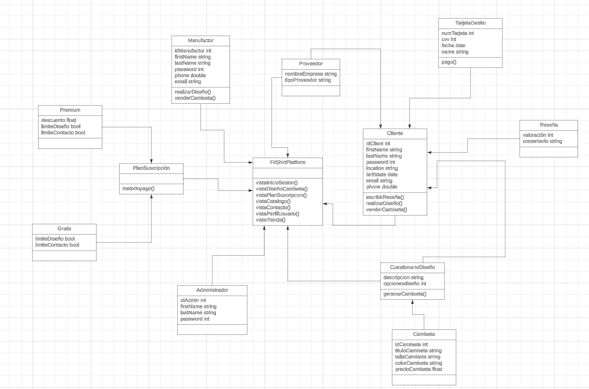

<h3 align="center"> Universidad Peruana de Ciencias Aplicadas </h3>

<h3 align="center"> Ingeniería de Software </h3>
<h3 align="center"> Ciclo 2024 - 1 </h3>

 

  

 

<h1 align="center"> TB1 Report </h1>

<h3 align="center"> Aplicaciones Web - SW53 </h3>

<h3 align="center"> Docente: Naldo Reupo-Musayón Gastulo </h3>

<h3> Startup: Dreamers in a Hurry </h3>

<h3> Product: </h3>

<h3> Team Members: </h3>

| Member                           |    Code    |
| :------------------------------- | :--------: |
| Aliaga Pimentel, George Arturo   | U20211c273 |
| Chirinos Arevalo, Daniel Rodrigo | U202019577 |
| Cruz Ticona, Aaron Alejandro     | U202213502 |
| Defilippi Santillán, Diego       | U202120448 |
| Sanchez Maita, Agustin Alejandro | U20181a313 |

<h3 align="center">Marzo, 2024</h3>

  

# Registro de Versiones del Informe

| Versión | Fecha | Autor | Descripción de modificación |
| :-----: | :---: | :---: | :-------------------------- |

  

# Project Report Collaboration Insights

  

# Contenido

## Tabla de Contenidos

### [Registro de versiones del informe](#registro-de-versiones-del-informe)

### [Project Report Collaboration Insights](#project-report-collaboration-insights)

### [Contenido](#contenido)

### [Student Outcome](#student-outcome-1)

### [Capítulo I: Introducción](#capc3adtulo-i-introduccic3b3n-1)

- [1.1. Startup Profile](#11-startup-profile)
  - [1.1.1. Descripción de la Startup](#111-description-de-la-startup)
  - [1.1.2. Perfiles de integrantes del equipo](#112-perfiles-de-integrantes-del-equipo)
- [1.2. Solution Profile](#12-solution-profile)
  - [1.2.1 Antecedentes y problemática](#121-antecedentes-y-problemática)
  - [1.2.2 Lean UX Process](#122-lean-ux-process)
    - [1.2.2.1. Lean UX Problem Statements](#1221-lean-ux-problem-statements)
    - [1.2.2.2. Lean UX Assumptions](#1222-lean-ux-assumptions)
    - [1.2.2.3. Lean UX Hypothesis Statements](#1223-lean-ux-hypothesis-statements)
    - [1.2.2.4. Lean UX Canvas](#1224-lean-ux-canvas)
- [1.3. Segmentos objetivo](#13-segmentos-objetivo)

### [Capítulo II: Requirements Elicitation & Analysis](#capc3adtulo-ii-requirements-elicitation--analysis-1)

- [2.1. Competidores](#21-competidores)
  - [2.1.1. Análisis competitivo](#211-análisis-competitivo)
  - [2.1.2. Estrategias y tácticas frente a competidores](#212-estrategias-y-tácticas-frente-a-competidores)
- [2.2. Entrevistas](#22-entrevistas)
  - [2.2.1. Diseño de entrevistas](#221-diseño-de-entrevistas)
  - [2.2.2. Registro de entrevistas](#222-registro-de-entrevistas)
  - [2.2.3. Análisis de entrevistas](#223-análisis-de-entrevistas)
- [2.3. Needfinding](#23-needfinding)
  - [2.3.1. User Personas](#231-user-personas)
  - [2.3.2. User Task Matrix](#232-user-task-matrix)
  - [2.3.3. User Journey Mapping](#233-user-journey-mapping)
  - [2.3.4. Empathy Mapping](#234-empathy-mapping)
  - [2.3.5. As-is Scenario Mapping](#235-as-is-scenario-mapping)

### [Capítulo III: Requirements Specification](#capc3adtulo-iii-requirements-specification-1)

- [3.1. To-Be Scenario Mapping](#31-to-be-scenario-mapping)
- [3.2. User Stories](#32-user-stories)
- [3.3. Impact Mapping](#33-impact-mapping)
- [3.4. Product Backlog](#34-product-backlog)

### [Capítulo IV: Product Design](#capc3adtulo-iv-product-design-1)

- [4.1. Style Guidelines](#41-style-guidelines)
  - [4.1.1. General Style Guidelines](#411-general-style-guidelines)
  - [4.1.2. Web Style Guidelines](#412-web-style-guidelines)
- [4.2. Information Architecture](#42-information-architecture)
  - [4.2.1. Organization Systems](#421-organization-systems)
  - [4.2.2. Labeling Systems](#422-labeling-systems)
  - [4.2.3. SEO Tags and Meta Tags](#423-seo-tags-and-meta-tags)
  - [4.2.4. Searching Systems](#424-searching-systems)
  - [4.2.5. Navigation Systems](#425-navigation-systems)
- [4.3. Landing Page UI Design](#43-landing-page-ui-design)
  - [4.3.1. Landing Page Wireframe](#431-landing-page-wireframe)
  - [4.3.2. Landing Page Mock-up](#432-landing-page-mock-up)
- [4.4. Web Applications UX/UI Design](#44-web-applications-uxui-design)
  - [4.4.1. Web Applications Wireframes](#441-web-applications-wireframes)
  - [4.4.2. Web Applications Wireflow Diagrams](#442-web-applications-wireflow-diagrams)
  - [4.4.3. Web Applications Mock-ups](#443-web-applications-mock-ups)
  - [4.4.4. Web Applications User Flow Diagrams](#444-web-applications-user-flow-diagrams)
- [4.5. Web Applications Prototyping](#45-web-applications-prototyping)
- [4.6. Domain-Driven Software Architecture](#46-domain-driven-software-architecture)
  - [4.6.1. Software Architecture Context Diagram](#461-software-architecture-context-diagram)
  - [4.6.2. Software Architecture Container Diagrams](#462-software-architecture-container-diagrams)
  - [4.6.3. Software Architecture Components Diagrams](#463-software-architecture-components-diagrams)
- [4.7. Software Object-Oriented Design](#47-software-object-oriented-design)
  - [4.7.1. Class Diagrams](#471-class-diagrams)
  - [4.7.2. Class Dictionary](#472-class-dictionary)
- [4.8. Database Design](#48-database-design)
  - [4.8.1. Database Diagram](#481-database-diagram)

### [Capítulo V: Product Implementation, Validation & Deployment](#capc3adtulo-v-product-implementation-validation--deployment-1)

- [5.1. Software Configuration Management](#51-software-configuration-management)
  - [5.1.1. Software Development Environment Configuration](#511-software-development-environment-configuration)
  - [5.1.2. Source Code Management](#512-source-code-management)
  - [5.1.3. Source Code Style Guide & Conventions](#513-source-code-style-guide--conventions)
  - [5.1.4. Software Deployment Configuration](#514-software-deployment-configuration)
- [5.2. Landing Page, Services & Applications Implementation](#52-landing-page-services--applications-implementation)
  - [5.2.1. Sprint 1](#521-sprint-1)
    - [5.2.1.1. Sprint Planning 1](#5211-sprint-planning-1)
    - [5.2.1.2. Sprint Backlog 1](#5212-sprint-backlog-1)
    - [5.2.1.3. Development Evidence for Sprint Review](#5213-development-evidence-for-sprint-review)
    - [5.2.1.4. Testing Suite Evidence for Sprint Review](#5214-testing-suite-evidence-for-sprint-review)
    - [5.2.1.5. Execution Evidence for Sprint Review](#5215-execution-evidence-for-sprint-review)
    - [5.2.1.6. Services Documentation Evidence for Sprint Review](#5216-services-documentation-evidence-for-sprint-review)
    - [5.2.1.7. Software Deployment Evidence for Sprint Review](#5217-software-deployment-evidence-for-sprint-review)
    - [5.2.1.8. Team Collaboration Insights during Sprint](#5218-team-collaboration-insights-during-sprint)

### [Conclusiones](#conclusiones-1)

- [Conclusiones y recomendaciones](#conclusiones-y-recomendaciones)

### [Bibliografía](#bibliografc3ada-1)

### [Anexos](#anexos-1)

  

# Student Outcome

| Criterio específico                                                                                                                                 | Acciones realizadas | Conclusiones |
| :-------------------------------------------------------------------------------------------------------------------------------------------------- | :------------------ | :----------- |
| Participa en equipos multidisciplinarios con eficacia, eficiencia y objetividad, en el marco de un proyecto en soluciones de ingeniería de software |                     |              |
| Conoce al menos un sector empresarial o dominio de aplicación de soluciones de software.                                                            |                     |              |

  

## Capítulo I: Introducción

## 1.1. StartUp Profile

### 1.1.1. Description de la StartUp

### 1.1.2. Perfiles de integrantes del equipo

## 1.2. Solution Profile

### 1.2.1. Antecedentes y problemática

### 1.2.2. Lean UX Process

#### 1.2.2.1. Lean UX Problem Statements

#### 1.2.2.2. Lean UX Assumptions

#### 1.2.2.3. Lean UX Hypothesis Statements

#### 1.2.2.4. Lean UX Canvas

# 1.3. Segmentos Objetivo

  

# Capítulo II: Requirements Elicitation & Analysis

## 2.1. Competidores

### 2.1.1. Análisis competitivo

### 2.1.2. Estrategias y tácticas frente a competidores

## 2.2. Entrevistas

### 2.2.1. Diseño de entrevistas

### 2.2.2. Registro de entrevistas

### 2.2.3. Análisis de entrevistas

## 2.3. Needfinding

### 2.3.1. User Personas

### 2.3.2. User Task Matrix

### 2.3.3. User Journey Mapping

### 2.3.4. Empathy Mapping

### 2.3.5. As-is Scenario Mapping

  

# Capítulo III: Requirements Specification

## 3.1. To-Be Scenario Mapping

## 3.2. User Stories

## 3.3. Impact Mapping

## 3.4. Product Backlog

  

# Capítulo IV: Product Design

## 4.1. Style Guidelines.

### 4.1.1. General Style Guidelines

### 4.1.2. Web Style Guidelines

## 4.2. Information Architecture

### 4.2.1. Organization Systems

### 4.2.2. Labeling Systems

### 4.2.3. SEO Tags and Meta Tags

### 4.2.4. Searching Systems

### 4.2.5. Navigation Systems

## 4.3. Landing Page UI Design

### 4.3.1. Landing Page Wireframe

<b>Página Principal </b>
<td></td>
    <td>
<b>Catálogo</b>
<td></td>
    <td>
<b>Diseña</b>
<td></td>
    <td>
<b>¿Quienes Somos?</b>
<td></td>
    <td>
<b>Contactanos</b>
<td></td>
    <td>
    
### 4.3.2. Landing Page Mock-up

<b>Página Principal </b>
<td></td>
    <td>
<b>Catálogo</b>
<td></td>
    <td>
<b>Diseña</b>
<td></td>
    <td>
<b>¿Quienes Somos? <b>
<td></td>
    <td>
<b>Contactanos <b>
<td></td>
    <td>
     
    
[Ver diseño en Figma](https://www.figma.com/file/34WQCRohgfDxl5QPuWQxKc/FitShirt?type=design&node-id=0-1&mode=design&t=trCfJ8GunZpOGtwE-0)

## 4.4. Web Applications UX/UI Design

### 4.4.1. Web Applications Wireframes

### 4.4.2. Web Applications Wireflow Diagrams

### 4.4.3. Web Applications Mock-ups

<b>Página de Producto:</b>
<td></td>
    <td>
La siguiente Imagen permite al usuario encontrar las diferentes camisetas deportivas que son publicadas por los diversos comerciantes, aquí se les ofrece la opción de seleccionar el producto que quieran y filtrarlos en base a sus preferencias.
  
<b>Cambio de Contraseña:</b>
<td></td>
    <td>

La siguiente interfaz permite al usuario cambiar su contraseña actual con el fin de que pueda proporcionar la seguridad adecuada a su cuenta privada.

<b>Confirmación de Compra:</b>
<td></td>
    <td>

La siguiente interfaz permite al usuario reafirmar o cancelar la acción de compra realizada, esto permite evitar errores posteriores y mejora la experiencia de usuario.

<b>Crear Diseño:</b>
<td></td>
    <td>

La siguiente interfaz permite al usuario crear un diseño personalizado, en el que tiene la opción de escoger los colores primario, secundarios y terciarios, el diseño y el Escudo.

<b>Personalizar Camisa Deportiva:</b>
<td></td>
    <td>

Esta interfaz permite al usuario personalizar su camisa deportiva añadiendole un nombre y un dorsal de su preferencia.

<b>Editar Diseño:</b>
<td></td>
    <td>

Esta interfaz Permite al Usuario ver y editar la descripción de un diseño, además de ir a la siguiente interfaz donde puede editar las imágenes.

<b></b>
<td>Sección de Productos Filtrada:</td>
    <td>

Esta interfaz muestra los productos filtrados después que el usuario escogió los filtros de su preferencia y seleccionó el botón filtrar.

<b>Imágenes de diseño:</b>
<td></td>
    <td>

Esta interfaz permite al usuario visualizar las imágenes de un diseño, editarlas y confirmarlas.

<b>Carga exitosa:</b>
<td></td>
    <td>

Esta interfaz permite al usuario reconocer que la carga de imágenes fue exitosa.

<b>Edición exitosa:</b>
<td></td>
    <td>

Esta interfaz permite al usuario reconocer que la edición de imágenes fue exitosa.

<b>Insertar Imagen de Diseño:</b>
<td></td>
    <td>

Esta interfaz permite al usuario ingresar las imágenes de un diseño.

<b>Detalles de producto</b>
<td></td>
    <td>

Esta interfaz permite al usuario ver los detalles de un producto, definir la talla y cantidad que desea para añadir al carrito de compras.

<b>Edición de Perfil:</b>
<td></td>
    <td>

Esta interfaz permite que el usuario cambie la información de su perfil.

<b>Interfaz de Login:</b>
<td></td>
    <td>

Esta interfaz permite al usuario ingresar sus credenciales de acceso a la aplicación y en caso de no tener una cuenta, le permite ir a la interfaz de registro.

<b>Ingreso de Método de Pago:</b>
<td></td>
    <td>

Esta interfaz permite al usuario ingresar el método de pago para realizar compras en la aplicación.

<b>Interfaz de Diseños:</b>
<td></td>
    <td>

Esta interfaz permite al comerciante o usuario visualizar sus diseños y mediante los iconos puedes decidir si quieren que se muestren al público para realizar su venta o si quiere que determinado producto tenga más visibilidad. También puede dirigirse a las interfaces para crear o subir diseños.

<b>Comfirmación de Premium:</b>
<td></td>
    <td>

Esta interfaz permite rectificar que el usuario quiere hacer compra de la membresía premium.

<b>Mejora a Premium:</b>
<td></td>
    <td>

Esta interfaz muestra los beneficios de adquirir la membresía premium y permite hacer compra de esta mediante un botón.

<b>Interfaz de Perfil:</b>
<td></td>
    <td>

Meduante esta Interfaz el usuario podrá acceder a su perfil y será capaz de escoger si desea cambiar su contraseña, añadir un método de pago o editar su perfil.

<b>Interfaz de Registro:</b>
<td></td>
    <td>

Mediante esta interfaz el usuario podrá crear su cuenta en nuestra aplicación, para que pueda gozar de nuestros servicios y funcionalidades.

<b>Carrito de Compras Vacío:</b>
<td></td>
    <td>

Esta interfaz muestra el carrito de compras sin ningún artículo para comprar.

<b>Carrito de Compra:</b>
<td></td>
    <td>

Esta interfaz es el de carrito de compra, acá puede ver todos los artículos que añadió para su copra posterior, con sus subtotales, cantidad, precio unitario y total. También puede eliminar items del carrito.

<b>Subir Diseño:</b>
<td></td>
    <td>

Esta interfaz permite al usuario subir un diseño que ya tenga hecho, aqui puede agregar su descripción del producto e ir a la siguiente interfaz para insertar imágenes.

[Ver diseño en Figma](https://www.figma.com/file/rAcxltmkjSIrKyjWHsL1dL/WEB%2FMOBILE-FITSHIRT?type=design&node-id=0%3A1&mode=design&t=5XHQaKGutqJZ8IPJ-1)

### 4.4.4. Web Applications User Flow Diagrams
<td></td>
<td></td>
<td></td>
<td></td>
<td></td>
<td></td>
<td></td>
<td></td>
<td></td>
<td></td>
<td></td>
<td></td>

## 4.5. Web Applications Prototyping
<b>Demostración Prototypo Web:</b>
<td></td>

Enlance del Video de la Explicación del Prototipo: https://upcedupe-my.sharepoint.com/:v:/g/personal/u20181a313_upc_edu_pe/EUdsYyXsjZpGouMlFt7A9HEBWGfVWbpR0PloDuq0mJgaKA?e=SoOR8e&nav=eyJyZWZlcnJhbEluZm8iOnsicmVmZXJyYWxBcHAiOiJTdHJlYW1XZWJBcHAiLCJyZWZlcnJhbFZpZXciOiJTaGFyZURpYWxvZy1MaW5rIiwicmVmZXJyYWxBcHBQbGF0Zm9ybSI6IldlYiIsInJlZmVycmFsTW9kZSI6InZpZXcifX0%3D

Enlance del Prototipo: https://www.figma.com/proto/rAcxltmkjSIrKyjWHsL1dL/WEB%2FMOBILE-FITSHIRT?type=design&node-id=3-18363&t=6X1dlatUsJWHBgui-1&scaling=contain&page-id=0%3A1&starting-point-node-id=3%3A18363&mode=design

<b>Demostración Prototypo Mobile:</b>
<td></td>

Enlance del Video de la Explicación del Prototipo: https://upcedupe-my.sharepoint.com/:v:/g/personal/u20181a313_upc_edu_pe/EZCfuUL-CyZBjMyHp8LdkagBG6jscX8zl7PfeklTZYVtCQ?e=YYTjdu&nav=eyJyZWZlcnJhbEluZm8iOnsicmVmZXJyYWxBcHAiOiJTdHJlYW1XZWJBcHAiLCJyZWZlcnJhbFZpZXciOiJTaGFyZURpYWxvZy1MaW5rIiwicmVmZXJyYWxBcHBQbGF0Zm9ybSI6IldlYiIsInJlZmVycmFsTW9kZSI6InZpZXcifX0%3D

Enlance del Prototipo: https://www.figma.com/proto/NgftH2JsrQBU8XiT7UGm3w/MOBILE-FITSHIRT?type=design&node-id=139-2995&t=LSHlHkTGqHIIYWEU-1&scaling=contain&page-id=0%3A1&mode=design

## 4.6. Domain-Driven Software Architecture

### 4.6.1. Software Architecture Context Diagram

### 4.6.2. Software Architecture Container Diagrams

### 4.6.3. Software Architecture Components Diagrams

## 4.7. Software Object-Oriented Design

### 4.7.1. Class Diagrams

<td></td>

### 4.7.2. Class Dictionary

## 4.8. Database Design

### 4.8.1. Database Diagram

<td></td>

  

# Capítulo V: Product Implementation, Validation & Deployment

## 5.1. Software Configuration Management

### 5.1.1. Software Development Environment Configuration

### 5.1.2. Source Code Management

### 5.1.3. Source Code Style Guide & Conventions

### 5.1.4. Software Deployment Configuration

## 5.2. Landing Page, Services & Applications Implementation

### 5.2.1. Sprint 1

#### 5.2.1.1. Sprint Planning 1

#### 5.2.1.2. Sprint Backlog 1

#### 5.2.1.3. Development Evidence for Sprint Review

#### 5.2.1.4. Testing Suite Evidence for Sprint Review

#### 5.2.1.5. Execution Evidence for Sprint Review

#### 5.2.1.6. Services Documentation Evidence for Sprint Review

#### 5.2.1.7. Software Deployment Evidence for Sprint Review

#### 5.2.1.8. Team Collaboration Insights during Sprint

  

# Conclusiones

## Conclusiones y recomendaciones

  

# Bibliografía

  

# Anexos
